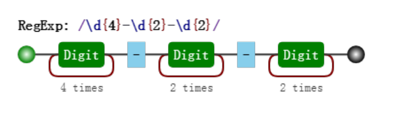
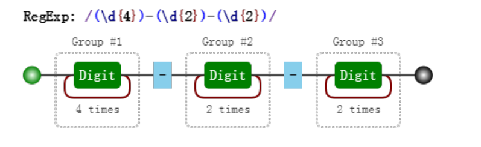
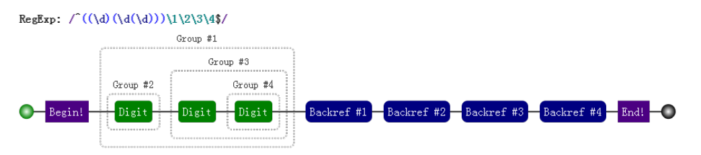

# 搞明白正则

本文来自于 [JS正则语法书](https://github.com/qdlaoyao/js-regex-mini-book)

正则表达式是匹配模式，要么匹配字符，要么匹配位置

## 正则字符匹配

### 基础知识补充

[`String.prototype.match()`](https://developer.mozilla.org/zh-CN/docs/Web/JavaScript/Reference/Global_Objects/String/match)

###  两种模糊匹配

#### 横向模糊匹配

> 横向模糊指的是，一个正则可匹配的字符串的长度不是固定的，可以是多种情况的

其实现的方式是使用量词。譬如 {m,n}，表示连续出现最少 m 次，最多 n 次。

```js
var regex = /ab{2,5}c/g;
var string = "abc abbc abbbc abbbbc abbbbbc abbbbbbc";
console.log( string.match(regex) );
// => ["abbc", "abbbc", "abbbbc", "abbbbbc"]
```

#### 纵向模糊匹配

> 纵向模糊指的是，一个正则匹配的字符串，具体到某一位字符时，它可以不是某个确定的字符，可以有多种可能。

其实现的方式是使用**字符组**。譬如 [abc]，表示该字符是可以字符 "a"、"b"、"c" 中的任何一个。

```js
var regex = /a[123]b/g;
var string = "a0b a1b a2b a3b a4b";
console.log( string.match(regex) );
// => ["a1b", "a2b", "a3b"]
```

### 字符组

> 需要强调的是，虽叫字符组（字符类），**但只是其中一个字符**。

#### 范围表示法

> 如果字符组里的字符特别多的话，比如 [123456abcdefGHIJKLM]，可以使用范围表示法。

- [1-6a-fG-M]。

如果要匹配 "a"、"-"、"z" 这三者中任意一个字符；那么可以改变顺序：

- [-az] 或 [az-] 或 [a\-z]。


#### 排除字符组

纵向模糊匹配，还有一种情形就是，某位字符可以是任何东西，但就不能是 `"a"、"b"、"c"`。 `[^abc]`，表示是一个除 "a"、"b"、"c"之外的任意一个字 符。

> 字符组的第一位放 ^（脱字符），表示求反的概念。


#### 常见的简写形式

| 字符组 | 具体含义                                                     |
| ------ | ------------------------------------------------------------ |
| \d     | 表示 [0-9]。表示是一位数字。                                 |
| \D     | 表示 [^0-9]。表示除数字外的任意字符。                        |
| \w     | 表示 [0-9a-zA-Z_]。表示数字、大小写字母和下划线。            |
| \W     | 表示 `[^0-9a-zA-Z_]`。非单词字符。                           |
| \s     | 表示 [ \t\v\n\r\f]。表示空白符，包括空格、水平制表符、垂直制表符、换行符、回车符、换页符。 |
| \S     | 表示 `[^\t\v\n\r\f]` 。 非空白符。                           |
| .      | 表示 `[^\n\r\u2028\u2029]`。通配符，表示几乎任意字符。换行符、回车符、行分隔符和段分隔符 除外。 |


### 量词

> 简写形式

| 量词 | 具体含义                                  |
| ---- | ----------------------------------------- |
| {m,} | 表示至少出现 m 次。                       |
| {m}  | 等价于 {m,m}，表示出现 m 次。             |
| ？   | 等价于 {0,1}，表示出现或者不出现。        |
| +    | 等价于 {1,}，表示出现至少一次             |
| *    | 等价于 {0,}，表示出现任意次，有可能不出现 |

#### 贪婪匹配与惰性匹配

> 贪婪

```js
var regex = /\d{2,5}/g;
var string = "123 1234 12345 123456";
console.log( string.match(regex) );
// => ["123", "1234", "12345", "12345"]
```

其中正则 /\d{2,5}/，表示数字连续出现 2 到 5 次。会匹配 2 位、3 位、4 位、5 位连续数字。 

但是其是贪婪的，它会尽可能多的匹配。你能给我 6 个，我就要 5 个。你能给我 3 个，我就要 3 个。 反正只要在能力范围内，越多越好。

> 惰性

```js
var regex = /\d{2,5}?/g;
var string = "123 1234 12345 123456";
console.log( string.match(regex) );
// => ["12", "12", "34", "12", "34", "12", "34", "56"]
```

其中 /\d{2,5}?/ 表示，虽然 2 到 5 次都行，当 2 个就够的时候，就不再往下尝试了。

通过在量词后面加个问号就能实现惰性匹配，因此所有惰性匹配情形如下：

| 惰性量词 | 贪婪量词 |
| -------- | -------- |
| {m,n}    | {m,n}    |
| {m,}?    | {m,}     |
| ??       | ？       |
| +?       | +        |
| *?       | *        |

### 多选分支

> 一个模式可以实现横向和纵向模糊匹配。具体形式如下：(p1|p2|p3)，其中 p1、p2 和 p3 是子模式，用 |（管道符）分隔，表示其中任何之一。

```js
var regex = /good|nice/g;
var string = "good idea, nice try.";
console.log( string.match(regex) );
// => ["good", "nice"]
```

但要注意的是：多选分支是惰性匹配；，即当前面的匹配上了，后面的就不再尝试了

```js
var regex = /good|goodbye/g;
var string = "goodbye";
console.log( string.match(regex) );
// => ["good"]

var regex = /goodbye|good/g;
var string = "goodbye";
console.log( string.match(regex) );
// => ["goodbye"]
```


### 例子

- 匹配 16 进制颜色值

```js
/*
	#ffbbad
    #Fc01DF
    #FFF
    #ffE
*/
// 分支加量词

var regex = /#([0-9a-fA-F]{6}|[0-9a-fA-F]{3})/g;
var string = "#ffbbad #Fc01DF #FFF #ffE";
console.log( string.match(regex) );
// => ["#ffbbad", "#Fc01DF", "#FFF", "#ffE"]
```


- 匹配时间

```js
/*
	23:59
	02:07
*/
// 多种情况
var regex = /^([01][0-9]|[2][0-3]):[0-5][0-9]$/;
console.log( regex.test("23:59") );
console.log( regex.test("02:07") );
// => true
// => true

```


- 匹配日期

```js
/*
	2017-06-10
*/
var regex = /^[0-9]{4}-(0[1-9]|1[0-2])-(0[1-9]|[12][0-9]|3[01])$/;
console.log( regex.test("2017-06-10") );
```


## 正则位置匹配

### 什么是位置呢？

位置（锚）是相邻字符之间的位置。比如，下图中箭头所指的地方：


### 如何匹配位置呢？

> 在 ES5 中，共有 6 个锚：
>
> ^、$、\b、\B、(?=p)、(?!p)


#### ^ 和 $

^（脱字符）匹配开头，在多行匹配中匹配行开头。

$（美元符号）匹配结尾，在多行匹配中匹配行结尾。

```js
var result = "hello".replace(/^|$/g, '#');
console.log(result);
// => "#hello#"
```

多行匹配模式（即有修饰符 m）

```js
var result = "I\nlove\njavascript".replace(/^|$/gm, '#');
console.log(result);
/*
#I#
#love#
#javascript#
*/
```

####  \b 和 \B

> \b 是单词边界，具体就是 \w 与 \W 之间的位置，也包括 \w 与 ^ 之间的位置，和 \w 与 $ 之间的位置。

```js
var result = "[JS] Lesson_01.mp4".replace(/\b/g, '#');
console.log(result);
// => "[#JS#] #Lesson_01#.#mp4#"
```

解析：

- 两边字符是 "[" 与 "J"，是 \W 与 \w 之间的位置。
- 两边字符是 "S" 与 "]"，也就是 \w 与 \W 之间的位置。
- 两边字符是空格与 "L"，也就是 \W 与 \w 之间的位置。
- 两边字符是 "1" 与 "."，也就是 \w 与 \W 之间的位置。
- 两边字符是 "." 与 "m"，也就是 \W 与 \w之间的位置。
- 位于结尾，前面的字符 "4" 是 \w，即 \w 与 $ 之间的位置。

> \B 就是 \b 的反面的意思，非单词边界。例如在字符串中所有位置中，扣掉 \b，剩下的都是 \B 的。具体说来就是 \w 与 \w、 \W 与 \W、^ 与 \W，\W 与 $ 之间的位置。

```js
var result = "[JS] Lesson_01.mp4".replace(/\B/g, '#');
console.log(result);
// => "#[J#S]# L#e#s#s#o#n#_#0#1.m#p#4"
```


####  (?=p) 和 (?!p)

> (?=p)，其中 p 是一个子模式，即 p 前面的位置，比如 (?=l)，表示 "l" 字符前面的位置

```js
var result = "hello".replace(/(?=l)/g, '#');
console.log(result);
// => "he#l#lo"
```

>  (?!p) 就是 (?=p) 的反面意思

```js
var result = "hello".replace(/(?!l)/g, '#');
console.log(result);
// => "#h#ell#o#"
```

### 位置的特性

对于位置的理解，我们可以理解成空字符 ""。比如 "hello" 字符串等价于如下的形式：

```js
"hello" == "" + "h" + "" + "e" + "" + "l" + "" + "l" + "" + "o" + "";
```

### 例子

- 数字的千位分隔符表示法

```js
/*
	数字变成千分位，很明显就是在合适的地方插入分隔符，可以用(?=p) 实现
	是这个p是三位数字可以用 \d{3}
*/

var regex = /(?!^)(?=(\d{3})+$)/g;
result = "123456789".replace(regex, ',');
```


## 正则括号的作用

### 分组合分支结构

#### 分组

我们知道 /a+/ 匹配连续出现的 "a"，而要匹配连续出现的 "ab" 时，需要使用 /(ab)+/。

括号是提供分组功能，使量词 + 作用于 "ab" 这个整体，测试如下：

```js
var regex = /(ab)+/g;
var string = "ababa abbb ababab";
console.log( string.match(regex) );
// => ["abab", "ab", "ababab"]
```

#### 分支结构

在多选分支结构 (p1|p2) 中，此处括号的作用也是不言而喻的，提供了分支表达式的所有可能。

```js
var regex = /^I love (JavaScript|Regular Expression)$/;
console.log( regex.test("I love JavaScript") );
console.log( regex.test("I love Regular Expression") );
// => true
// => true
```

如果去掉正则中的括号，即： /^I love JavaScript|Regular Expression$/， 匹配字符串是 "I love JavaScript" 和 `"Regular Expression"`，当然这不是我们想要的。


### 分组引用

括号一个重要的作用，可以进行数据提取，以及更强大的替换操作。

我们先对比两种表达式的可视化形式：






对比这两个可视化图片，我们发现，与前者相比，**后者多了分组编号**，如 Group #1。 其实正则引擎也是这么做的，在匹配过程中，给每一个分组都开辟一个空间，用来存储每一个分组匹配到的 数据。

#### 提取数据

比如提取出年、月、日，可以这么做：

```js
var regex = /(\d{4})-(\d{2})-(\d{2})/;
var string = "2017-06-12";
console.log( string.match(regex) );
// => ["2017-06-12", "2017", "06", "12", index: 0, input: "2017-06-12"]
```

> 可以使用构造函数的全局属性 $1 至 $9 来获取：

```js
var regex = /(\d{4})-(\d{2})-(\d{2})/;
var string = "2017-06-12";
regex.test(string); // 正则操作即可，例如
//regex.exec(string);
//string.match(regex);
console.log(RegExp.$1); // "2017"
console.log(RegExp.$2); // "06"
console.log(RegExp.$3); // "12"
```

#### 替换

```js
var regex = /(\d{4})-(\d{2})-(\d{2})/;
var string = "2017-06-12";
var result = string.replace(regex, "$2/$3/$1");
console.log(result);  // => "06/12/2017"

等价于如下的形式：
var result = string.replace(regex, function () {
  return RegExp.$2 + "/" + RegExp.$3 + "/" + RegExp.$1;
});

或者
var result = string.replace(regex, function (match, year, month, day) {
  return month + "/" + day + "/" + year;
});
```


### 反向引用

除了使用相应 API 来引用分组，也可以在正则本身里引用分组。但只能引用之前出现的分组，即反向引用。 还是以日期为例。

比如要写一个正则支持匹配如下三种格式：

```
2016-06-12
2016/06/12
2016.06.12
```

```js
var regex = /\d{4}(-|\/|\.)\d{2}(-|\/|\.)\d{2}/;
var string1 = "2017-06-12";
var string2 = "2017/06/12";
var string3 = "2017.06.12";
var string4 = "2016-06/12";
console.log( regex.test(string1) ); // true
console.log( regex.test(string2) ); // true
console.log( regex.test(string3) ); // true
console.log( regex.test(string4) ); // true  这个不对但也是true；这个时候可以用反向引用来保持一致
```

```js
var regex = /\d{4}(-|\/|\.)\d{2}\1\d{2}/;
console.log( regex.test(string4) ); // false
```

注意里面的 \1，表示的引用之前的那个分组 (-|\/|\.)。不管它匹配到什么（比如 -），\1 都匹配那个同 样的具体某个字符。

#### 括号嵌套

`var regex = /^((\d)(\d(\d)))\1\2\3\4$/`



```js
var regex = /^((\d)(\d(\d)))\1\2\3\4$/;
var string = "1231231233";
console.log( regex.test(string) ); // true
console.log( RegExp.$1 ); // 123
console.log( RegExp.$2 ); // 1
console.log( RegExp.$3 ); // 23
console.log( RegExp.$4 ); // 3

我们可以看看这个正则匹配模式：
第一个字符是数字，比如说 "1"，
第二个字符是数字，比如说 "2"，
第三个字符是数字，比如说 "3"，
接下来的是 \1，是第一个分组内容，那么看第一个开括号对应的分组是什么，是 "123"，
接下来的是 \2，找到第2个开括号，对应的分组，匹配的内容是 "1"，
接下来的是 \3，找到第3个开括号，对应的分组，匹配的内容是 "23"，
最后的是 \4，找到第3个开括号，对应的分组，匹配的内容是 "3"。
```

#### 分组后面有量词

> 分组后面有量词的话，分组最终捕获到的数据是最后一次的匹配

```js
var regex = /(\d)+/;
var string = "12345";
console.log( string.match(regex) ); // => ["12345", "5", index: 0, input: "12345"]

var regex = /(\d)+ \1/;
console.log( regex.test("12345 1") );
// => false
console.log( regex.test("12345 5") );
// => true
```

### 非捕获括号

> 我只是想要一个括号，既不在API中引用，也不再正则里面反向引用，只要一个原始的功能；这个就是非捕获括号  (?:p) 和 (?:p1|p2|p3)

```js
// match返回的数组中没有其他的信息
var regex = /(?:ab)+/g;
var string = "ababa abbb ababab";
console.log( string.match(regex) );
// => ["abab", "ab", "ababab"]

var regex = /^I love (?:JavaScript|Regular Expression)$/;
console.log( regex.test("I love JavaScript") );
console.log( regex.test("I love Regular Expression") );
// => true
// => true
```

### 案例

> 字符串 trim 方法模拟

trim 方法是去掉字符串的开头和结尾的空白符。

```js
// 匹配到开头和结尾的空白符，然后替换成空字符。如：
function trim(str) {
  return str.replace(/^\s+|\s+$/g, '');
}
console.log( trim(" foobar ") );
```

> 单词的首字母转换为大写

```js
function titleize (str) {
  return str.toLowerCase().replace(/(?:^|\s)\w/g, function (c) {
  return c.toUpperCase();
  });
}
console.log( titleize('my name is epeli') );
// => "My Name Is Epeli"
```

> 驼峰化

```
function camelize (str) {
  return str.replace(/[-_\s]+(.)?/g, function (match, c) {
  return c ? c.toUpperCase() : '';
  });
}
console.log( camelize('-moz-transform') );
```

