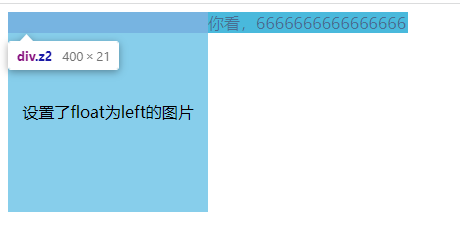
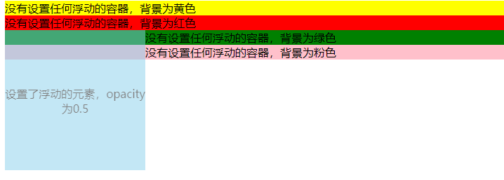
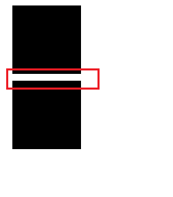

# 从浮动到BFC

## 浮动为了什么

`float`的目的是为了能实现文字能够环绕图片的排版功能、下面设置了浮动、文字也没有直接进入左侧；这说明  **float并不是完全的脱离文档流**

```html
<!DOCTYPE html>
<html lang="en">
<head>
    <meta charset="UTF-8">
    <title>float实现浮动</title>
</head>
<style>
    .z1{
        height: 200px;
        width: 200px;
        float: left;
        text-align: center;
        line-height: 200px;
        background: skyblue;
    }
    .fu {
        width: 400px;
    }
</style>
<body>
<div class="fu clearfix">
    <div class="z1">设置了float为left的图片</div>
    <div class="z2">你看，6666666666666666</div>
</div>
</body>
</html>
```




如果设置 绝对定位，才是真正脱离文档流

```css
.z1{
        height: 200px;
        width: 200px;
        position: absolute;
        text-align: center;
        line-height: 200px;
        background: skyblue;
    }
```


## 浮动会造成什么影响？

浮动会造成父级元素塌陷、影响其他元素布局



```html
<!DOCTYPE html>
<html lang="en">
<head>
    <meta charset="UTF-8">
    <title>清除float浮动</title>
</head>
<style>
    .z1{
        height: 200px;
        width: 200px;
        box-sizing: border-box;
        float: left;
        text-align: center;
        background: skyblue;
        padding-top: 80px;
        opacity: 0.5;
    }
    .z2 {
        background: yellow
    }
    .z3 {
        background: red;
    }
    .z4 {
        background: green;
    }
    .z5 {
        background: pink;
    }
</style>
<body>
<div class="fu">
    <div class="z2">没有设置任何浮动的容器，背景为黄色</div>
    <div class="z3">没有设置任何浮动的容器，背景为红色</div>
    <div class="z1">设置了浮动的元素，opacity为0.5</div>
    <div class="z4">没有设置任何浮动的容器，背景为绿色</div>
    <div class="z5">没有设置任何浮动的容器，背景为粉色</div>
</div>
</body>
</html>

```


## 如何解决这些因为浮动而造成的影响？

两个方向：

- 解决父元素给其同级的元素造成的影响，我比喻成解决**外部矛盾**。
- 解决父级元素内部的浮动元素对其同级元素的影响，我比喻成解决**内部矛盾**。

外部矛盾解决

1. 父元素设置 `overflow: hidden;`

2. 给父元素增加伪元素

   ```html
   <!DOCTYPE html>
   <html lang="en">
   <head>
       <meta charset="UTF-8">
       <title>清除float浮动</title>
   </head>
   <style>
       .z1{
           height: 200px;
           width: 200px;
           box-sizing: border-box;
           float: left;
           text-align: center;
           background: skyblue;
           padding-top: 80px;
           opacity: 0.5;
       }
       .z2 {
           background: yellow
       }
       .z3 {
           background: red;
       }
       .z4 {
           background: green;
           /* clear: left */
       }
       .z5 {
           background: pink;
       }
       .z6 {
           color: #fff;
           background: black;
       }
       .z7 {
           color: #fff;
           background: blue;
       }
       .fu {
       }
       .clearfix:after {
           display: block;
           content: '伪元素的内容哦';
           clear: both;
           height: 0;
           background: slateblue;
       }
   </style>
   <body>
   <div class="fu clearfix">
       <div class="z2">没有设置任何浮动的容器, 背景为黄色</div>
       <div class="z3">没有设置任何浮动的容器, 背景为红色</div>
       <div class="z1">设置了浮动的元素, opacity为0.5</div>
       <div class="z4">没有设置任何浮动的容器, 背景为绿色</div>
       <div class="z5">没有设置任何浮动的容器, 背景为粉色</div>
   </div>
   <div class="z6">和父级元素同级的容器, 没有设置任何浮动, 背景为绿色</div>
   <div class="z7">和父级元素同级的容器, 没有设置任何浮动, 背景为绿色</div>
   </body>
   </html>
   
   ```


内部解决

1. 添加末尾子元素，并设置清除浮动

   ```html
   <!DOCTYPE html>
   <html lang="en">
   <head>
       <meta charset="UTF-8">
       <title>清除float浮动</title>
   </head>
   <style>
       .z1{
           height: 200px;
           width: 200px;
           box-sizing: border-box;
           float: left;
           text-align: center;
           background: skyblue;
           padding-top: 80px;
           opacity: 0.5;
       }
       .z2 {
           background: yellow
       }
       .z3 {
           background: red;
       }
       .z4 {
           background: green;
           /* clear: left */
       }
       .z5 {
           background: pink;
       }
       .z6 {
           color: #fff;
           background: black;
       }
       .z7 {
           color: #fff;
           background: blue;
       }
       .fu {
       }
       .z10 {
           clear: both;
       }
   </style>
   <body>
   <div class="fu clearfix">
       <div class="z2">没有设置任何浮动的容器, 背景为黄色</div>
       <div class="z3">没有设置任何浮动的容器, 背景为红色</div>
       <div class="z1">设置了浮动的元素, opacity为0.5</div>
       <div class="z4">没有设置任何浮动的容器, 背景为绿色</div>
       <div class="z5">没有设置任何浮动的容器, 背景为粉色</div>
       <div class="z10">我是来清除浮动的</div>
   </div>
   <div class="z6">和父级元素同级的容器, 没有设置任何浮动, 背景为绿色</div>
   <div class="z7">和父级元素同级的容器, 没有设置任何浮动, 背景为绿色</div>
   </body>
   </html>
   
   ```

   

## bfc原理？

块格式化上下文（Block Formatting Context，BFC）;`BFC`是一个完全独立的空间（布局环境），让空间里的子元素不会影响到外面的布局。


### 触发条件：

- 浮动元素：`float`值为`left、right`
- `overflow`值不为 visible，为 `auto、scroll、hidden`
- `display`值为` inline-block、table-cell、table-caption、table、inline-table、flex、inline-flex、- - grid、inline-grid`
- 定位元素：`position`值为 `absolute、fixed`


### BFC的具体用处

- Float脱离文档流、高度塌陷、比如上面的父元素清除浮动

- Margin边距重叠

  - 这个边距重叠是BFC的特点、没有什么原因、就是会重叠

  ```
  <!DOCTYPE html>
  <html lang="en">
  <head>
      <meta charset="UTF-8">
      <meta http-equiv="X-UA-Compatible" content="IE=edge">
      <meta name="viewport" content="width=device-width, initial-scale=1.0">
      <title>Margin边距重叠</title>
      <style>
          .box {
              margin: 10px;
              width: 100px;
              height: 100px;
              background: #000;
          }
      </style>
  </head>
  <body>
      <div class="container">
          <div class="box"></div>
          <div class="box box1"></div>
      </div>
  </body>
  </html>
  
  ```

  

解决这个就可以考虑底部元素浮动脱离这个BFC

```css
.box1 {
	float: left
}
```


或者说、底部元素包裹父元素、overflow: hidden; 形成新的 BFC

```HTML
<!DOCTYPE html>
<html lang="en">
<head>
    <meta charset="UTF-8">
    <meta http-equiv="X-UA-Compatible" content="IE=edge">
    <meta name="viewport" content="width=device-width, initial-scale=1.0">
    <title>Margin边距重叠</title>
    <style>
        .box {
            margin: 10px;
            width: 100px;
            height: 100px;
            background: #000;
        }
        .bb {
            overflow: hidden;
        }
    </style>
</head>
<body>
    <div class="container">
        <div class="box"></div>
        <div class="bb"><div class="box box1"></div></div>
    </div>
</body>
</html>

```

