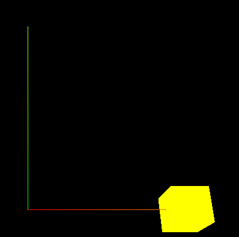

# 动画的了解

> 所谓动画就是通过时间帧来改变物体的物理位置从而形成了感观上的改变、这就是动画


修改渲染函数来改变物体的物理位置

```js
function render() {
  // X 轴位置
  cube.position.x += 0.01;
  // 朝 X 轴旋转
  cube.rotation.x += 0.01;
  if (cube.position.x > 5) {
    cube.position.x = 0;
  }
  renderer.render(scene, camera);
  requestAnimationFrame(render);
}

```




## 渲染函数的参数

```js
function render(time) {
  // time 是渲染的时间戳
  let t = (time / 1000) % 5;
  cube.position.x = t * 1;
  renderer.render(scene, camera);
  requestAnimationFrame(render);
}
```


## threejs的时钟

```js
const clock = new THREE.Clock();
function render(tt) {
  // 获取时钟运行的总时长、clock.getElapsedTime()得到的是 s
  let time = clock.getElapsedTime();
  console.log("时钟运行总时长：", time,tt);
  cube.position.x = t * 1;

  renderer.render(scene, camera);
  requestAnimationFrame(render);
}
```


## 第三方动画库-[GSAP](https://github.com/greensock/GSAP)

自己通过时间戳或者始终来控制物理位置只能做一些简单的动画、GASP动画库解决了这个问题

### GSAP.to

- 返回一个动画对象
- 参数1：物体对象；参数2：动画效果

```js
// 为物体坐标设置动画
var animate1 = gsap.to(cube.position, {
  x: 5,
  duration: 5,
  ease: "power1.inOut",
  //   设置重复的次数，无限次循环-1
  repeat: -1,
  //   往返运动
  yoyo: true,
  //   delay，延迟2秒运动
  delay: 2,
  onComplete: () => {
    console.log("动画完成");
  },
  onStart: () => {
    console.log("动画开始");
  },
});

// 为物体转动设置动画
gsap.to(cube.rotation, { x: 2 * Math.PI, duration: 3, ease: "power1.inOut" });


// 通过gsap.to返回的对象设置暂停和开始
window.addEventListener("dblclick", () => {
  //   console.log(animate1);
  if (animate1.isActive()) {
    //   暂停
    animate1.pause();
  } else {
    //   恢复
    animate1.resume();
  }
});
```
