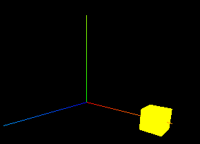

# 轨道控制器、坐标辅助器、全屏、屏幕变化


## 坐标辅助器

一个轴对象，以简单的方式可视化 3 个轴。
X 轴为红色。Y 轴为绿色。Z 轴为蓝色。参数就是轴的长度

```js
const axesHelper = new THREE.AxesHelper( 5 );
scene.add( axesHelper );
```




## 轨道控制

轨道控制允许相机围绕目标轨道运行

```js
const controls = new OrbitControls( camera, renderer.domElement );
```

### 参数

- camera：必传、相机对象
- `domElement`：用于事件侦听器的 HTML 元素。


### 阻尼

```js
// 设置控制器阻尼，让控制器更有真实效果,必须在动画循环里调用.update()。
controls.enableDamping = true;

function render() {
  controls.update();
  renderer.render(scene, camera);
  // 渲染下一帧的时候就会调用render函数
  requestAnimationFrame(render);
}
```


## 全屏

```js
window.addEventListener("dblclick", () => {
  const fullScreenElement = document.fullscreenElement;
  if (!fullScreenElement) {
    // 双击控制屏幕进入全屏，退出全屏
    // 让画布对象全屏
    renderer.domElement.requestFullscreen();
  } else {
    //   退出全屏，使用document对象
    document.exitFullscreen();
  }
});
```


## 屏幕变化

```js
window.addEventListener("resize", () => {
  // 更新摄像头
  camera.aspect = window.innerWidth / window.innerHeight;
  //   更新摄像机的投影矩阵
  camera.updateProjectionMatrix();
  //   更新渲染器
  renderer.setSize(window.innerWidth, window.innerHeight);
  //   设置渲染器的像素比
  renderer.setPixelRatio(window.devicePixelRatio);
});
```

