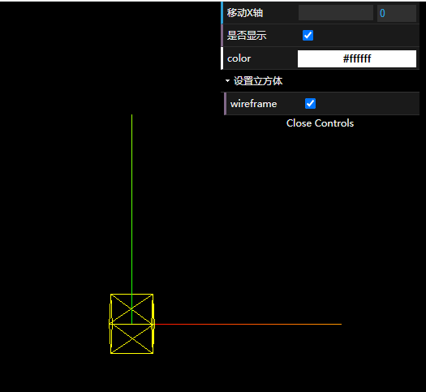

# dat.gui 基本用法


```js
import * as dat from "dat.gui";


const gui = new dat.GUI();
const params = {
  color: "#fff",
  x:0,
  visible:true
};
gui
  .add(params, "x")
  .min(0)
  .max(5)
  .step(0.1)
  .name("移动X轴")
  .onChange((value) => {
    cube.position.x = value
  })
  .onFinishChange((fValue) => {
    {
      console.log(fValue);
    }
  });
gui.add(params,"visible").name("是否显示").onChange(value => {
  cube.visible = value
})

gui.addColor(params, "color").onChange((value) => {
  cube.material.color.set(value)
});

const floder = gui.addFolder("设置立方体")
floder.add(cube.material,"wireframe")
```

