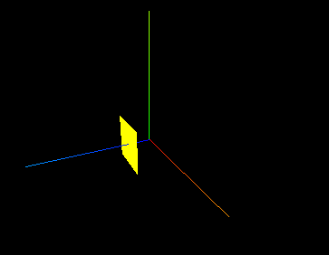
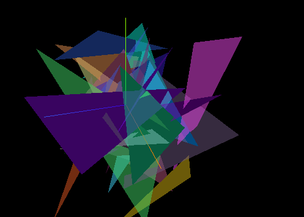

# 几何图形

https://blog.csdn.net/rexfow/article/details/124423743

## 正方形

```js
const geometry = new THREE.BufferGeometry();
const vertices = new Float32Array([
  -1.0, -1.0, 1.0, 1.0, -1.0, 1.0, 1.0, 1.0, 1.0, 1.0, 1.0, 1.0, -1.0, 1.0, 1.0,
  -1.0, -1.0, 1.0,
]);
// 三个坐标确定一个点、正方体的一个面平铺出来是六个点、两个三角形形成一个面
geometry.setAttribute("position", new THREE.BufferAttribute(vertices, 3));
```

效果：




## 三角形

```js
for (let i = 0; i < 50; i++) {
  // 一个三角形，需要3个顶点，每个顶点需要3个值
  const geometry = new THREE.BufferGeometry();
  const positionArray = new Float32Array(9);
  for (let j = 0; j < 9; j++) {
    positionArray[j] = Math.random() * 10 - 5;
  }
  geometry.setAttribute(
    "position",
    new THREE.BufferAttribute(positionArray, 3)
  );
  let color = new THREE.Color(Math.random(), Math.random(), Math.random());
  const material = new THREE.MeshBasicMaterial({
    color: color,
    transparent: true,
    opacity: 0.5,
  });
  // 根据几何体和材质创建物体
  const mesh = new THREE.Mesh(geometry, material);
  console.log(mesh);
  scene.add(mesh);
}
```

效果：




