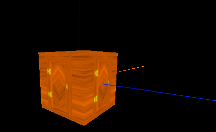
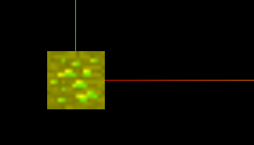
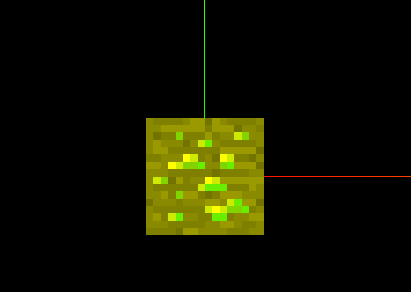
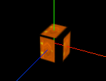
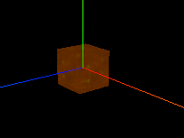
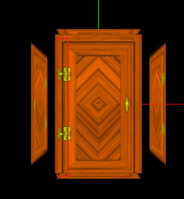

# 纹理的认识


```js
// 导入纹理
const textureLoader = new THREE.TextureLoader();
const doorColorTexture = textureLoader.load("./textures/door/color.jpg");


// 添加物体
const cubeGeometry = new THREE.BoxBufferGeometry(1, 1, 1);
// 材质
const basicMaterial = new THREE.MeshBasicMaterial({
  color: "#ffff00",
  map: doorColorTexture,
});
const cube = new THREE.Mesh(cubeGeometry, basicMaterial);
scene.add(cube);
```




## 纹理属性

```js
// 设置旋转的原点
doorColorTexture.center.set(0.5, 0.5);
// // 旋转45deg
doorColorTexture.rotation = Math.PI / 4;
// 设置纹理的重复
doorColorTexture.repeat.set(2, 3);
// // 设置纹理重复的模式
doorColorTexture.wrapS = THREE.MirroredRepeatWrapping;
doorColorTexture.wrapT = THREE.RepeatWrapping;
```


## 纹理算法

```js
// texture纹理显示设置
// texture.minFilter = THREE.NearestFilter;
// texture.magFilter = THREE.NearestFilter;
texture.minFilter = THREE.LinearFilter;
texture.magFilter = THREE.LinearFilter;
// 更优质的设置
texture.minFilter = THREE.NearestFilter;
texture.magFilter = THREE.NearestFilter;
```





优化后：




## 纹理透明

材质可以设置纹理透明，有两种方式

1. ```js
   const basicMaterial = new THREE.MeshBasicMaterial({
     color: "#ffff00",
     map: doorColorTexture,
     alphaMap: doorAplhaTexture,
     transparent: true,
   });
   ```

   

2. ```js
   const basicMaterial = new THREE.MeshBasicMaterial({
     color: "#ffff00",
     map: doorColorTexture,
     transparent: true,
     opacity: 0.3,
     side: THREE.DoubleSide, // 双面透明
   });
   ```

   


## 纹理遮挡

```js
const cubeGeometry = new THREE.BoxBufferGeometry(1, 1, 1);
const doorAoTexture = textureLoader.load(
  "./textures/door/ambientOcclusion.jpg"
); // 添加纹理图

const basicMaterial = new THREE.MeshBasicMaterial({
  color: "#ffff00",
  map: doorColorTexture,
  alphaMap: doorAplhaTexture,
  transparent: true,
  aoMap: doorAoTexture, // 纹理遮挡的两个属性
  aoMapIntensity: 1, // 纹理遮挡的两个属性
});

// 给物体添加第二组UV
// 给cube添加第二组uv
cubeGeometry.setAttribute(
  "uv2",
  new THREE.BufferAttribute(cubeGeometry.attributes.uv.array, 2)
);
```



## 完整代码

```js
import * as THREE from "three";
// 导入轨道控制器
import { OrbitControls } from "three/examples/jsm/controls/OrbitControls";
// 导入动画库
import gsap from "gsap";
// 导入dat.gui
import * as dat from "dat.gui";

// 目标：AO环境遮挡贴图

// 1、创建场景
const scene = new THREE.Scene();

// 2、创建相机
const camera = new THREE.PerspectiveCamera(
  75,
  window.innerWidth / window.innerHeight,
  0.1,
  1000
);

// 设置相机位置
camera.position.set(0, 0, 10);
scene.add(camera);

// 导入纹理
const textureLoader = new THREE.TextureLoader();
const doorColorTexture = textureLoader.load("./textures/door/color.jpg");
const doorAplhaTexture = textureLoader.load("./textures/door/alpha.jpg");
const doorAoTexture = textureLoader.load(
  "./textures/door/ambientOcclusion.jpg"
);

// 添加物体
const cubeGeometry = new THREE.BoxBufferGeometry(1, 1, 1);
// 材质
const basicMaterial = new THREE.MeshBasicMaterial({
  color: "#ffff00",
  map: doorColorTexture,
  alphaMap: doorAplhaTexture,
  transparent: true,
  aoMap: doorAoTexture,
  aoMapIntensity: 1,
  //   opacity: 0.3,
  //   side: THREE.DoubleSide,
});
basicMaterial.side = THREE.DoubleSide;
const cube = new THREE.Mesh(cubeGeometry, basicMaterial);
scene.add(cube);
// 给cube添加第二组uv
cubeGeometry.setAttribute(
  "uv2",
  new THREE.BufferAttribute(cubeGeometry.attributes.uv.array, 2)
);

// 添加平面
// const planeGeometry = new THREE.PlaneBufferGeometry(1, 1);
// const plane = new THREE.Mesh(planeGeometry, basicMaterial);
// plane.position.set(3, 0, 0);

// scene.add(plane);
// console.log(plane);
// 给平面设置第二组uv
// planeGeometry.setAttribute(
//   "uv2",
//   new THREE.BufferAttribute(planeGeometry.attributes.uv.array, 2)
// );

// 初始化渲染器
const renderer = new THREE.WebGLRenderer();
// 设置渲染的尺寸大小
renderer.setSize(window.innerWidth, window.innerHeight);
// console.log(renderer);
// 将webgl渲染的canvas内容添加到body
document.body.appendChild(renderer.domElement);

// // 使用渲染器，通过相机将场景渲染进来
// renderer.render(scene, camera);

// 创建轨道控制器
const controls = new OrbitControls(camera, renderer.domElement);
// 设置控制器阻尼，让控制器更有真实效果,必须在动画循环里调用.update()。
controls.enableDamping = true;

// 添加坐标轴辅助器
const axesHelper = new THREE.AxesHelper(5);
scene.add(axesHelper);
// 设置时钟
const clock = new THREE.Clock();

function render() {
  controls.update();
  renderer.render(scene, camera);
  //   渲染下一帧的时候就会调用render函数
  requestAnimationFrame(render);
}

render();

// 监听画面变化，更新渲染画面
window.addEventListener("resize", () => {
  //   console.log("画面变化了");
  // 更新摄像头
  camera.aspect = window.innerWidth / window.innerHeight;
  //   更新摄像机的投影矩阵
  camera.updateProjectionMatrix();

  //   更新渲染器
  renderer.setSize(window.innerWidth, window.innerHeight);
  //   设置渲染器的像素比
  renderer.setPixelRatio(window.devicePixelRatio);
});

```

