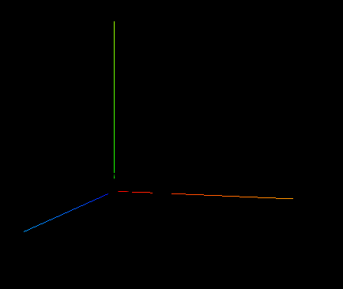
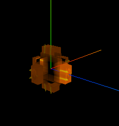
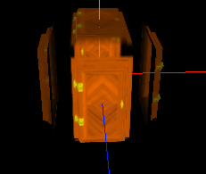

```js
const material = new THREE.MeshStandardMaterial({
  color: "#ffff00",
  map: doorColorTexture,
  alphaMap: doorAplhaTexture,
  transparent: true,
  aoMap: doorAoTexture,
  aoMapIntensity: 1,
  displacementMap: doorHeightTexture,
  displacementScale: 0.1,
  //   opacity: 0.3,
  //   side: THREE.DoubleSide,
});
```



这个材质没有灯光是看不清的


添加灯光

```js
// 灯光
// 环境光
const light = new THREE.AmbientLight(0xffffff, 0.5); // soft white light
scene.add(light);
//直线光源
const directionalLight = new THREE.DirectionalLight(0xffffff, 0.5);
directionalLight.position.set(0, 0, 10);
scene.add(directionalLight);
```


## 置换贴图

导入纹理

```js
//导入置换贴图
const doorHeightTexture = textureLoader.load("./textures/door/height.jpg");
```


置换

```
const material = new THREE.MeshStandardMaterial({
  color: "#ffff00",
  map: doorColorTexture,
  alphaMap: doorAplhaTexture,
  transparent: true,
  aoMap: doorAoTexture,
  aoMapIntensity: 1,
  displacementMap: doorHeightTexture,
});
```



添加缩比

```
const material = new THREE.MeshStandardMaterial({
  color: "#ffff00",
  map: doorColorTexture,
  alphaMap: doorAplhaTexture,
  transparent: true,
  aoMap: doorAoTexture,
  aoMapIntensity: 1,
  displacementMap: doorHeightTexture,
  displacementScale: 0.2,
});
```

