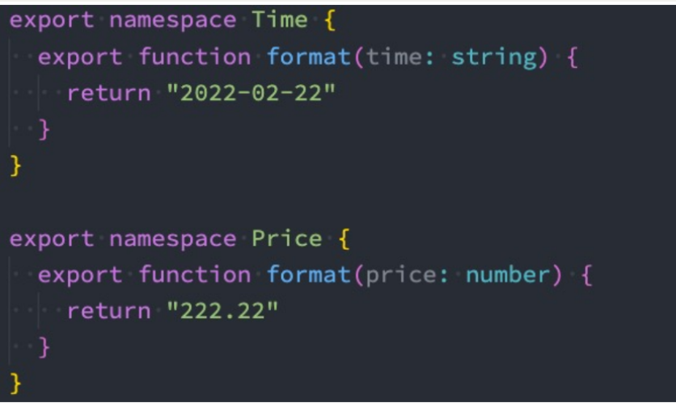

# TypeScript

## 概念

> 定义

TypeScript是加强版的JavaScript，

JavaScript所拥有的特性，TypeScript全部都是支持的，并且它紧随ECMAScript的标准，所以ES6、ES7、ES8等新语法标准，它都是 支持的

在语言层面上，不仅仅增加了类型约束，而且包括一些语法的扩展，比如枚举类型（Enum）、元组类型（Tuple）等

TypeScript最终会被编译成JavaScript代码，所以你并不需要担心它的兼容性问题，在编译时也不需要借助于Babel这样的工具


> 安装

```JS
# 安装命令
npm install typescript -g
# 查看版本
tsc --version
```


> 运行环境

- 方式一：通过webpack，配置本地的TypeScript编译环境和开启一个本地服务，可以直接运行在浏览器上；

  [ts的webpack搭建](https://mp.weixin.qq.com/s/wnL1l-ERjTDykWM76l4Ajw)

- 方式二：通过ts-node库，为TypeScript的运行提供执行环境；

  - ```JS
    // 安装ts-node
    npm install ts-node -g
    
    // 另外ts-node需要依赖 tslib 和 @types/node 两个包
    npm install tslib @types/node -g
    
    // 通过 ts-node 来运行TypeScript的代码
    ts-node math.ts
    ```


## 语法

###  变量的声明

```JS
var/let/const 标识符: 数据类型 = 赋值;
// 不建议使用 var
```


> 数组的声明

```JS
// 两种声明方式
const names1: Array<string> = [] // 不推荐(react jsx中是有冲突   <div></div>)
const names2: string[] = [] // 推荐

// 这两种声明方式限制了数组中的元素只能放置字符型
```

> 对象的声明

```js
const info:object = {
  name: "why",
  age: 18
}
// 但是不能直接用 . / [] 读取属性值
// info.age = 22 报错
// Property 'name' does not exist on type '{}'.
```

> any类型

无法确定一个变量的类型，并且可能它会发生一些变化，这个时候我们可以使用any类型

- 我们可以对any类型的变量进行任何的操作，包括获取不存在的属性、方法
- 我们给一个any类型的变量赋值任何的值，比如数字、字符串的值

```js
let message: any = "Hello World"

message = 123
message = true
message = {}
```


> unknown 类型

unknown是TypeScript中比较特殊的一种类型，它用于描述类型不确定的变量

```js
function foo() {
  return "abc"
}

function bar() {
  return 123
}

// unknown类型只能赋值给any和unknown类型
// any类型可以赋值给任意类型

let flag = true
let result: unknown // 最好不要使用any
if (flag) {
  result = foo()
} else {
  result = bar()
}

let message: string = result // 报错，无法赋值
let num: number = result // 报错，无法赋值

console.log(result)
```


> void类型

void通常用来指定一个函数是没有返回值的，那么它的返回值就是void类型

```js
function sum(num1: number, num2: number):void {
  console.log(num1 + num2)
}

sum(20, 30)
```


> never类型

never 表示永远不会发生值的类型

```js
function handleMessage(message: string | number | boolean) {
  switch (typeof message) {
    case 'string':
      console.log("string处理方式处理message")
      break
    case 'number':
      console.log("number处理方式处理message")
      break
    case 'boolean':
      console.log("boolean处理方式处理message")
      break
    default:
          // 永远不会发生的场景
      const check: never = message
  }
}
```


> tuple类型

数组中通常建议存放相同类型的元素，不同类型的元素是不推荐放在数组中。（可以放在对象或者元组中）

元组中每个元素都有自己特性的类型，根据索引值获取到的值可以确定对应的类型

```JS
const info: [string, number, number] = ["why", 18, 1.88]
```

### 函数

> 函数参数类型

声明函数时，可以在每个参数后添加类型注解，以声明函数接受的参数类型：

```js
function sum(num1: number, num2: number) {
  return num1 + num2
}
```

> 函数返回值类型

```js
function sum(num1: number, num2: number):number {
  return num1 + num2
}
// 通常情况可以不写返回值类型，因为会自动推导
```

> 匿名函数的参数

当一个函数出现在TypeScript可以确定该函数会被如何调用的地方时，**该函数的参数会自动指定类型；**

```js
const names = ["abc", "cba", "nba"]
// item根据上下文的环境推导出来的, 这个时候可以不添加的类型注解
// 上下文中的函数: 可以不添加类型注解
names.forEach(function(item) {
  console.log(item.split(""))
})
```

> 参数是对象

```js
function printPoint(point: {x: number, y: number}) {
  console.log(point.x);
  console.log(point.y)
}

printPoint({x: 123, y: 321})
```

## 类型

> 可选类型

对象类型也可以指定哪些属性是可选的，可以在属性的后面添加一个?：

**可选类型可以看做是 类型 和 undefined 的联合类型：**

```js
function printPoint(point: {x: number, y: number, z?: number}) {
  console.log(point.x)
  console.log(point.y)
  console.log(point.z)
}

printPoint({x: 123, y: 321}) // 不传 z 属性也行
printPoint({x: 123, y: 321, z: 111})
```

> 联合类型

就是参数类型是多种，或 的意思

```js
function printID(id: number|string|boolean) {
  // 使用联合类型的值时, 需要特别的小心
  // narrow: 缩小
  if (typeof id === 'string') {
    // TypeScript帮助确定id一定是string类型
    console.log(id.toUpperCase())
  } else {
    console.log(id)
  }
}

printID(123)
printID("abc")
```

> 类型别名

不想在多个函数中去反复定义参数类型，直接给一个类型别名

```js
type IDType = string | number | boolean
type PointType = {
  x: number
  y: number
  z?: number
}

function printId(id: IDType) {

}

function printPoint(point: PointType) {
  
}
```

> 断言

TypeScript无法获取具体的类型信息，这个我们需要使用类型断言。

**TypeScript只允许类型断言转换为 更具体 或者 不太具体 的类型版本，此规则可防止不可能的强制转换**

比如我们通过 document.getElementById，TypeScript只知道该函数会返回 HTMLElement ，但并不知道它 具体的类型：

```js
const el = document.getElementById("why") as HTMLImageElement
```

> 非空类型

非空断言使用的是 ! ，表示可以确定某个标识符是有值的，跳过ts在编译阶段对它的检测

```tsx
// message? -> undefined | string
function printMessageLength(message?: string) {
  console.log(message!.length)
}

printMessageLength()
printMessageLength("hello world")
```

> 可选链

可选链使用可选链操作符 ?.    它的作用是当对象的属性不存在时，会短路，直接返回undefined，如果存在，那么才会继续执行；

```ts
type Person = {
  name: string
  friend?: {
    name: string
    age?: number,
    girlFriend?: {
      name: string
    }
  }
}

const info: Person = {
  name: "why",
  friend: {
    name: "kobe",
    girlFriend: {
      name: "lily"
    }
  }
}

console.log(info.friend?.age) // 有friend属性才会继续执行，没有就是undefined
console.log(info.friend?.girlFriend?.name)
```

> ??和!!

空值合并操作符（??）是一个逻辑操作符，当操作符的左侧是 null 或者 undefined 时，返回其右侧操作数， 否则返回左侧操作数

```tsx
let message: string|null = "Hello World"

const content = message ?? "你好啊, 李银河"
```

!! 就是两次取反，直接返回Boolean值

> 字面量类型

显示的使用字面量类型，将一个类型变成“字面量类型”

```tsx
// "Hello World"也是可以作为类型的, 叫做字面量类型
let message: "Hello World" = "Hello World"
message = '1' // 不能将类型“"1"”分配给类型“"Hello World"”。
```

> 类型缩小

函数参数类型有多种，我们不能用统一的方式去处理参数，这个时候就需要缩小参数类型；有以下几种方式缩小

- typeof 
- 平等缩小（比如===、!==）
- instanceof 
- in

> 函数类型

可以直接定义一个函数类型的表达式来表示函数类型

```tsx
type FooFnType = () => void
// 这个函数类型就是没有参数，如果一个函数有参数，那么定义函数类型的时候不可以省略参数                              
```

> this类型

对于this的隐式调用来说，this的指向可能会出问题

```tsx
function eating() {
  console.log(this.name);
}

const info = {
  name: "why",
  eating: eating,
};

// 隐式绑定
info.eating();
// 编译报错，因为这个eating方法可能独立调用，可能其他方式调用，会导致这个this是不稳定的
```

所以需要指定this的类型

- 显示调用 call，apply
- 参数显示定义this的类型

```ts
type ThisType = { name: string };

function eating(this: ThisType, message: string) {
  console.log(this.name + " eating", message);
}

info.eating('sss');
// 显示绑定
eating.call({name: "kobe"}, "呵呵呵")
```

> 函数的重载

在TypeScript中，我们可以去编写不同的重载签名（overload signatures）来表示函数可以以不同的方式进行 调用；意思就是我们给一个函数写多个副本，只写一个函数体

```tsx
function add(a1: number | string, a2: number | string) {
  return a1 + a2; // 报错，不允许number与string相加
}
```

上面这种问题就需要函数重载，这个时候的重载方式有两种：

```tsx
// 1：联合类型的判断
function add(a1: number | string, a2: number | string) {
  if (typeof a1 === "number" && typeof a2 === "number") {
    return a1 + a2
  } else if (typeof a1 === "string" && typeof a2 === "string") {
    return a1 + a2
  }
}
```

```ts
// 2：函数重载
function add(num1: number, num2: number): number; // 没函数体
function add(num1: string, num2: string): string;

function add(num1: any, num2: any): any {
  return num1 + num2
}

const result = add(20, 30)
const result2 = add("abc", "cba")
```

## 类

一般的概念与js中的类差不多，下面只说一些我不熟悉的：

- 一般来说类有三个成员：类的成员，类的构造函数，类的方法

  ```tsx
  class Person {
    name: string='222'
    age: number=111
  
    constructor(name: string, age: number) {
      this.name = name
      this.age = age
    }
  
    eating() {
      console.log(this.name + " eating")
    }
  }
  
  const p = new Person("why", 18)
  ```

- 类的成员有三种修饰符，public、private、protected

  ```ts
  class Person {
    private name: string = ""
    protected age: number
    getName() {
      return this.name
    }
  }
  ```

- 类的成员可以设置只读属性readonly

  ```tsx
  class Person {
    // 1.只读属性是可以在构造器中赋值, 赋值之后就不可以修改
    // 2.属性本身不能进行修改, 但是如果它是对象类型, 对象中的属性是可以修改
    readonly name: string
    age?: number
    readonly friend?: Person
    constructor(name: string, friend?: Person) {
      this.name = name
      this.friend = friend
    }
  }
  ```

- 多态

  ```tsx
  class Animal {
    action() {
      console.log("animal action")
    }
  }
  
  class Dog extends Animal {
    action() {
      console.log("dog running!!!")
    }
  }
  
  class Fish extends Animal {
    action() {
      console.log("fish swimming")
    }
  }
  
  // animal: dog/fish
  // 多态的目的是为了写出更加具备通用性的代码
  function makeActions(animals: Animal[]) {
    animals.forEach(animal => {
      animal.action()
    })
  }
  
  makeActions([new Dog(), new Fish()])
  ```

- 类的类型

  ```tsx
  class Person {
    name: string = "123"
    eating() {
  
    }
  }
  
  const p = new Person()
  
  const p1: Person = {
    name: "why",
    eating() {
  
    }
  }
  ```

## 接口

接口的作用就是对类型命名和代码进行类型检查

接口通过interface关键字来声明

```tsx
// 接口定义对象
interface IInfoType {
  readonly name: string
  age: number
  friend?: {
    name: string
  }
}

// 接口定义索引类型
interface ILanguageYear {
  [name: string]: number
}
const languageYear: ILanguageYear = {
  "C": 1972,
  "Java": 1995,
  "JavaScript": 1996,
  "TypeScript": 2014
}

// 接口定义函数类型
interface CalcFn {
  (n1: number, n2: number): number
}

function calc(num1: number, num2: number, calcFn: CalcFn) {
  return calcFn(num1, num2)
}
```

接口是可以继承的

```tsx
interface ISwim {
  swimming: () => void
}

interface IFly {
  flying: () => void
}


interface IAction extends ISwim, IFly {

}

const action: IAction = {
  swimming() {

  },
  flying() {
    
  }
}
```

接口的实现

```tsx
interface ISwim {
  swimming: () => void
}

interface IEat {
  eating: () => void
}

// 类实现接口
class Animal {
  
}

// 继承: 只能实现单继承
// 实现: 实现接口, 类可以实现多个接口
class Fish extends Animal implements ISwim, IEat {
  swimming() {
    console.log("Fish Swmming")
  }

  eating() {
    console.log("Fish Eating")
  }
}
```

## 泛型

泛型的作用就是将函数实参的类型赋给函数形参，这样就不用显示的定义函数参数类型降低重用性

两种调用方式：

- 通过 <类型> 的方式将类型传递给函数、
- 通过类型推到，自动推到出我们传入变量的类型

```ts
// 在定义这个函数时, 我不决定这些参数的类型
// 而是让调用者以参数的形式告知,我这里的函数参数应该是什么类型
function sum<Type>(num: Type): Type {
  return num
}

// 1.调用方式一: 明确的传入类型
sum<number>(20)
sum<{name: string}>({name: "why"})
sum<any[]>(["abc"])

// 2.调用方式二: 类型推到
sum(50)
sum("abc")
```

> 泛型接口

```tsx
interface IPerson<T1 = string, T2 = number> {
  name: T1
  age: T2
}

const p: IPerson = {
  name: "why",
  age: 18
}
```

> 泛型类

```tsx
class Point<T> {
  x: T
  y: T
  z: T

  constructor(x: T, y: T, z: T) {
    this.x = x
    this.y = y
    this.z = y
  }
}

const p1 = new Point("1.33.2", "2.22.3", "4.22.1")
```

> 泛型约束

有的时候我们函数执行体中有一些属性是参数不具有的，这个时候我们要做的是给参数做一个泛型约束

```tsx
interface ILength {
  length: number
}
// 这里用泛型去继承接口形成泛型约束
function getLength<T extends ILength>(arg: T) {
  return arg.length
}

getLength("abc")
getLength(["abc", "cba"])
```

> 模块化开发  namespace

命名空间在TypeScript早期时，称之为内部模块，主要目的是将一个模块内部再进行作用域的划分，防止一些命名 冲突的问题。



