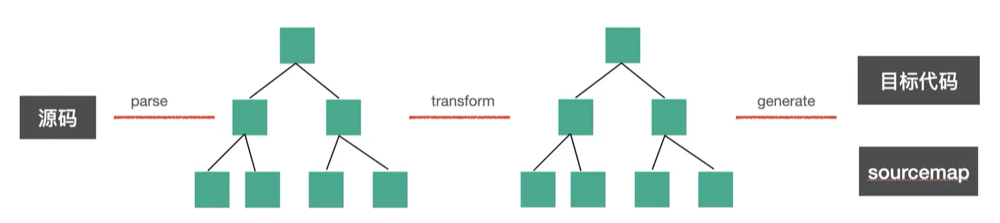
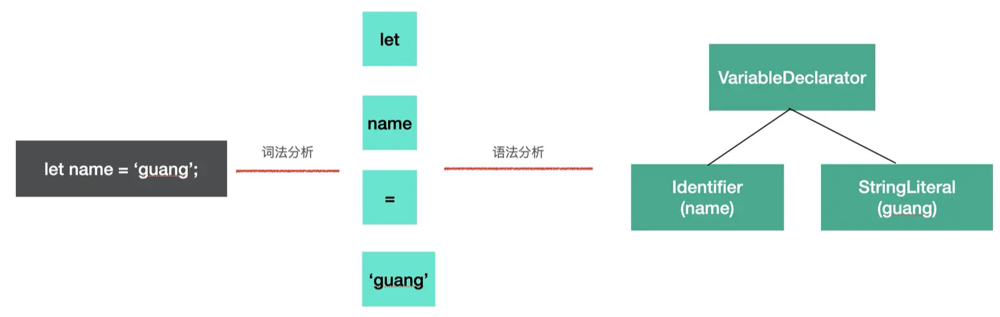
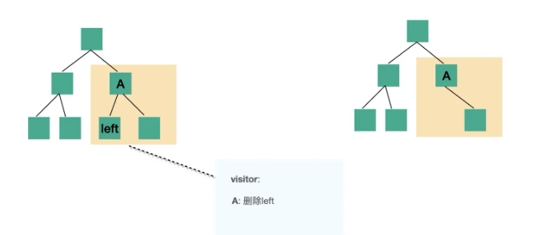

# babel介绍和编译流程

## 介绍

`babel` 最开始叫 `6to5`，顾名思义是 `es6` 转 `es5`，但是后来随着 `es` 标准的演进，有了 `es7`、`es8` 等， `6to5` 的名字已经不合适了，所以改名为了 `babel`。

### babel用途

1. 转译 `esnext`、`typescript`、`flow` 等到目标环境支持的 `js`

   - **把代码中的 `esnext` 的新语法、`typescript` 和 `flow` 的语法转成基于目标环境支持的语法的实现**。并且根部不同环境进行 `polyfill`。

   - `babel7` 提供了 `@babel/preset-env` 的包，可以指定目标 `env` 来按需转换，转换更加的精准，产物更小。

2. 一些特定用途的代码转换

   `babel` 是一个转译器，暴露了很多 `api`，用这些 `api` 可以完成代码到 `AST` 的解析、转换、以及目标代码的生成。

   开发者可以用它来来完成一些特定用途的转换，比如函数插桩（函数中自动插入一些代码，例如埋点代码）、自动国际化等。

3. 代码的静态分析

   - 对代码进行 `parse` 之后，会生成 `AST`，通过 `AST` 能够理解代码结构，除了转换 `AST` 再打印成目标代码之外，也同样可以用于分析代码的信息，进行一些静态检查。
   - - `linter` 工具就是分析 `AST` 的结构，对代码规范进行检查。
     - **`api` 文档自动生成工具，可以提取源码中的注释，然后生成文档。**
     - `js` 解释器，除了对 `AST` 进行各种信息的提取和检查以外，我们还可以直接解释执行 `AST`。

## 编译流程

编译器：编译的定义就是从一种编程语言转成另一种编程语言。主要指的是高级语言到低级语言。

转译器：**转译的定义就是从高级语言到高级语言的转换工具**

> 高级语言：有很多用于描述逻辑的语言特性，比如分支、循环、函数、面向对象等，接近人的思维，可以让开发者快速的通过它来表达各种逻辑。比如 `c++`、`javascript`。

> 低级语言：与硬件和执行细节有关，会操作寄存器、内存，具体做内存与寄存器之间的复制，需要开发者理解熟悉计算机的工作原理，熟悉具体的执行细节。比如汇编语言、机器语言。

babel就是一个转译器

### babel的转译器的编译流程

babel 是 source to source 的转换，整体编译流程分为三步：

1. `parse`：通过 `parser` 把源码转成抽象语法树（`AST`）
2. `transform`：遍历 `AST`，调用各种 `transform` 插件对 `AST` 进行增删改
3. `generate`：把转换后的 `AST` 打印成目标代码，并生成 `sourcemap`

### parse

`parse` 阶段的目的是把源码字符串转换成机器能够理解的 `AST`，这个过程分为词法分析、语法分析。

**词法分析：**比如 `let name = 'guang';` 这样一段源码，我们要先把它分成一个个不能细分的单词（**token**），也就是 `let`, `name`, `=`, `'guang'`，这个过程是词法分析

**语法分析**：把 `token` 进行递归的组装，生成 `AST`，这个过程是语法分析。

### transform

transform 阶段是对 parse 生成的 `AST` 的处理

- 进行 `AST` 的遍历
- 遍历的过程中**处理到不同的 `AST` 节点会调用注册的相应的 visitor 函数**
- `visitor` 函数里可以对 `AST` 节点进行增删改，返回新的 `AST`

### generate

`generate` 阶段会把 `AST` 打印成目标代码字符串，并且会生成 `sourcemap`。

- `sourcemap` 记录了源码到目标代码的转换关系，通过它我们可以找到目标代码中每一个节点对应的源码位置，用于调试的时候把编译后的代码映射回源码，或者线上报错的时候把报错位置映射到源码。