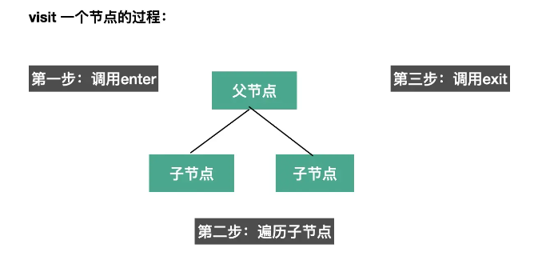
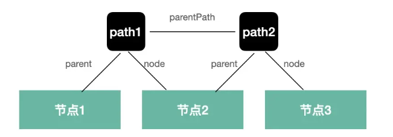
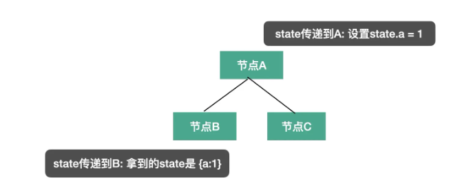

# babel的API

我们知道 babel 的编译流程分为三步：parse、transform、generate，每一步都暴露了一些 api 出来。

- parse 阶段有`@babel/parser`，功能是把源码转成 AST
- transform 阶段有 `@babel/traverse`，可以遍历 AST，并调用 visitor 函数修改 AST
  - 修改 AST 自然涉及到 AST 的判断、创建、修改等，这时候就需要 `@babel/types` 了
  - 需要批量创建 AST 的时候可以使用 `@babel/template` 来简化 AST 创建逻辑。

- generate 阶段会把 AST 打印为目标代码字符串，同时生成 sourcemap，需要 `@babel/generator` 包

- 中途遇到错误想打印代码位置的时候，使用 `@babel/code-frame` 包

- babel 的整体功能通过 `@babel/core` 提供，基于上面的包完成 babel 整体的编译流程，并应用 plugin 和 preset


## @babel/parser

`babel parser` 默认只能 `parse js` 代码，`jsx`、`flow`、`typescript` 这些非标准的语法的解析需要指定语法插件。

**它提供了有两个 `api：parse` 和 `parseExpression`。两者都是把源码转成 `AST`，粒度不同。**

- `parse` 返回的 `AST` 根节点是 `File`（整个 `AST`）
- `parseExpression` 返回的 `AST` 根节点是是 `Expression`（表达式的 `AST`）


**parse 的内容是什么：**

- `plugins`： 指定`jsx`、`typescript`、`flow` 等插件来解析对应的语法
- `allowXxx`： 指定一些语法是否允许，比如函数外的 `await`、没声明的 `export`等
- `sourceType`：指定是否支持解析模块语法，有 `module`、`script`、`unambiguous` 3个取值：
  - `module`：解析 `es module` 语法
  - `script`：不解析 `es module` 语法
  - `unambiguous`：根据内容是否有 `import` 和 `export` 来自动设置 `module` 还是 `script`

一般我们会指定 `sourceType` 为 `unambiguous`。

```js
const  parser = require('@babel/parser');

const ast = parser.parse("代码", {
    sourceType: 'unambiguous',
    plugins: ['jsx']
});
```


## @babel/traverse

parse 出的 AST 由 `@babel/traverse` 来遍历和修改，babel traverse 包提供了 traverse 方法：

```js
function traverse(parent, opts)
```

`parent` 指定要遍历的 `AST` 节点，`opts` 指定 `visitor` 函数。`babel` 会在遍历 `parent` 对应的 AST 时调用相应的 `visitor` 函数。

#### 遍历过程

**`visitor` 是指定对什么 `AST` 做什么处理的函数，`babel` 会在遍历到对应的 `AST` 时回调它们**

可以指定刚开始遍历（enter）和遍历结束后（exit）两个阶段的回调函数，

```js
traverse(ast, {
  FunctionDeclaration: { // 对于函数申明AST节点
      enter(path, state) {}, // 进入节点时调用
      exit(path, state) {} // 离开节点时调用
  }
})
```

如果只指定了一个函数，那就是 enter 阶段会调用的：

```js
traverse(ast, {
  FunctionDeclaration(path, state) {} // 进入节点时调用
})
```



而且同一个 visitor 函数可以用于多个 AST 节点的处理，方式是指定一系列 AST，用 | 连接：

```js
// 进入 FunctionDeclaration 和 VariableDeclaration 节点时调用
traverse(ast, {
  'FunctionDeclaration|VariableDeclaration'(path, state) {}
})
```

**AST 还有别名的**，比如各种 `XxxStatement` 有个 `Statement` 的别名，各种 `XxxDeclaration` 有个 `Declaration` 的别名，那自然可以通过别名来指定对这些 AST 的处理：

```js
// 通过别名指定离开各种 Declaration 节点时调用
traverse(ast, {
  Declaration: {
      exit(path, state) {}
  }
})
```


#### path

AST 是棵树，遍历过程中肯定是有个路径的，path 就记录了这个路径：



- path1 就关联了节点 1 和 节点 2，记录了节点 1 是父节点，节点 2 是子节点。
- path2 关联了节点 2 和节点 3，记录了节点 2 是父节点，节点 3 是子节点。
-  path1 和 path2 还有父子关系。


##### path的属性和方法

- path.node 指向当前 AST 节点
- path.parent 指向父级 AST 节点
- path.getSibling、path.getNextSibling、path.getPrevSibling 获取兄弟节点
- path.find 从当前节点向上查找节点
- path.get、path.set 获取 / 设置属性的 path
- path.scope 获取当前节点的作用域信息
- path.isXxx 判断当前节点是不是 xx 类型
- path.assertXxx 判断当前节点是不是 xx 类型，不是则抛出异常
- path.insertBefore、path.insertAfter 插入节点
- path.replaceWith、path.replaceWithMultiple、replaceWithSourceString 替换节点
- path.remove 删除节点
- path.skip 跳过当前节点的子节点的遍历
- path.stop 结束后续遍历


#### state

**第二个参数 state 则是遍历过程中在不同节点之间传递数据的机制**，插件会通过 state 传递 options 和 file 信息，我们也可以通过 state 存储一些遍历过程中的共享数据。




## @babel/types

遍历 AST 的过程中需要**创建一些 AST 和判断 AST 的类型**，这时候就需要 `@babel/types` 包。

- 创建IfStatement

  ```javascript
  t.ifStatement(test, consequent, alternate);
  ```

- 判断节点是否是 IfStatement 就可以调用 isIfStatement 或者 assertIfStatement

  ```javascript
  t.isIfStatement(node, opts);
  t.assertIfStatement(node, opts);
  ```

- opts 可以指定一些属性是什么值，增加更多限制条件，做更精确的判断。

  ```
  t.isIdentifier(node, { name: "paths" })
  ```


isXxx 和 assertXxx 看起来很像，但是功能不大一样：isXxx 会返回 boolean，而 assertXxx 则会在类型不一致时抛异常。


## @babel/template

通过 @babel/types 创建 AST 还是比较麻烦的，要一个个的创建然后组装，如果 AST 节点比较多的话需要写很多代码，这时候就可以使用 **`@babel/template` 包来批量创建。**

这个包有这些 api：

都是传入一段字符串，返回创建好的 AST，区别只是返回的 AST 粒度不大一样：

```js
const ast = template(code, [opts])(args);
const ast = template.ast(code, [opts]);
const ast = template.program(code, [opts]);
```

- template.ast 返回的是整个 AST。
- template.program 返回的是 Program 根节点。
- template.expression 返回创建的 expression 的 AST。
- template.statements 返回创建的 statems 数组的 AST。


## @babel/generator

AST 转换完之后就要打印成目标代码字符串，通过 `@babel/generator` 包的 generate api

```js
function (ast: Object, opts: Object, code: string): {code, map} 
```

- 第一个参数是要打印的 AST。

- 第二个参数是 options，指定打印的一些细节，比如通过 comments 指定是否包含注释，通过 minified 指定是否包含空白字符。

- 第三个参数当多个文件合并打印的时候需要用到，这部分直接看[文档](https://link.juejin.cn/?target=https%3A%2F%2Fbabeljs.io%2Fdocs%2Fen%2Fbabel-generator)即可，基本用不到。

`options` 中常用的是 `sourceMaps`，开启了这个选项才会生成 `sourcemap`。

```js
import generate from "@babel/generator";

const { code, map } = generate(ast, { sourceMaps: true })
```


## @babel/code-frame

babel 的报错一半都会直接打印错误位置的代码，而且还能高亮，

我们打印错误信息的时候也可以用，就是 `@babel/code-frame` 这个包。

```js
const result = codeFrameColumns(rawLines, location, {
  /* options */
});
```

options 可以设置 highlighted （是否高亮）、message（展示啥错误信息）。

```js
const { codeFrameColumns } = require("@babel/code-frame");

try {
 throw new Error("xxx 错误");
} catch (err) {
  console.error(codeFrameColumns(`const name = guang`, {
      start: { line: 1, column: 14 }
  }, {
    highlightCode: true,
    message: err.message
  }));
}
```


## @babel/core

前面讲了 @babel/parser、@babel/traverse、@babel/generaotr、@babel/types、@babel/template 等包，babel 的功能就是通过这些包来实现的。

babel 基于这些包来实现编译、插件、预设等功能的包就是 @babel/core。

**这个包的功能就是完成整个编译流程，从源码到目标代码，生成 sourcemap。实现 plugin 和 preset 的调用。**

api 也有好几个：

```js
transformSync(code, options); // => { code, map, ast }

transformFileSync(filename, options); // => { code, map, ast }

transformFromAstSync(
  parsedAst,
  sourceCode,
  options
); // => { code, map, ast }
```

比如这三个 transformXxx 的 api 分别是从源代码、源代码文件、源代码 AST 开始处理，最终生成目标代码和 sourcemap。

options 主要配置 plugins 和 presets，指定具体要做什么转换。

这些 api 也同样提供了异步的版本，异步地进行编译，返回一个 promise

```js
transformAsync("code();", options).then(result => {})
transformFileAsync("filename.js", options).then(result => {})
transformFromAstAsync(parsedAst, sourceCode, options).then(result => {})
```

