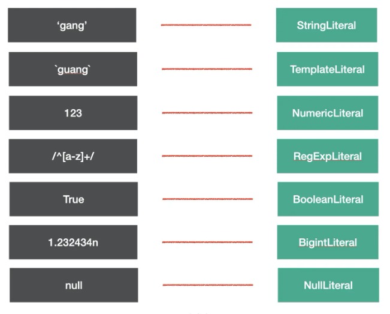
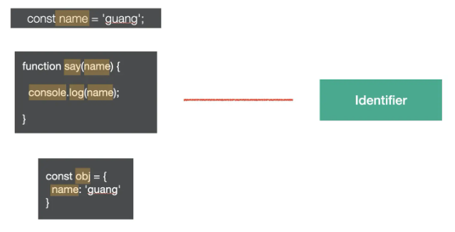
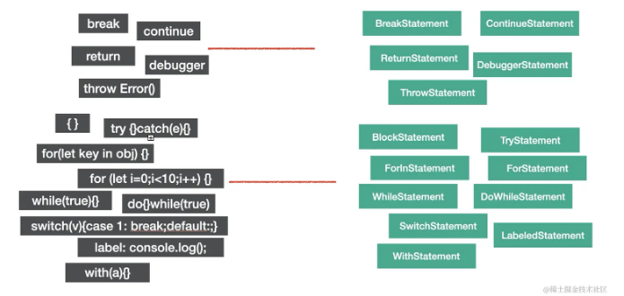
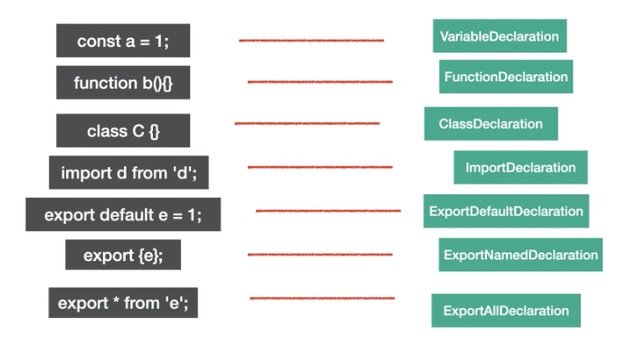
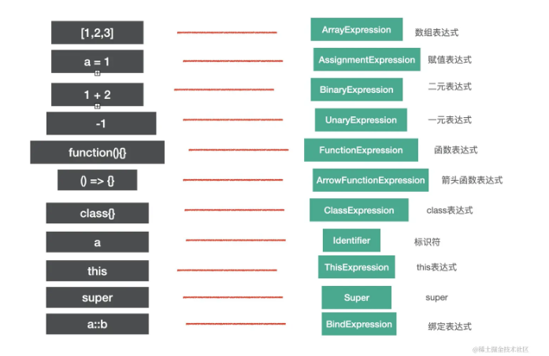
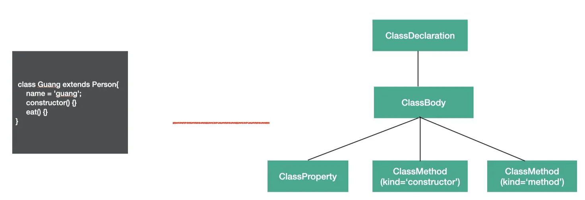
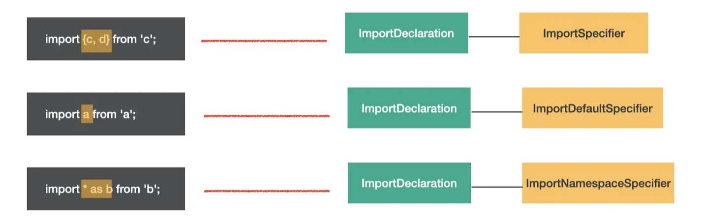
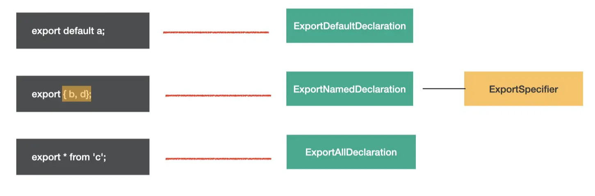
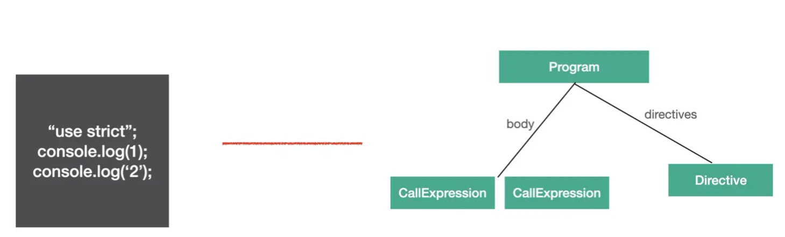
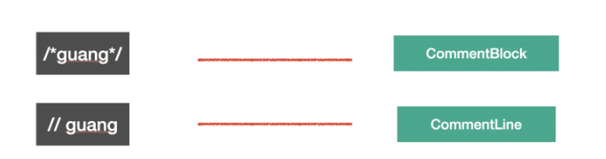

# babel的AST

babel 编译的第一步是把源码 parse 成抽象语法树 AST


## AST节点

AST 是对源码的抽象，字面量、标识符、表达式、语句、模块语法、class 语法都有各自的 AST。

### Literal

Literal 是字面量的意思，比如 `let name = 'guang'`中，`'guang'`就是一个字符串字面量 `StringLiteral`，相应的还有数字字面量 `NumericLiteral`，布尔字面量 `BooleanLiteral`，字符串字面量 `StringLiteral`，正则表达式字面量 `RegExpLiteral` 等。




### Identifier

`Identifer` 是标识符的意思，**变量名、属性名、参数名等各种声明和引用的名字**，都是`Identifer`。




### Statement

**statement 是语句，它是可以独立执行的单位**，比如 break、continue、debugger、return 或者 if 语句、while 语句、for 语句，还有声明语句，表达式语句等。我们写的每一条可以独立执行的代码都是语句。

```js
break;
continue;
return;
debugger;
throw Error();
{}
try {} catch(e) {} finally{}
for (let key in obj) {}
for (let i = 0;i < 10;i ++) {}
while (true) {}
do {} while (true)
switch (v){case 1: break;default:;}
label: console.log();
with (a){}
```




### Declaration

声明语句是一种特殊的语句，它执行的逻辑是在作用域内声明一个变量、函数、class、import、export 等。

```js
const a = 1;
function b(){}
class C {}

import d from 'e';

export default e = 1;
export {e};
export * from 'e';

```




### Expression

**expression 是表达式，特点是执行完以后有返回值**，这是和语句 (statement) 的区别。

```js
[1,2,3]
a = 1
1 + 2;
-1;
function(){};
() => {};
class{};
a;
this;
super;
a::b;

```




**我们判断 AST 节点是不是某种类型要看它是不是符合该种类型的特点**，比如语句的特点是能够单独执行，表达式的特点是有返回值。

 identifier、super 有返回值，符合表达式的特点，所以也是 expression


- 有的表达式可以单独执行，符合语句的特点，所以也是语句，比如赋值表达式、数组表达式等。

  ```js
  a=1;
  [1,2,3];
  
  ```

- 但有的表达式不能单独执行，需要和其他类型的节点组合在一起构成语句。

  ```js
  a = function() {}
  b = class{}
  
  ```

  

### Class

整个 class 的内容是 ClassBody，属性是 ClassProperty，方法是ClassMethod（通过 kind 属性来区分是 constructor 还是 method）。

```js
class Guang extends Person{
    name = 'guang';
    constructor() {}
    eat() {}
}
```




### Modules

es module 是语法级别的模块规范，所以也有专门的 AST 节点。

#### import

- named import：

  ```js
  import {c, d} from 'c';
  ```

- default import：

  ```js
  import a from 'a';
  ```

- namespaced import:

  ```js
  import * as b from 'b';
  ```

这 3 种语法都对应 `ImportDeclaration` 节点，但是 `specifiers` 属性不同，分别对应 `ImportSpicifier`、`ImportDefaultSpecifier`、`ImportNamespaceSpcifier`。




图中黄框标出的就是 `specifier` 部分。可以直观的看出整体结构相同，只是 `specifier` 部分不同，所以 **`import` 语法的 AST 的结构是 `ImportDeclaration` 包含着各种 `import specifier`**。


#### export

- named export：

  ```js
  export { b, d};
  ```

- default export：

  ```js
  export default a;
  ```

- all export：

  ```js
  export * from 'c';
  ```

分别对应 `ExportNamedDeclaration`、`ExportDefaultDeclaration`、`ExportAllDeclaration` 的 `AST`。



### Program &Directive

program 是代表整个程序的节点，它有 `body` 属性代表程序体，存放 `statement` 数组，就是具体执行的语句的集合。还有 `directives` 属性，存放 `Directive` 节点，比如`"use strict"` 这种指令会使用 `Directive` 节点表示。



Program 是包裹具体执行语句的节点，而 Directive 则是代码中的指令部分。


### File & Comment

babel 的 AST 最外层节点是 File，它有 program、comments、tokens 等属性，分别存放 Program 程序体、注释、token 等，是最外层节点。

注释分为块注释和行内注释，对应 CommentBlock 和 CommentLine 节点。




## AST的公共属性

- `type`： AST 节点的类型
- `start、end、loc`：start 和 end 代表该节点在源码中的开始和结束下标。而 loc 属性是一个对象，有 line 和 column 属性分别记录开始和结束的行列号。
- `leadingComments、innerComments、trailingComments`： 表示开始的注释、中间的注释、结尾的注释，每个 AST 节点中都可能存在注释，而且可能在开始、中间、结束这三种位置，想拿到某个 AST 的注释就通过这三个属性。


## AST可视化工具

https://link.juejin.cn/?target=https%3A%2F%2Fastexplorer.net%2F