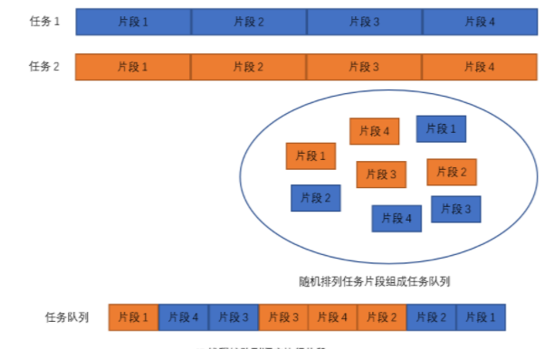

# 语法

## 知识点补充

### 1：JS引擎

**问题：**

我们知到JS引擎是单线程的，但是在写代码的过程中会发现同一时刻可以有多个动作发生；比如动画，上一个动画还没结束，下一个动画就已经开始了；这是为什么呢？

**答案：**

这与JS引擎中的轮转时间片有关；**轮转时间片就是短时间之内轮流执行多个任务的片段，模拟多线程**


#### 轮转时间片的工作方式

1. 多个任务存在
2. 切分多个任务
3. 随机排列这些任务片段，组成队列；
4. 按照这个队列顺序将任务片段送进JS进程；
5. JS线程执行一个又一个的任务片段。

所以JS单线程是没问题的，在上面的那个问题中显然js引擎执行代码的时间很快很快，所以我们是看不出来停顿的




### 2：堆与栈

**栈内存**

- 原始值存储在栈内存中
- 原始值通过变量名，在栈内存中获取值
- 每声明一个原始值，就在栈内存中开辟一块新的空间用来存放原始值


**堆内存**

- 引用值存储在堆内存中
- 引用值的地址存储在栈内存中
- 引用值通过变量名获取到地址，进而访问到引用值
- 把一个引用值赋值给另一个变量，本质是把该引用值在堆内存的地址赋值给该变量
- 引用值修改后，指向该引用值地址的变量都会修改

**注意：**

```js
var a = 1;
var b = a;
a = 3
```

**变量 a 的重新赋值，是在另一块栈内存中赋值，并不是在原先分配的那块内存地址上赋值**；

**这种机制可能是因为内存的修改机制消耗比较大，所以重新去分配反而是更好的选择，而不是在原有的内存地址上重新赋值**


### 3：编程语言与脚本语言

**编程语言**：

- 编译型：源码 -> 编译器 -> 机器语言 -> 可执行的文件
- 解释型：源码 -> 解释器 -> 解释一行就执行一行，不需要根据不同的系统平台进行移植

**脚本语言**：

客户端脚本语言：`JavaScript`

服务端脚本语言：`php`

脚本语言 -> 脚本引擎 -> 解释器


## 忽视的JS知识

### 运算符

#### 1：比较运算符

`>、<、==、===、!=、!==`：返回值为**布尔值**

- 如果操作数都是数值，则执行数值比较。
- 如果操作数都是字符串，则逐个比较字符串中对应字符的编码。
- 如果有任一操作数是数值，则将另一个操作数转换为数值，执行数值比较。
- 如果有任一操作数是布尔值，则将其转换为数值再执行比较。

字符串的比较是一位一位比较的

```js
1 == '1' // true
'4.5' > '11' // true
bool = true > 0 // true
// NaN与包括自己在内任何东西都不相等
NAN != NAN //TRUE
```

#### 2：逻辑操作符

**返回的不是布尔值**

```js
var a = 	
        true && 1;          // 1
        '123' && false;     // false
        undefined && 'str'; // undefined
        'str' && NaN;       // NaN
        '' && null;         // ''
        0 && 5;   
```

**逻辑非操作符始终返回布尔值**

> 无论应用到的是什么数据类型。
> 逻辑非操作符首先将操作符转换为布尔值，然后再对其取反。
> `!!(value) === Boolean(value)`

------


### 类型转换

#### 显示类型转换

**Number()**

- 布尔值：true转换为1，false转换为0。
- 数值：直接返回。
- null：返回0。
- undefined：返回NaN。
- 字符串
  - 如果是数字字符串，直接转成十进制
  - 空字符，转成0
  - 16进制格式的字符串，转成10进制对应的数值
  - 其他全部都是NAN

**parseInt(string, radix)**

- 将一个字符串转换为整数，

- 字符串最前面的空格会被忽略，**从第一个非空格字符开始转换。**

- **如果第一个字符不是数值字符、加号或减号**，parseInt()立即返回NaN。（空字符串返回NaN）。

- 如果第一个字符是数值字符、加号或减号，则继续依次检测每个字符，直到字符串末尾，或碰到非数值字符。

```js
console.log(parseInt('12.3'));    // 12
console.log(parseInt('123str'));  // 123
console.log(parseInt('str123'));  // NaN
console.log(parseInt(null));      // NaN
console.log(parseInt(undefined)); // NaN
console.log(parseInt(true));      // NaN
console.log(parseInt('a', 16));   // 10
console.log(parseInt('')); 		  // NaN
```

**parseFloat(string)**

- 将一个字符串转换为浮点数（只解析十进制值）

- 从位置0开始检测每个字符。

- 解析到字符串末尾或者解析到一个无效的浮点数值字符为止。

- 第一次出现的小数点是有效的，但第二次出现的小数点就无效了，此时字符串的剩余字符都会被忽略。

- **它始终忽略字符串开头的零。**

- **十六进制数值始终会返回0。**

  ```JS
  parseFloat('1234bb'); // 1234
  parseFloat('01.3A'); // 1.3
  parseFloat('22.5'); // 22.5
  parseFloat('22.34.5'); // 22.34
  parseFloat('0908.5'); // 908.5
  ```

**Boolean()**

null、undefined、0、''、 NaN、false都为假


#### 隐式类型转换

------

**`++、--、+（一元加）、-（一元减）、\* 、/、%`**

如果有不是数值的操作数，则会隐式调用Number()函数将其转换为数值

```JS
var a = '123';
// Number(a)
a++;
console.log(a); // 124

var b = '3' * 2;
console.log(b); // 6
```

**比较运算符**

```JS
// undefined、null 即不等于0，也不大于0，小于0
null == undefined //TRUE
null !== undefined // TRUE
```

**isNaN(value)**

把一个值传入isNaN()后，会隐式调用Number()函数尝试把它转换为数值。任何不能转换为数值的值都会导致这个函数返回true。

```JS
console.log(isNaN(NaN));       // true
console.log(isNaN(undefined)); // true
console.log(isNaN(null));      // false
console.log(isNaN(37));        // false
console.log(isNaN('37'));      // false
console.log(isNaN(false));     // false
console.log(isNaN('abc'));     // true
```


## 变量

> 变量就是存储数据的容器

### 1：命名规则

- 不能以数字开头
- 以字母、$、_开头
- 不能使用关键字、保留字
- 语义化、结构化命名
- 小驼峰命名法

### 2：变量类型

**原始值**

```
Number
String
undefined
null
Boolean
Symbol(常用于作为对象属性的标识符)
BigInt(可以表示任意大的整数)
```

**引用值**

```
Object
Array
function
Date
RehExp
```


## 循坏

### for

```js
for (initialization; condition; final-expression) {
  statement;
}
```

- `initialization`（可选的）

  一个表达式（包含赋值语句）或者变量声明。

- `condition`（可选的）

  如果被忽略，那么就被认为永远为真。**这个表达式只有两种结果，true和false，true进循环，false直接跳过**

  ```js
  // 死循环----不填以及通过Boolean(表达式)显示类型转化为true的表达式
  for (;;) {
    console.log(1);
  }
  // 不执行---通过Boolean(表达式)显示类型转化为fasle的表达式
  for (;0;) {
    console.log(1);
  }
  ```

- `final-expression`（可选的）

  一个表达式

### break

用于立即退出循环，强制执行循环后的下一条语句。

```js
for (var i = 1; i < 5; i++) {
  if (i === 3) {
     break // 退出的是全部循环，不是作用域，或者这一次循环
  }
  console.log(i);
}
```

### continue

用于立即退出本次循环（后面的代码不再执行），但会再次从循环顶部开始执行。

### 练习

**翻转数字**

```js
var num = 789;
var a = num % 10;
var b = (num - a) % 100 / 10;
var c = (num - a - b * 10) / 100;
```

**100以内的质数**

```js
var count = 0;
for (var i = 2; i < 100; i++) {
  for (var j = 1; j <= i; j++) {
    if (i % j == 0) {
      count++;
    }
  }
  if (count == 2) {
    console.log(i);
  }
  count = 0;
}
```

**斐波那契数列**

```js
// 斐波那契数列 1、1、2、3、5、8、13、21、34、
// 算出第n位
var n = window.prompt('请输入一个正整数');
var sum = [];
for (var i = 1; i <= n; i++) {
  if (i == 1 || i == 2) {
    sum[i] = 1;
  } else {
    sum[i] = sum[i - 1] + sum[i - 2];
  }
}
console.log(sum[n]);
```


## `typeof`的类型判断

`typeof`操作符返回一个字符串，括号打不打都行

|              类型              |    结果    |
| :----------------------------: | :--------: |
| BigInt（ECMAScript 2020 新增） |  'bigint'  |
| Symbol（ECMAScript 2015 新增） |  'symbol'  |
|          Function对象          | 'function' |
|          其他任何对象          |  'object'  |

```js
console.log(typeof(null));         // 'object'
console.log(typeof(function(){})); // 'function'
console.log(typeof(0n));           // 'bigint'
console.log(typeof(Symbol()));     // 'symbol'
// 未声明的变量返回'undefined'
console.log(typeof(a));            // 'undefined'
console.log(typeof(undefined));    // 'undefined'
```

