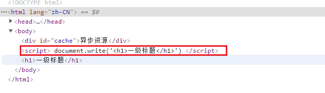
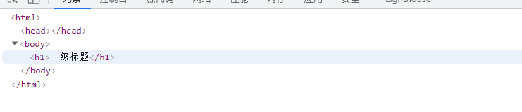

# js时间线

## 一个现象

我们先看一个`document.write('<h1>一级标题</h1>'`)的现象

```html
<body>
    <div id="cache">异步资源</div>
    <script>
        document.write('<h1>一级标题</h1>')
    </script>
</body>
```




但当我们在window.onload事件中再去执行这个方法时

```js
<body>
    <div id="cache">异步资源</div>
    <script>
        window.onload = function () {
            document.write('<h1>一级标题</h1>')
        } 
    </script>
</body>
```



**这个时候的只有h1标签，div标签没有了，同时script标签也没有了**；这个时候就可以引出我们今天的主角--**时间线**了

## 时间线


