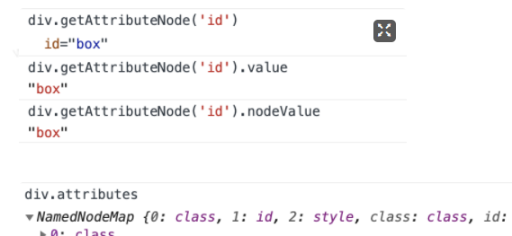

# 节点属性，方法，封装，DOM封装

```html
<div class="box" id='box' style="background-color: aqua;">
  我是文本节点
  <!-- 注释一下 -->
  <h2>我是h2</h2>
  <a>超链接</a>
  <p>p标签</p>
</div>
```

## 属性

### `nodeName`

- 元素节点的`nodeName`是大写
- 不可更改

### `nodeValue`

- 文本节点
- 属性节点
- 注释节点
- 元素节点没有`nodeValue`
- **可以修改**

```js
div.firstChild.nodeValue

div.childNodes[1]

div.childNodes[1].nodeValue

div.childNodes[3]

div.childNodes[3].nodeValue
```

### `nodeType`

- 元素节点 = 1
- 属性节点 = 2
- 文本节点 = 3
- 注释节点 =8
- document = 9
- `DocumnetFragment` = 11
- **只读**


### `getAttributeNode` `attributes`

> 获取属性节点和属性集




### `hasChildNodes`

- 是否具有子节点
- 包括文本节点


## 封装

> 封装一个获取元素节点的函数

```js
function elemChildren(node){
	var arr = [],
      children = node.childNodes;
  for(var i = 0; i < children.length; i++){
    var childItem = children[i];
  	if(childItem.nodeType == 1){
    	arr.push(childItem)
    }
  }
  return arr;
}
console.log(elemChildren(div));
```

