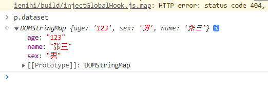

# 节点的创建删除，属性设置

## 创建

### `createElement`

- 创建元素
- `document.createElement`
- 出自 `Document.prototype`

```js
var div = document.createElement('div');
div.innerHTML = 123;
document.body.appendChild(div);
```

### `createTextNode`

- 创建文本节点

```js
var text = document.createTextNode('文本');
document.body.appendChild(text);
```

### `createComment`

- 创建注释节点

```js
var comment = document.createComment('注释一下');
document.body.appendChild(comment);
```

### `appendChild` 

- 增加子节点
- `Node.prototype` (DOM 结构树的最顶层)
- 在最后面增加（类似数组的push）

```js
var div = document.getElementsByTagName('div')[0];
var p = document.createElement('p');
p.innerHTML = 'javascript';
var text = document.createTextNode('ECMA');
var comment = document.createComment('我是注释');
div.appendChild(p);
div.appendChild(text);
div.appendChild(comment);
```

- **剪切节点功能**

```js
<a>我是超链接</a>
var a = document.getElementsByTagName('a')[0];
var div = document.getElementsByTagName('div')[0];
div.innerHTML = '<p>我是段落标签</p>'
document.body.appendChild(div);
div.appendChild(a); // 会把dom中原来的a标签剪切到div标签内部去
```

### `c.insertBefore(a,b)`

- 插入：在父级c节点下的子节点b之前，插入a节点

```js
<div>
  <p>p标签</p>
</div>

var div = document.getElementsByTagName('div')[0];
var p = document.getElementsByTagName('p')[0];
var a = document.createElement('a');
a.href = '';
div.insertBefore(a, p);
```

## 替换

### `c.replaceChild(a, b)`

- 节点替换
- 把父级c的节点b替换为a

## 删除

### `c.removeChild(子节点)`

- 返回被remove的节点
- 存在于`Node.prototype`

```js
<div>
  <p>p标签</p>
</div>

var div = document.getElementsByTagName('div')[0];
var p = document.getElementsByTagName('p')[0];
div.removeChild(p);
```

### `remove` 

- 元素销毁

```js
p.remove(); 
```

## `innerHTML/innerText`

### `innerHTML`

- `HTMLElement.prototype`
- `innerHTML` 还存在于 `Element.prototype`

```js
div.innerHTML = 123;
// 追加
div.innerHTML += '111'
div.innerHTML = '<div>hhh</div>'
```

### `innerText`

- 获取的是文本
- 老版本火狐不支持，要使用 `textContent`
- `textContent` IE老版本不支持

## 属性

### `setAttribute、getAttribute`

- 设置属性、获取属性

### `data-*`

- 自定义属性
- HTML5内容
- IE9及以下没有

#### `dataset`

> data-*的属性和属性值可以从dataset获取到

```html
<p data-age='123' data-sex='男' data-name='张三'>p标签</p>

var p = document.getElementsByTagName('p')[0];
p.dataset
```



#### 获取`dataset`属性

```js
p.getAttribute('data-age')
p.getAttribute('data-name')
```

#### 设置`dataset`属性

```js
p.setAttribute('data-age','32')
```

## `createDocumentFragment()`

- 创建文档片段（碎片）

- `document.createDocumentFragment()`

```js
<ul id='list'>

</ul>
<script>
    // 回流
  var oUl = document.getElementById('list');
  for (var i = 0; i < 10000; i++){
    var oLi = document.createElement('li');
    oLi.innerHTML = i + '、这是第' + i + '个';
    oLi.className = 'list-item';
    oUl.appendChild(oLi); // 会导致回流
  }
</script>
```


**避免回流**

```js
<ul id='list'>

</ul>
<script>
  var oUl = document.getElementById('list');
	var oDiv = document.createElement('div');
  for (var i = 0; i < 10000; i++){
    var oLi = document.createElement('li');
    oLi.innerHTML = i + '、这是第' + i + '个';
    oLi.className = 'list-item';
    oDiv.appendChild(oLi);
  }
	oUl.appendChild(oDiv); // 缺点是会多出一个div标签
</script>
```

**避免回流-优化**

```js
<ul id='list'>

</ul>
<script>
  var oUl = document.getElementById('list');
	var oFrag = document.createDocumentFragment();
  for (var i = 0; i < 10000; i++){
    var oLi = document.createElement('li');
    oLi.innerHTML = i + '、这是第' + i + '个';
    oLi.className = 'list-item';
    oFrag.appendChild(oLi);
  }
	oUl.appendChild(oFrag);
</script>
```

