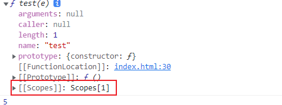

# JavaScript函数-预编译-作用域

## 知识点补充

## 忽视的JS知识

### **函数名：**

```js
// 1
var test = function () {
    var a = 1,
        b = 2;
}
// 匿名函数名就是变量名
console.dir(test); // 'test'

// 2
var test = function tt() {
    var a = 1,
        b = 2;
}
console.dir(test); // 'tt'
```

### 隐私的全局变量：

函数内部不使用var声明变量，这个变量会成为全局变量，即便这个函数套了多层；**同时这个变量会被挂在到window上去**

```js
function test() {
    a = 3;
    function untest() {
        c = 6
    }
    untest()
}
test();
console.log(a); // 3
console.log(c); // 6
```

------


## 函数

> 函数作用就是功能的封装、解耦合。
> 函数名命名和变量名规则相同。

### **arguments**

`arguments`有几个特点：

- 类数组对象。
- 存储实参列表。
- 可以在函数内部修改传入的实参值。
- 实参未传入时，在函数内部给行参赋值无效。

```js
function test(a, b, c) {
  a = 3;
  c = 5;
  console.log(arguments[0]); // 3
  // 修改第三个参数不会影响arguments中的数据
  console.log(arguments[2]); // undefined
}

test(1, 2);
```


### 参数默认值

> 没有传入实参时，形参默认值为undefined，但是在函数定义的时候可以设置默认值，这是es6的写法

```js
function test(a=2,b) {
}
```

## 预编译（重要）

JS引擎在执行代码之前会进行预编译操作；预编译可以检查通篇的语法错误。

**预编译对于函数声明和变量声明是不一样的：**

- 函数声明：整体提升
- var关键字声明的变量：只有声明提升，赋值不提升

### 预编译步骤

**需要记住的是在 if 代码块中声明的变量同样会在预编译中执行**

GO（global object）全局对象，全局上下文。

- 找变量声明
- 找函数声明
- 执行

AO （activation object）活跃对象，函数执行上下文。

- 函数形参、变量声明（值都是undefined)
- 函数实参赋值给形参
- 函数声明
- 执行

------


## 作用域（重要）

**在函数被创建的时候**，JS引擎会给函数生成一个内部隐式属性：[[scope]]



### 作用域链

> 不同的函数在创建与执行的过程中，造成了各自的作用域有了包含关系，这个时候这个关系就是作用域链

作用域链决定了各级上下文中的代码在访问变量和函数时的顺序。

**函数在执行前会生成AO，执行完后会销毁自身AO**


------


## 练习：

### 斐波拉切数列：

```js
function test(data) {
    if (data < 0) {
        return 0
    }
    if (data == 1 || data == 2) {
        return 1
    } else {
        return test(data - 1) + test(data - 2)
    }
}

// 优化
function fib(num) {
    if (num == 0) return 0
    if (num ==2 || num ==1) return 1
    let prev = 1,
        curr = 1;
    for (let i = 3; i <= num; i++ ) {
        let sum = prev + curr
        prev = curr
        curr = sum
    }
    return curr
}

console.log(fib(10));
```

### AO与VO

```js
/**
 * GO = {
 *  a : undefined -> 1
 *  test: function test(e) {}
 *  f : 5 // 这个是在执行test函数时，内部的f变量没有用var声明导致
 * }
 * 
 * AO = {
 *  e : undefined -> 1 -> function e() {} -> 2
 *  b : undefined
 *  c : undefined
 *  a : undefined -> 4
 * }
 */
function test(e) {
    function e() {}
    arguments[0] = 2;
    console.log(e); // 2
    // 此时变量a的值为undefined，不执行if语句内容
    if (a) {
        var b = 3;
    }
    var c;
    a = 4;
    var a;
    console.log(b); // undefined
    // 暗示全局变量
    f = 5;
    console.log(c); // undefined
    console.log(a); // 4
}
var a;
test(1);
console.log(a); // 1
console.log(f); // 5
```

