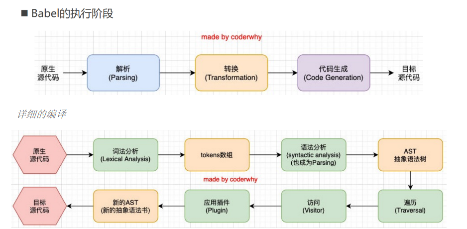

# babel的原理

`Babel`是一个工具链，主要用于旧浏览器或者环境中将ECMAScript 2015+代码转换为向后兼容版本的 `JavaScript`；

## 原理

babel做到将我们的一段代码（ES6、TypeScript、React）转成另外一段代码（ES5），Babel编译器的作用就是将我们的源代码，转换成浏览器可以直接识别的另外一段源代码；

### babel的工作流程

- 解析阶段（Parsing）
- 转换阶段（Transformation）
- 生成阶段（Code Generation）

