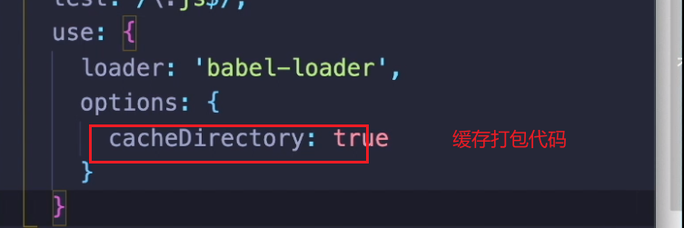
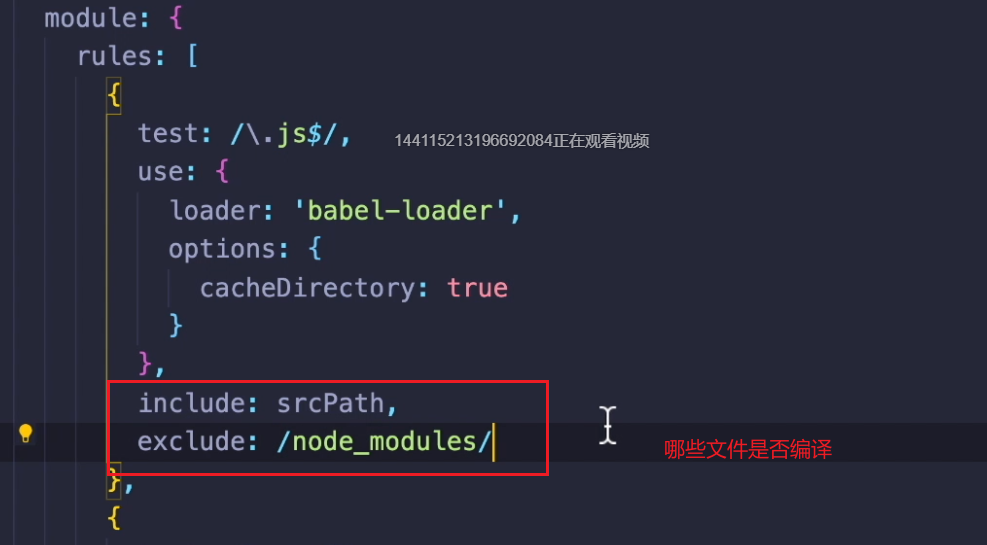
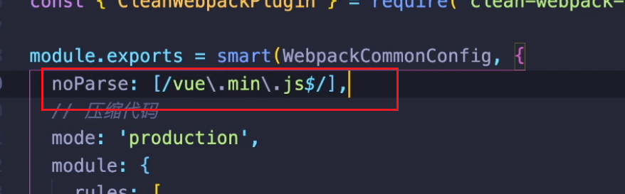
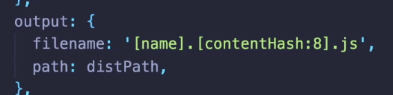

# 优化两个点

1. 优化打包构建速度
2. 优化产出代码体积


## bable-loader的优化

两个点

1. 



2. 




## IgnorePlugin

去除moment时区，最终打包没有其他时区代码

```
configureWebpack: config => {
    config.plugins.push(new webpack.IgnorePlugin(/^\.\/locale$/, /moment$/))
}
```

### noParse

不管这部分代码，但是最终有这部分代码；相当于直接把这部分代码拿过来




## 多进程打包

两个工具

- [happyPack](http://webpack.wuhaolin.cn/4%E4%BC%98%E5%8C%96/4-3%E4%BD%BF%E7%94%A8HappyPack.html)

- [ParallelUglifyPlugin](http://webpack.wuhaolin.cn/4%E4%BC%98%E5%8C%96/4-4%E4%BD%BF%E7%94%A8ParallelUglifyPlugin.html)


## DLL配置

优化打包构建速度


## 建议只使用在开发环境的配置

### 1：热更新

### 2：DLLPlugin 预先打包

3：


## 优化产出代码体积


## 网页加载速率

1. 小图片转base64  url-loader
2. 文件名hash值   会走缓存

