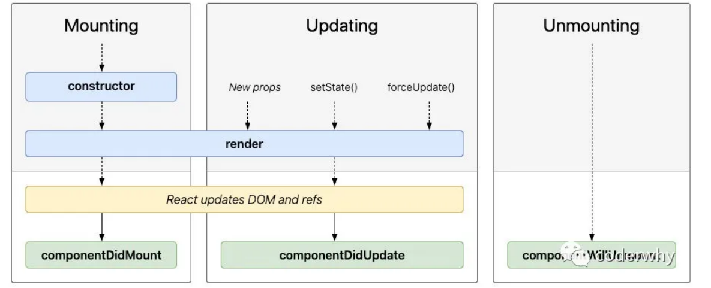

# 脚手架开发

## 安装

```
npm install -g create-react-app
```

安装是否成功

```
create-react-app --version
```

报错：

`react中-create-react-app不是内部或者外部命令...-解决方案/`

```
执行下面这个
npx create-react-app my-app
```


组件化开发

- 函数式组件和类组件
- 有状态组件和无状态组件


类组件有如下要求

- 组件名称必须大写、因为JSX中严格区分大小写、大写的标签会被当成一个组件、小写的会被当成html标签
- 类组件必须继承React.Component
- 类组件必须实现render函数
- constructor是可选的，我们通常在constructor中初始化一些数据
- **render() 方法是 class 组件中唯一必须实现的方法**


## 类组件

```jsx
import React, {
  Component
} from 'react'
export default class App extends Component {
  constructor() {
    super()
    this.state = {
      message: '你好啊'
    }
  }
  render() {
    return (
      <div>
        <h1>{this.state.message}</h1>
      </div>
    )
  }
}
```

### render函数返回的值有哪些

- React 元素：
  - 通常通过 JSX 创建
  - html标签或者react组件（div、App）均为React元素
- **数组或fragments**：使得 render 方法可以返回多个元素。
- **字符串或数值类型**：它们在 DOM 中会被渲染为文本节点
- **布尔类型或 null**：什么都不渲染
- **Portals**：可以渲染子节点到不同的 DOM 子树中。

## 函数式组件

- 没有内部状态
- 没有this对象

```jsx
export default function App() {
  return (
    <h2>我是函数组件、app组件</h2>
  )
}
```

函数组件return 返回的东西和类组件render返回的东西是一样的


## 生命周期函数

函数式组件没有生命周期函数，通产说的生命周期函数都是针对类组件的



1. 挂载阶段--执行顺序
   1. 先执行 `constructor`
   2. 再执行 `render`
   3. 后面执行 `componentDidMount()`
2. 更新阶段
   1. `props`、`setState`、`forceUpdate` 调用的时候重新执行 render 函数
   2. 后面执行 `componentDidUpdate`

```JSX
import React, {
  Component
} from 'react'

class Cpn extends Component {
  render() {
    return (
      <h1>我是Cpn组件</h1>
    )
  }
  componentWillUnmount() {
    console.log('执行 componentWillUnmount');
  }
}
export default class App extends Component {
  constructor() {
    super()
    this.state = {
      message: '你好啊',
      counter: 1,
      isShow: true
    }
    console.log('执行了constructor');
  }
  render() {
    console.log('执行了render');
    return (
      <div>
        <h1>{this.state.message}</h1>
        <h1>当前计数：{this.state.counter}</h1>
        <button onClick={e => this.increment()}>增加</button>
        <hr />
        <button onClick={e => this.change()}>切换</button>
        {this.state.isShow && <Cpn />}
      </div>
    )
  }
  increment() {
    this.setState({
      counter: this.state.counter + 1
    })
  }
  change() {
    this.setState({
      isShow: !this.state.isShow
    })
  }
  componentDidMount() {
    console.log('执行了componentDidMount');
  }
  componentDidUpdate() {
    console.log('执行了componentDidUpdate');
  }
}
```


## 组件通讯

类组件

```jsx
class ChildCpn extends App {
    constructor(props) {
        super()
        this.props = props
    }
    render() {
        return (
            <div>子组件:{this.props.name}</div>
        )
    }
}
```

函数式组件

```jsx
function ChildCpn(props) {
    return (
        <div>子组件:{props.name}</div>
    )
}
```


### super(props)

```jsx
class ChildCpn extends App {
    constructor(props) {
        super(props)
    }
    render() {
        return (
            <div>子组件:{this.props.name}</div>
        )
    }
}
```


值得注意的是、子组件中继承props、在render函数中仍然可以使用props；

```jsx
class ChildCpn extends App {
    constructor() {
        super()
    }
    render() {
		const { name } = this.props
        return (
            <div>子组件:{name}</div>
        )
    }
}
```

主要就是react源码`mountClassComponent`方法中写了一行、这个方法在render函数之前调用

```js
this._instance.props = element.props
```


### props验证

```jsx
ChildCpn.propTypes = {
    name: PropTypes.string.isRequired,
    age: PropTypes.number,
    height: PropTypes.number,
    names: PropTypes.array
}

ChildCpn.defaultProps = {
    name: "why",
    age: 30,
    height: 1.98,
    names: ["aaa", "bbb"]
}
```


### 子传父

单向数据流的限制子传父只能让父组件传递方法、子组件调用这个方法来修改数据

```jsx
import React, { Component } from 'react';


class CounterButton extends Component {
  render() {
    // onClick 就是父组件的 increment
    const {onClick} = this.props;
    return <button onClick={onClick}>+1</button>
  }
}


export default class App extends Component {
  constructor(props) {
    super(props);

    this.state = {
      counter: 0
    }
  }

  render() {
    return (
      <div>
        <h2>当前计数: {this.state.counter}</h2>
        <button onClick={e => this.increment()}>+</button>
        <CounterButton onClick={e => this.increment()} name="why"/>
      </div>
    )
  }

  increment() {
    this.setState({
      counter: this.state.counter + 1
    })
  }
}
```


### 案例

```jsx
import React, { Component } from 'react';

import TabControl from './TabControl';

export default class App extends Component {
  constructor(props) {
    super(props);

    this.titles = ['新款', '精选', '流行'];

    this.state = {
      currentTitle: "新款",
      currentIndex: 0
    }
  }

  render() {
    const { currentTitle } = this.state;

    return (
      <div>
        <TabControl itemClick={index => this.itemClick(index)} titles={this.titles} />
        <h2>{currentTitle}</h2>
      </div>
    )
  }

  itemClick(index) {
    this.setState({
      currentTitle: this.titles[index]
    })
  }
}

```

```jsx
// TabControl.js
import React, { Component } from 'react';
import PropTypes from 'prop-types';

export default class TabControl extends Component {
  constructor(props) {
    super(props);

    this.state = {
      currentIndex: 0
    }
  }

  render() {
    const { titles } = this.props;
    const {currentIndex} = this.state;

    return (
      <div className="tab-control">
        {
          titles.map((item, index) => {
            return (
              <div key={item} 
                   className={"tab-item " + (index === currentIndex ? "active": "")}
                   onClick={e => this.itemClick(index)}>
                <span>{item}</span>
              </div>
            )
          })
        }
      </div>
    )
  }

  itemClick(index) {
    this.setState({
      currentIndex: index
    })

    const {itemClick} = this.props;
    itemClick(index);
  }
}

TabControl.propTypes = {
  titles: PropTypes.array.isRequired
}

```


### 跨组件传值

React提供了一个`API：Context`、用的比较少

`Context` 提供了一种在组件之间共享此类值的方式，而不必显式地通过组件树的逐层传递 props

#### `React.createContext`

```jsx
const UserContext = React.createContext({
  nickname: "aaaa",
  level: -1
})
```

创建一个需要共享的Context对象：

- 如果一个组件订阅了Context，那么这个组件会从离自身最近的那个匹配的 Provider 中读取到当前的context值

#### `Context.Provider`

每个 Context 对象都会返回一个 Provider React 组件，它允许消费组件订阅 context 的变化

```jsx
render() {
    return (
      <div>
        <UserContext.Provider value={this.state}>
          <Profile />
        </UserContext.Provider>
      </div>
    )
  }
```

- Provider 接收一个 value 属性，传递给消费组件
- 一个 Provider 可以和多个消费组件有对应关系
- 多个 Provider 也可以嵌套使用，里层的会覆盖外层的数据
- 当 Provider 的 value 值发生变化时，它内部的所有消费组件都会重新渲染；


#### `Context.Consumer`

React 组件也可以订阅到 context 变更。这能让你在 函数式组件 中完成订阅 context

- 这里需要 函数作为子元素（function as child）这种做法
- 这个函数接收当前的 context 值，返回一个 React 节点

```jsx
import React, { Component } from 'react';

// 创建Context对象
const UserContext = React.createContext({
  nickname: "aaaa",
  level: -1
})

function ProfileHeader() {
  return (
    <UserContext.Consumer>
      {
        value => {
          return (
            <div>
              <h2>用户昵称: {value.nickname}</h2>
              <h2>用户等级: {value.level}</h2>
            </div>
          )
        }
      }
    </UserContext.Consumer>
  )
}

function Profile(props) {
  return (
    <div>
      <ProfileHeader />
      <ul>
        <li>设置1</li>
        <li>设置2</li>
        <li>设置3</li>
        <li>设置4</li>
      </ul>
    </div>
  )
}

export default class App extends Component {
  constructor(props) {
    super(props);

    this.state = {
      nickname: "kobe",
      level: 99
    }
  }

  render() {
    return (
      <div>
        <UserContext.Provider value={this.state}>
          <Profile />
        </UserContext.Provider>
      </div>
    )
  }
}

```

