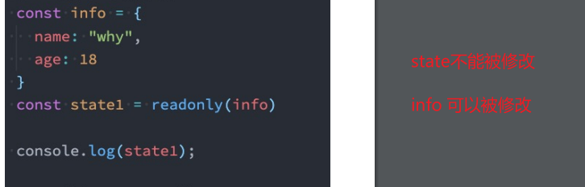

# Vue3

Vue3用setup函数代替了methods、computed、watch、data、生命周期等等、

## setup

### 两个参数 props、context

props：和之前一样、父组件传递过来的属性会被放到props对象中

context：上下文对象、三个属性

- attrs：所有的非prop的attribute
- slots：父组件传递过来的插槽
- emit：当我们组件内部需要发出事件时会用到emit

### 返回值

> setup的返回值可以在模板template中被使用、也就是说我们可以通过setup的返回值来替代 data/methods 选项


### 为什么setup中不能使用 this

> 因为`setup`的调用发生在`data`、`computed`、`methods`被解析之前、所以无法在 `setup` 中被获取


## 响应式API

### `Reactive`

**传入的参数必须是对象或者数组**

```vue
<template>
  <div>
    Home Page
    <h2>{{message}}</h2>
    <h2>当前计数: {{state.counter}}</h2>
    <button @click="increment">+1</button>
  </div>
</template>

<script>
  import { reactive } from 'vue';

  export default {
    props: {
      message: {
        type: String,
        required: true
      }
    },
    setup() {
      const state = reactive({
        counter: 100
      })

      // 局部函数
      const increment = () => {
        state.counter++;
        console.log(state.counter);
      }

      return {
        state,
        increment
      }
    }
  }
</script>

<style scoped>

</style>
```


### Ref

传入的参数没有限制

```vue
<template>
  <div>
    Home Page
    <h2>{{message}}</h2>
    <!-- 当我们在template模板中使用ref对象, 它会自动进行解包 -->
    <h2>当前计数: {{counter}}</h2>
    <!-- ref的解包只能是一个浅层解包(info是一个普通的JavaScript对象) -->
    <h2>当前计数: {{info.counter.value}}</h2>
    <!-- 当如果最外层包裹的是一个reactive可响应式对象, 那么内容的ref可以解包 -->
    <h2>当前计数: {{reactiveInfo.counter}}</h2>
    <button @click="increment">+1</button>
  </div>
</template>

<script>
  import { ref, reactive } from 'vue';

  export default {
    props: {
      message: {
        type: String,
        required: true
      }
    },
    setup() {
      let counter = ref(100);

      const info = {
        counter
      }

      const reactiveInfo = reactive({
        counter
      })

      // 局部函数
      const increment = () => {
        counter.value++;
        console.log(counter.value);
      }

      return {
        counter,
        info,
        reactiveInfo,
        increment
      }
    }
  }
</script>

<style scoped>

</style>
```


需要注意的是：

1. ref 会返回一个可变的响应式对象、无论参数是简单类型函数复杂类型

2. 在 setup 函数内部、要想使用这个值、需要 `ref.value` 指向

   ```js
   let offset = pageInfo.value.currentPage - 1
   ```

3. 在template中不需要使用value、，Vue会自动帮助我们进行解包操作

4. 模板中的解包是浅层的解包


### ref绑定Dom对象

```vue
<template>
  <div>
    <h2 ref="dndnd">哈哈哈哈</h2>
  </div>
</template>

<script>
  import { ref, watchEffect } from 'vue';

  export default {
    setup() {
      const dndnd = ref()
      return {
        dndnd,
      }
    }
  }
</script>

<style scoped>

</style>
```


### readonly

> 不想被别人修改，只读属性；具体规则如下

1. readonly返回的对象都是不允许修改的；
2. readonly处理的原来的对象是允许被修改的；




### toRefs

使用ES6的解构语法，对reactive返回的对象进行解构获取值，那么之后无论是修改结构后的变量，还是修改reactive 返回的state对象，数据都不再是响应式的；使用 `toRefs` 可以响应式结构

```js
const state = reactive({
	name:'why',
	age:18
})


const {name, age} = toRefs(state)
age.value++ // 这个修改、state中的age也会改变
```


#### 原理

`toRefs`的函数，可以将`reactive`返回的对象中的属性都转成`ref`、再次进行结构出来的 `name` 和 `age` 本身都是 `ref` 的


### toRef

单个`reactive`返回的对象中的属性变成 ref、使用这个方法

```js
const state = reactive({
	name:'why',
	age:18
})

const {age} = toRef(state)
age.value++ // 这个修改、state中的age也会改变
```


### computed

两种用法

- 传入一个getter函数、返回一个 ref 对象；但这个**是只读的**
- 传入一个函数，内部含有 getter/setter；这个**可读可写**

**值得注意的是：firstName、lastName 必须是响应的、要不然无法赋值**

```vue
<template>
  <div>
    <h2>{{fullName}}</h2>
    <button @click="changeName">修改firstName</button>
  </div>
</template>

<script>
  import { ref, computed } from 'vue';

  export default {
    setup() {
      const firstName = ref("Kobe");
    
      const lastName = ref("Bryant");

      // 1.用法一: 传入一个getter函数
      // computed的返回值是一个ref对象
      const fullName = computed(() => firstName + " " + lastName);

      // 2.用法二: 传入一个对象, 对象包含getter/setter
      const fullName = computed({
        get: () => firstName.value + " " + lastName.value,
        set(newValue) {
          const names = newValue.split(" ");
          firstName.value = names[0];
          lastName.value = names[1];
        }
      });

      const changeName = () => {
        // firstName.value = "James"
        fullName.value = "coder why";
      }

      return {
        fullName,
        changeName
      }
    }
  }
</script>

<style scoped>

</style>
```


### watchEffect

侦听到某些响应式数据的变化、一开始就会执行一次、然后修改响应数据都会更新；如果想要**停止监听可以调用 watchEffect 返回的函数**

```vue
<template>
  <div>
    <h2>{{name}}-{{age}}</h2>
    <button @click="changeName">修改name</button>
    <button @click="changeAge">修改age</button>
  </div>
</template>

<script>
  import { ref, watchEffect } from 'vue';

  export default {
    setup() {
      // watchEffect: 自动收集响应式的依赖
      const name = ref("why");
      const age = ref(18);

      const stop = watchEffect(() => {
        console.log("name:", name.value, "age:", age.value);
      });

      const changeName = () => name.value = "kobe"
      const changeAge = () => {
        age.value++;
        if (age.value > 25) {
          stop();
        }
      }

      return {
        name,
        age,
        changeName,
        changeAge
      }
    }
  }
</script>

<style scoped>

</style>
```


#### watchEffect 清除副作用

再次执行`watchEffect`监听时、 `onInvalidate`可以当作一参数、并且可以执行

```vue
<template>
  <div>
    <h2>{{name}}-{{age}}</h2>
    <button @click="changeName">修改name</button>
    <button @click="changeAge">修改age</button>
  </div>
</template>

<script>
  import { ref, watchEffect } from 'vue';

  export default {
    setup() {
      // watchEffect: 自动收集响应式的依赖
      const name = ref("why");
      const age = ref(18);

      const stop = watchEffect((onInvalidate) => {
        const timer = setTimeout(() => {
            console.log("name:", name.value, "age:", age.value);
            onsole.log("网络请求成功~");
        }, 2000)

        // 根据name和age两个变量发送网络请求
        onInvalidate(() => {
          // 在这个函数中清除额外的副作用
          // request.cancel()
          clearTimeout(timer);
          console.log("onInvalidate");
        })
      });

      const changeName = () => name.value = "kobe"
      const changeAge = () => {
        age.value++;
        if (age.value > 25) {
          stop();
        }
      }

      return {
        name,
        age,
        changeName,
        changeAge
      }
    }
  }
</script>

<style scoped>

</style>
```


#### watchEffect 执行时机