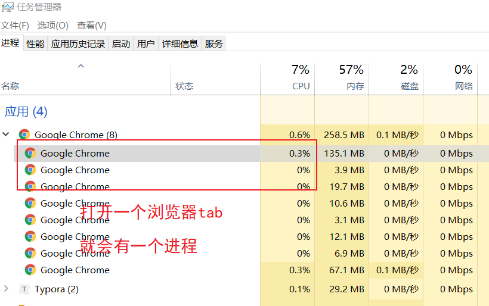
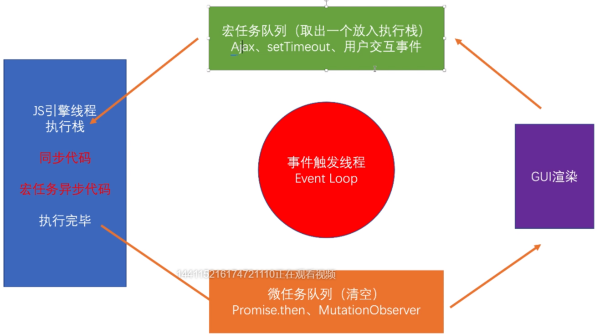
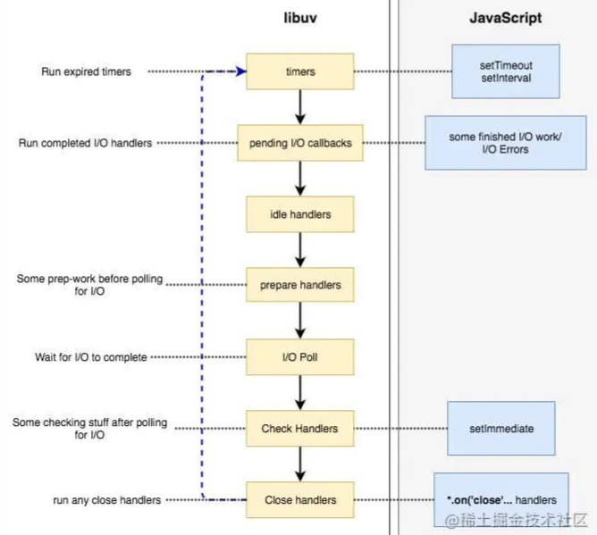

# 事件环

## 前置知识

[事件环](https://juejin.cn/post/6844903581636640782#heading-0)

[nodejs的事件环](https://juejin.cn/post/6844903708694691854#heading-0)

### 进程线程：

- 进程是计算机调度的基本单位，**进程包含多个线程，线程在进程中运行**，在浏览器中，每个tab页都是一个独立的进程




#### 浏览器渲染进程

- GUI渲染线程（渲染页面）

- JS引擎线程

- GUI渲染与JS引擎线程运行互斥


#### GUI渲染线程

- 解析HTML、CSS 

-  构建DOM/Render树 

-  初始布局与绘制 

-  重绘与回流 


#### JS引擎线程

- 一个主线程与多个辅助线程配合

- 一个浏览器只有一个JS引擎（即只有一个主线程，但可有多个辅助线程）

- 解析JS脚本

- 运行JS代码


### 宏任务微任务

`setImmediate`只在IE新版本/Edge/NodeJS 0.10+中存在。（比如在chrome中是不存在的

| 宏任务                  | 微任务                                   |
| ----------------------- | ---------------------------------------- |
| script                  | `promise.then`                           |
| UI渲染                  | `mutationObserver`                       |
| `setTimeout`            | `nextTick`(存在于Node.js的process对象中) |
| `setInterval`           |                                          |
| `setImmediate`          |                                          |
| `messageChannel`        |                                          |
| `requestAnimationFrame` |                                          |
| 用户交互事件（click等） |                                          |
| ajax                    |                                          |


## 浏览器中的事件环



从上面这张图解释：

- 有同步执行同步
- 同步执行完执行微任务
- 微任务执行完GUI渲染
- 最后执行宏任务

```js
console.log('start');
let dDom = document.getElementById('app')

setTimeout(() => {
  dDom.style.backgroundColor = 'red'
}, 100);

Promise.resolve().then(() => {
  dDom.style.backgroundColor = 'green'
})
// 先绿后红并不只是先微任务后宏任务，其中更重要的是微任务执行完后---GUI渲染---宏任务
```


### 案例1

```js
let res = function() {
  console.log(1)
  return new Promise((resolve, reject) => {
    console.log(2)
    resolve(4)
  })
}

new Promise(async (resolve, reject) => {
  console.log(3)
  let test = await res()
  /**
   * res().then(res => {
   *  console.log(test)
   * })
   **/ 
  console.log(test)
})

console.log(5)

new Promise((resolve, reject) => {
  console.log(6)
})
console.log(7)
-----------------------------
3
1
2
5
6
7
4   
//之所以test的值是4，是因为await的特性：
//await 表达式会暂停当前 async function 的执行，等待 Promise 处理完成。
//若 Promise 正常处理(fulfilled)，其回调的resolve函数参数作为 await 表达式的值，继续执行 async function。
//如果没有await，那么test就是一个fulfilled状态的promise
```


### 案例2

```js
let res = function() {
  console.log(1)
  return new Promise((resolve, reject) => {
    setTimeout(() => {
      new Promise((resolve) => {
        console.log(2)
        setTimeout(() => {
         console.log(3) 
        });
      })
    },0)
    resolve(5)
  })
}
new Promise(async (resolve, reject) => {
  setTimeout(() => {
    Promise.resolve().then(() => {
      console.log(4)
    })
  }, 0);
  let test = await res()
  console.log(test)
})
setTimeout(() => {
  console.log(6)
}, 0);
new Promise((resolve, reject) => {
  setTimeout(() => {
    console.log(7)
  }, 0);
})
console.log(8)
----------------------------------
1
8
5
4
2
6
7
3
```


### 事件处理函数的事件环

**代码触发和用户点击是不一样的**

#### 代码触发

##### 案例3 

```js
oBtn.addEventListener('click', () => {
    console.log('1')
    Promise.resolve('m1').then(str => {
        console.log(str)
    })
}, false)

oBtn.addEventListener('click', () => {
    console.log('2')
    Promise.resolve('m2').then(str => {
        console.log(str)
    })
}, false)
oBtn.click()
----------------------
1
2
m1
m2
解释：当回调函数被oBtn.click()形式触发时，那么相当于同步地执行两个回调函数。（可理解为将他们放在同一个宏任务中）
```


##### 案例4

```js
oBtn.addEventListener('click', () => {
    setTimeOut(() => {
      console.log('1')
    })
    Promise.resolve('m1').then(str => {
      console.log(str)
    })
}, false)

oBtn.addEventListener('click', () => {
    setTimeOut(() => {
      console.log('2')
    })
    Promise.resolve('m2').then(str => {
        console.log(str)
    })
}, false)
oBtn.click()
------------------------
m1
m2
1
2
解释：在没有点击之前，宏任务队列按着顺序把这两个事件放进来了，点击事件的时候就会按着顺序执行这两个宏任务中的回调函数
1：执行第一个宏任务回调，把新的宏任务添加进队列
2：执行第二个宏任务回调，把新的宏任务添加进队列
```


#### 用户点击

##### 案例5

```js
oBtn.addEventListener('click', () => {
    console.log('1')
    Promise.resolve('m1').then(str => {
        console.log(str)
    })
}, false)

oBtn.addEventListener('click', () => {
    console.log('2')
    Promise.resolve('m2').then(str => {
        console.log(str)
    })
}, false)
//用户点击按钮，触发oBtn的回调函数
----------------------
1
m1
2
m2
解释：当回调函数被用户自己点击而触发时，那么这两个回调函数会作为两个单独的宏任务，按顺序触发。
```


##### 案例6

```
oBtn.addEventListener('click', () => {
    setTimeOut(() => {
      console.log('1')
    })
    Promise.resolve('m1').then(str => {
      console.log(str)
    })
}, false)

oBtn.addEventListener('click', () => {
    setTimeOut(() => {
      console.log('2')
    })
    Promise.resolve('m2').then(str => {
        console.log(str)
    })
}, false)
//用户点击按钮，触发oBtn的回调函数
------------------------
m1
m2
1
2
```


### `setInterval`

```js
console.log('start')

//setInterval 1
const interval = setInterval(() => {
    console.log('setInterval')
}, 0)
//setTimeout1
setTimeOut(() => {
    console.log('setTimeOut 1')
    Promise.resolve()
    	//then1
    	.then(() => {
        console.log('promise3')
    	})
    //then2
    	.then(() => {
        console.log('promise4')
    	})
    //then3
    	.then(() => {
        //setTimeOut3
        setTimeOut(() => {
            console.log('setTimeOut 2')
            Promise.resolve()
            //then5
            	.then(() => {
					console.log('promise5')
            	})
            //then6
            	.then(() => {
					console.log('promise6')
            	})
            //then7
            	.then(() => {
					clearInterval(interval)
            	})
        }, 0)
    	})
}, 0)

Promise.resolve()
.then(() => {
    console.log('promise 1')
})
.then(() => {
    console.log('promise 2')
})
---------------------------------------------
start
promise 1
promise 2
setInterval
setTimeOut 1
promise3
promise4
setInterval
setTimeOut 2
promise5
promise6
// 注：其实这里注意一下，setInterval是一直存在于宏任务队列中就行了；执行完第一遍宏任务后再次执行一次 setInterval
// 当然 setTimeout 的时间必须是0才行，不然是不会把它计算进"宏任务"队列中
```


## `nodejs`中的事件环

node中的事件环和浏览器中的是不一样的，node的事件环分为六个阶段，每个阶段都一有一个`callbcak queue`，只有当一个阶段的queue清理干净后才会进入到下一个阶段。




| 阶段                        | 作用                                                         |
| --------------------------- | ------------------------------------------------------------ |
| timer(计时器)               | 执行`setTimeout`以及`setInterval`的回调                      |
| I/O `callbcacks`            | 处理网络、流、`tcp`的`callbcak`以及错误                      |
| `idle,prepare node`内部使用 |                                                              |
| poll(轮询)                  | 取出新完成的`I/O`事件；执行与`I/O`相关的回调（除了关闭回调，计时器调度的回调和`setImmediate`之外，几乎所有这些回调） 适当时，`node`将在此处阻塞。 |
| `check`                     | 处理`setImmediate`回调                                       |
| `close callbcaks`           | 处理关闭的回调例如 `socke.on('close')`                       |


### 问题

#### setTimeout，setImmediate谁先谁后？

```js
setTimeout(function(){
	console.log('Timeout');
})
setImmediate(function(){
	console.log('Immediate');
})
// 谁都有可能先执行
// setTimeout最快也有4ms的延迟，所以没有办法确定这两个谁快，除非是在一个poll阶段中，setImmediate一定先执行；这是因为IO后面就是check阶段先执行setImmediate
fs.readFile('./1.txt',function(){
    console.log('fs');
    setTimeout(function(){
    	console.log('timeout');
    });
    setImmediate(function(){
    	console.log('setImmediate');
    });
})

```


#### nextTick和promise.then谁快？

```js
process.nextTick(function () {
  console.log(4);
})
new Promise((resolve, reject) => {
  resolve(1)
}).then(val => {
  console.log(val);
})
// 4 1
```


#### nextTick和其它的定时器嵌套

```js
setImmediate(function () {
  console.log(1);
  process.nextTick(function () {
    console.log(4);
  })
})
process.nextTick(function () {
  console.log(2);
  setImmediate(function () {
    console.log(3);
  })
  setTimeout(() => {
    console.log(5);
  });
})
// 2 5 1 4 3
// 先执行 process.nextTick；然后按着事件环顺序阶段执行
```


#### 定时器指定的回调函数一定会在指定的时间内执行吗？

不一定，node中事件环六中状态之间转化也需要耗时


