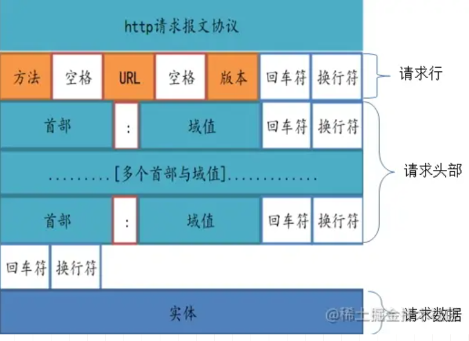
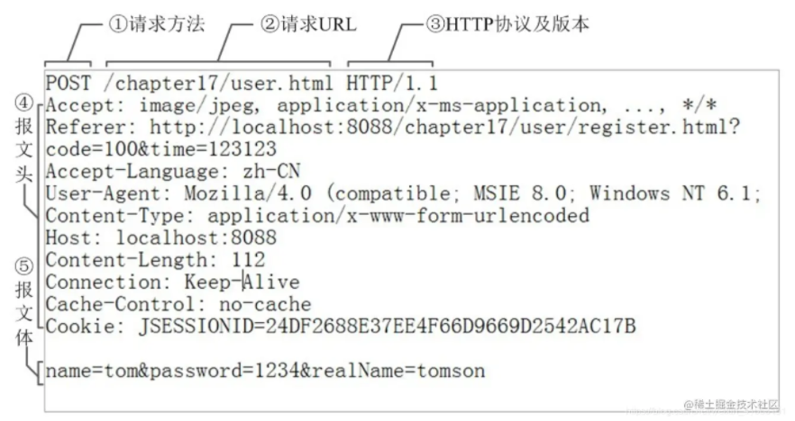

# HTTP报文

[TOC]

**HTTP有两种报文：**请求报文和响应报文

 HTTP消息是服务器和客户端之间交换数据的方式。 有两种类型的消息︰ 请求（requests）--由客户端发送用来触发一个服务器上的动作；响应（responses）--来自服务器的应答。

## HTTP请求报文

HTTP请求报文主要包括请求行、请求头部以及请求的数据（实体）三部分。

### 请求行

请求行由方法字段、URL字段和HTTP协议版本字段。其中，方法字段严格区分大小写，当前HTTP协议中的方法都是大写

方法：GET/POST/PUT/DELETE

URL：www.baidu.com/path...

HTTP协议版本：有HTTP/0.9、HTTP/1.0、HTTP/1.1、HTTP/2.0。目前主流版本为**HTTP/1.1**

### 请求头部：

常用请求头：

|   **请求头**    |                **描述**                |
| :-------------: | :------------------------------------: |
|    Connetion    |                连接管理                |
|    **Host**     | 给出了接收请求的服务器的主机名和端口号 |
|    **Range**    |           请求实体的字节范围           |
|   User-Agent    |         包含发出请求的用户信息         |
|     Accept      |      用户代理期望的MIME 类型列表       |
| Accept-Language |       列出用户代理期望的页面语言       |
|   **Referer**   |    提供了包含当前请求URI的文档的URL    |
| Accept-Charset  |      告诉服务器能够发送哪些字符集      |
| Accept-Encoding |     告诉服务器能够发送哪些编码方式     |
|      From       |      提供了客户端用户的E-mail地址      |
|   **Cookie**    |       客户端用它向服务器传送数据       |
|     Cookie2     |     用来说明请求端支持的cookie版本     |

### 请求数据：

## HTTP响应报文