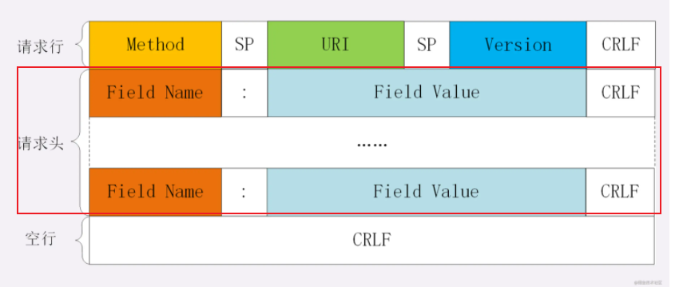
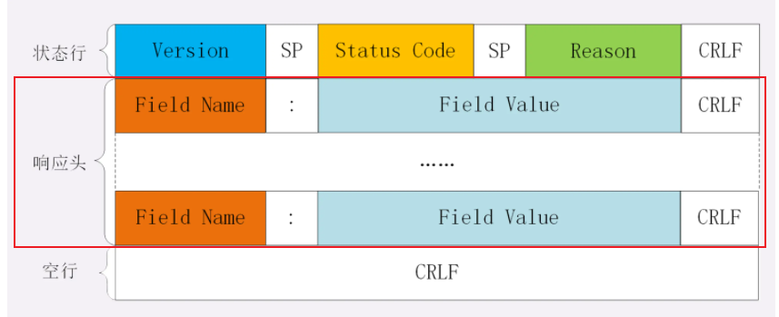
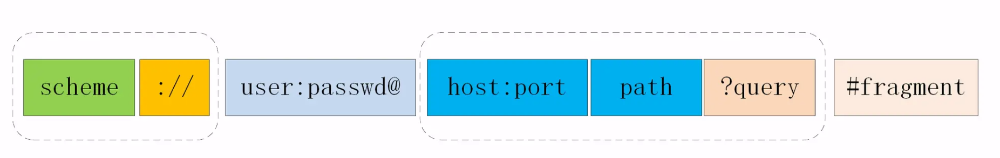
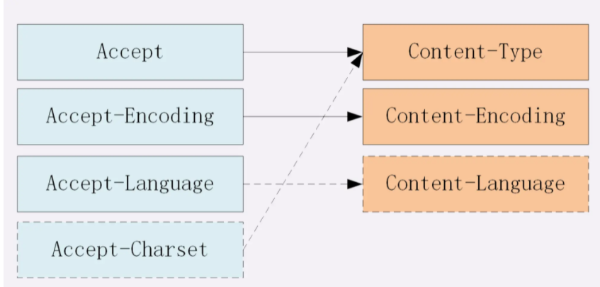

# HTTP

[掘金-神三元](https://juejin.cn/post/6844904100035821575#heading-7)

[TOC]


## HTTP的含义

**HTTP：**HyperText Transfer Protocol 超文本传输协议

**定义：**客户端和服务器端请求和应答的标准，用于从WEB服务器传输超文本到本地浏览器的传输协议。

**HTTP请求：**按照协议规则先向WEB服务器发送的将超文本传输到本地浏览器的请求。

## HTTP报文

http `请求报文`和`响应报文`是有一定区别

### 结构

对于 TCP 而言，在传输的时候分为两个部分:**TCP头**和**数据部分**。

而 HTTP 类似，也是`header + body`的结构，具体而言:

```
起始行 + 头部 + 空行 + 实体
```

#### 起始行

1. 请求报文：

   **方法 + 路径 + http版本**

```
GET /home HTTP/1.1
```

2. 响应报文：

   响应报文的起始行也叫做`状态行`。由**http版本、状态码和原因**三部分组成。

```
HTTP/1.1 200 OK
```

值得注意的是，在起始行中，每两个部分之间用**空格**隔开，最后一个部分后面应该接一个**换行**，严格遵循`ABNF`语法规范。


#### 头部

1. 请求报文头部

   

2. 响应报文头部

   


**头部的字段名(Field Name)有以下格式：**

1. 字段名不区分大小写
2. 字段名不允许出现空格，不可以出现下划线`_`
3. 字段名后面必须**紧接着`:`**


#### 空行

**很重要，用来区分开`头部`和`实体`。**

问: 如果说在头部中间故意加一个空行会怎么样？

那么空行后的内容全部被视为实体。


#### 实体

就是具体的数据了，也就是`body`部分。请求报文对应`请求体`, 响应报文对应`响应体`。


## HTTP 的请求方法

**请求方法：**

`http/1.1`规定了以下请求方法(注意，都是大写):

1. GET: 通常用来获取资源
2. HEAD: 获取资源的元信息
3. POST: 提交数据，即上传数据
4. PUT: 修改数据
5. DELETE: 删除资源(几乎用不到)
6. CONNECT: 建立连接隧道，用于代理服务器
7. OPTIONS: 列出可对资源实行的请求方法，用来跨域请求
8. TRACE: 追踪请求-响应的传输路径


**GET 和 POST 有什么区别：**

1. 从**缓存**的角度，GET 请求会被浏览器主动缓存下来，留下历史记录，而 POST 默认不会。
2. 从**TCP**的角度，**GET 请求会把请求报文一次性发出去**，而 **POST 会分为两个 TCP 数据包，首先发 header 部分，如果服务器响应 100(continue)， 然后发 body 部分。(火狐浏览器除外，它的 POST 请求只发一个 TCP 包)**
3. 从**编码**的角度，GET 只能进行 URL 编码，只能接收 ASCII 字符，而 POST 没有限制。
4. 从**参数**的角度，GET 一般放在 URL 中，因此不安全，POST 放在请求体中，更适合传输敏感信息。
5. 从**幂等性**的角度，`GET`是**幂等**的，而`POST`不是。(`幂等`表示执行相同的操作，结果也是相同的)


## URI

> 全称为(Uniform Resource Identifier), 也就是**统一资源标识符**，它的作用很简单，就是区分互联网上不同的资源。

我们常说的`网址`, 网址指的是`URL`, 实际上`URI`包含了`URN`和`URL`两个部分，由于 URL 过于普及，就默认将 URI 视为 URL 了。


### 结构



- **scheme** 表示协议名，比如`http`, `https`, `file`等等。后面必须和`://`连在一起。
- **user:passwd**@ 表示登录主机时的用户信息，不过很不安全，不推荐使用，也不常用。
- **host:port**表示主机名和端口。(http默认端口80、https默认443)
- **path**表示请求路径，标记资源所在位置。
- **query**表示查询参数，为`key=val`这种形式，多个键值对之间用`&`隔开。
- **fragment**表示 URI 所定位的资源内的一个**锚点**，浏览器可以根据这个锚点跳转到对应的位置。

#### 编码

**由于**URI 只能使用`ASCII`, ASCII 之外的字符是不支持显示的，而且还有一部分符号是界定符，如果不加以处理就会导致解析出错。

**所以URI 引入了`编码`机制**，将所有**非 ASCII 码字符**和**界定符**转为十六进制字节值，然后在前面加个`%`。

如，空格被转义成了`%20`，**三元**被转义成了`%E4%B8%89%E5%85%83`。


## HTTP状态码

RFC 规定 HTTP 的状态码为**三位数**，被分为五类:

- **1xx**: 表示目前是协议处理的中间状态，还需要后续操作。

  - 100：

    ```
    post发送请求时，首先发 header 部分，如果服务器响应 100(continue)
    ```

  - 101：

    ```
    Switching Protocols：在HTTP升级为WebSocket的时候，如果服务器同意变更，就会发送状态码 101
    ```

- **2xx**: 表示成功状态。

  - 204：

    ```
    No Content含义与 200 相同，但响应头后没有 body 数据
    ```

  - 206：

    ```
    Partial Content顾名思义，表示部分内容，它的使用场景为 HTTP 分块下载和断点续传，当然也会带上相应的响应头字段Content-Range
    ```

- **3xx**: 重定向状态，资源位置发生变动，需要重新请求。

  - 301：

    ```
    301 Moved Permanently即永久重定向
    
    比如你的网站从 HTTP 升级到了 HTTPS 了，以前的站点再也不用了，应当返回301，这个时候浏览器默认会做缓存优化，在第二次访问的时候自动访问重定向的那个地址。
    ```

  - 302

    ```
    302 Found，即临时重定向；对应301
    如果只是暂时不可用，那么直接返回302即可，和301不同的是，浏览器并不会做缓存优化。
    ```

  - 304

    ```
    304 Not Modified: 当协商缓存命中时会返回这个状态码。
    ```

- **4xx**: 请求报文有误。

- **5xx**: 服务器端发生错误。


## HTTP的特点与缺点

### 特点

1. **可靠传输**。HTTP 基于 TCP/IP，因此把这一特性继承了下来。

2. **无状态**。这里的状态是指**通信过程的上下文信息**，而每次 http 请求都是独立、无关的，默认不需要保留状态信息。

3. **灵活可扩展**

   1. 语义自由：

      只规定了基本格式，比如空格分隔单词，换行分隔字段，其他的各个部分都没有严格的语法限制

   2. 传输形式的多样性：

      不仅仅可以传输文本，还能传输图片、视频等任意数据，非常方便。

### 缺点

1. 无状态

   **在需要长连接的场景中，需要保存大量的上下文信息**，以免传输大量重复的信息，那么这时候无状态就是 http 的缺点了。

   但与此同时，另外一些应用仅仅只是为了获取一些数据，不需要保存连接上下文信息，无状态反而减少了网络开销，成为了 http 的优点。

2. 明文传输

   即协议里的报文(主要指的是头部)不使用二进制数据，而是文本形式。

   这当然对于调试提供了便利，但同时也让 HTTP 的报文信息暴露给了外界，给攻击者也提供了便利。`WIFI陷阱`就是利用 HTTP 明文传输的缺点，诱导你连上热点，然后疯狂抓你所有的流量，从而拿到你的敏感信息。


## Accept系列字段

对于`Accept`系列字段的介绍分为四个部分: **数据格式**、**压缩方式**、**支持语言**和**字符集**。

### 数据格式

HTTP能够支持多种数据格式传输，发送端和接收端需要**定义字段**知道是哪些格式

| **发送端**：     | **接收端：** |
| ---------------- | ------------ |
| `Content-Type：` | `Accept`     |

两个字段的取值可以分为下面几类:

- text： text/html, text/plain, text/css 等

- image: image/gif, image/jpeg, image/png 等

- audio/video: audio/mpeg, video/mp4 等

- application: application/json, application/javascript, application/pdf, application/octet-stream


### 压缩方式

| **发送端**：       | **接收端：**      |
| ------------------ | ----------------- |
| `Content-Encoding` | `Accept-Encoding` |

两个字段的取值可以分为下面几类:

- gzip: 当今最流行的压缩格式
- deflate: 另外一种著名的压缩格式
- br: 一种专门为 HTTP 发明的压缩算法


### 支持语言

| **发送端**：       | **接收端：**      |
| ------------------ | ----------------- |
| `Content-Language` | `Accept-Language` |

两个字段的取值可以分为下面几类:

```
zh-CN, zh, en
```


### 字符集

发送端和之前不太一样，并不是`Content-Charset`

| **发送端**：   | **接收端：**     |
| -------------- | ---------------- |
| `Content-Type` | `Accept-Charset` |





## 定长与不定长传输

| 定长传输         | 不定长传输          |
| ---------------- | ------------------- |
| `Content-Length` | `Transfer-Encoding` |

### 定长包

对于定长包体而言，发送端在传输的时候一般会带上 `Content-Length`, 来指明包体的长度。

```js
const http = require('http');

const server = http.createServer();

server.on('request', (req, res) => {
  if(req.url === '/') {
    res.setHeader('Content-Type', 'text/plain');
    // 如果设置Content-Length的值是 8，传输的就是hellowor
    res.setHeader('Content-Length', 10);
    res.write("helloworld");
  }
})

server.listen(8081, () => {
  console.log("成功启动");
})

```

### 不定长包

```
Transfer-Encoding: chunked
```

表示分块传输数据，设置这个字段后会自动产生两个效果:

- Content-Length 字段会被忽略
- 基于长连接持续推送动态内容

```js
const http = require('http');

const server = http.createServer();

server.on('request', (req, res) => {
  if(req.url === '/') {
    res.setHeader('Content-Type', 'text/html; charset=utf8');
    res.setHeader('Content-Length', 10);
    res.setHeader('Transfer-Encoding', 'chunked');
    res.write("<p>来啦</p>");
    setTimeout(() => {
      res.write("第一次传输<br/>");
    }, 1000);
    setTimeout(() => {
      res.write("第二次传输");
      res.end()
    }, 2000);
  }
})

server.listen(8009, () => {
  console.log("成功启动");
})
```


## Cookie

前面说到了 HTTP 是一个无状态的协议，每次 http 请求都是独立、无关的，默认不需要保留状态信息。但有时候需要保存一些状态，怎么办呢？

HTTP 为此引入了 Cookie。Cookie 本质上就是浏览器里面存储的一个很小的文本文件，内部以键值对的方式来存储(在chrome开发者面板的Application这一栏可以看到)。向同一个域名下发送请求，都会携带相同的 Cookie，服务器拿到 Cookie 进行解析，便能拿到客户端的状态。而服务端可以通过响应头中的`Set-Cookie`字段来对客户端写入`Cookie`。举例如下:


```
// 请求头
Cookie: a=xxx;b=xxx
// 响应头
Set-Cookie: a=xxx
set-Cookie: b=xxx
```

### 属性

Cookie 的有效期可以通过**Expires**和**Max-Age**两个属性来设置。

- **Expires**即`过期时间`
- **Max-Age**用的是一段时间间隔，单位是秒，从浏览器收到报文开始计算。

若 Cookie 过期，则这个 Cookie 会被删除，并不会发送给服务端。


#### 作用域

关于作用域也有两个属性: **Domain**和**path**, 给 **Cookie** 绑定了域名和路径，在发送请求之前，发现域名或者路径和这两个属性不匹配，那么就不会带上 Cookie。值得注意的是，对于路径来说，`/`表示域名下的任意路径都允许使用 Cookie。


#### 安全

如果带上`Secure`，说明只能通过 HTTPS 传输 cookie。

如果 cookie 字段带上`HttpOnly`，那么说明只能通过 HTTP 协议传输，不能通过 JS 访问，这也是预防 XSS 攻击的重要手段。

相应的，对于 CSRF 攻击的预防，也有`SameSite`属性。

`SameSite`可以设置为三个值，`Strict`、`Lax`和`None`。

**a.** 在`Strict`模式下，浏览器完全禁止第三方请求携带Cookie。比如请求`sanyuan.com`网站只能在`sanyuan.com`域名当中请求才能携带 Cookie，在其他网站请求都不能。

**b.** 在`Lax`模式，就宽松一点了，但是只能在 `get 方法提交表单`况或者`a 标签发送 get 请求`的情况下可以携带 Cookie，其他情况均不能。

**c.** 在`None`模式下，也就是默认模式，请求会自动携带上 Cookie。


### 缺点

1. 容量缺陷。Cookie 的体积上限只有`4KB`，只能用来存储少量的信息。

2. 性能缺陷。Cookie 紧跟域名，不管域名下面的某一个地址需不需要这个 Cookie ，请求都会携带上完整的 Cookie，这样随着请求数的增多，其实会造成巨大的性能浪费的，因为请求携带了很多不必要的内容。但可以通过`Domain`和`Path`指定**作用域**来解决。

3. 安全缺陷。由于 Cookie 以纯文本的形式在浏览器和服务器中传递，很容易被非法用户截获，然后进行一系列的篡改，在 Cookie 的有效期内重新发送给服务器，这是相当危险的。另外，在`HttpOnly`为 false 的情况下，Cookie 信息能直接通过 JS 脚本来读取


   

4. 
   


