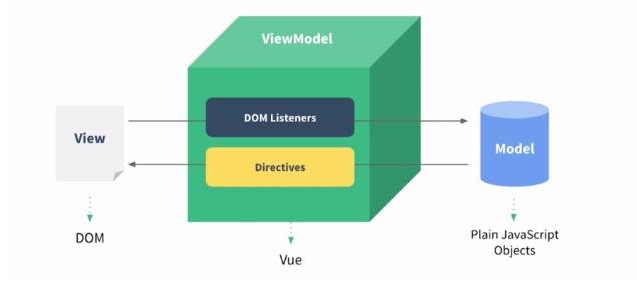

[TOC]

#### 1：v-model原理

`v-model` 指令在表单 `<input>`、`<textarea>` 及 `<select>` 元素上创建双向数据绑定。它会根据控件类型自动选取正确的方法来更新元素。

- `text` 和 `textarea` 元素使用 `value` property 和 `input` 事件；
- `checkbox` 和 `radio` 使用 `checked` property 和 `change` 事件；
- `select` 字段将 `value` 作为 prop 并将 `change` 作为事件。

```vue
<template>
  <div id="app">
    <input type="text" :value="message" @input="changeValue">{{message}}
    <input type="text" v-model="message">{{message}}
  </div>
</template>

<script>
export default {
  name: 'App',
  data() {
    return {
      message: "hello world"
    }
  },
  methods: {
      changeValue(event){
        console.log("值改变了");
        this.message = event.target.value
      }
    }
}
</script>
```

##### **在组件上使用 `v-model`**

[文档地址](https://cn.vuejs.org/v2/guide/components-custom-events.html#%E8%87%AA%E5%AE%9A%E4%B9%89%E7%BB%84%E4%BB%B6%E7%9A%84-v-model)

需要注意的是：照着文档写会报错

```
error:
You are using the runtime-only build of Vue where the template compiler is not available
```

`vue`有两种形式的代码 分别是`compiler`（模板）模式和`runtime`模式（运行时），`vue`模块的`package.json`的`main`字段默认为`runtime`模式， 指向了`"dist/vue.runtime.common.js"`位置
 在`main.js`文件中，初始化`vue`是`compiler`模式的，因此出现上面的报错信息。

**解决方案：**

```js
// vue.config.js
module.exports = {
  runtimeCompiler: true,
};

```


#### 2：挂在el的两种写法

```js
const v = new Vue({
  //el:'#root', //第一种写法
  data: {
    name: "尚硅谷",
  },
});
v.$mount("#root"); //第二种写法
```

#### 3：MVVM



1. M：模型(Model) ：数据层

2. V：视图(View) ：在前端开发中通常是DOM层，主要给用户展示各种信息

3. VM：视图模型层，是view&model沟通的桥梁。一方面实现了Directives（数据绑定），将Model的改变实时反应到View中，另一方面实现了Dom Listener（DOM监听），当DOM发生一些事件（点击、滚动、touch等），可以监听到并在需要的情况下改变对应的Data

 **观察发现：**

- .data中所有的属性，最后都出现在了vm身上。

- vm身上所有的属性 及 Vue原型上所有属性，在Vue模板中都可以直接使用。


#### 4：computed与watch

**计算属性是基于它们的响应式依赖进行缓存的**。只在相关响应式依赖发生改变时它们才会重新求值。相比之下，每当触发重新渲染时，调用方法将**总会**再次执行函数。遍历一个巨大的数组并做大量的计算。然后我们可能有其他的计算属性依赖于 **A**。如果没有缓存，我们将不可避免的多次执行 **A** 的 getter！

#### 5：render函数

`render` 函数的作用替代 `template` 模板

```vue
// App.vue

<script>
export default {
  name: 'App',
  render(createElement) {
    return createElement(
      'h1',  // 标签名称
      this.message
    )
  },
  data() {
    return {
      message: "hello world",
    }
  },
}
</script>

<style>
</style>

```

##### 深入 render

render函数返回`createElement` 执行的结果，

`createElement` 返回的不是一个真实DOM 元素。而是一个“**VNode**”。虚拟节点它所包含的信息会告诉 Vue 页面上需要渲染什么样的节点，包括及其子节点的描述信息。

```js
new Vue({
  render: (h) => h(App),
}).$mount("#app");
```

将 `h` 作为 `createElement` 的别名是 Vue 生态系统中的一个通用惯例，实际上也是 JSX 所要求的。

##### `createElement` 接受的参数：

三个参数：

1. 必填：一个 HTML 标签名、组件选项对象
2. 可选：属性
3. 子节点

```js
export default {
  name: 'App',
  render(createElement) {
    return createElement(
      HelloWorld,  // 标签名称
      { attrs: { class: 'test' } }, // 属性
      [createElement('h1', '一则头条'),]
    )
  },
  data() {
    return {
      message: "hello world",
    }
  },
}
```


#### 6：v-if与v-for 一起用

[v-if与v-for 一起用](https://cn.vuejs.org/v2/style-guide/#%E9%81%BF%E5%85%8D-v-if-%E5%92%8C-v-for-%E7%94%A8%E5%9C%A8%E4%B8%80%E8%B5%B7%E5%BF%85%E8%A6%81)

当 Vue 处理指令时，`v-for` 比 `v-if` 具有更高的优先级

```html
<ul>
  <li
    v-for="user in users"
    v-if="user.isActive"
    :key="user.id"
  >
    {{ user.name }}
  </li>
</ul>
```

将会经过如下运算：

```js
// 因此哪怕我们只渲染出一小部分用户的元素，也得在每次重渲染的时候遍历整个列表，不论活跃用户是否发生了变化。
this.users.map(function (user) {
  if (user.isActive) {
    return user.name
  }
})
```

#### 7：v-for遍历对象

```
在遍历对象时，会按 Object.keys() 的结果遍历，但是不能保证它的结果在不同的 JavaScript 引擎下都一致。
```

```html
<div v-for="(value, name, index) in object">
  {{ index }}. {{ name }}: {{ value }}
</div>
```

#### 8：vue为什么不能检测数组和对象的变化

##### 对象：

就对象而言，不能检测变化的原因是在实例时没有这个属性，如果有的话是可以检测的

```vue
<template>
  <div id="app">
    <span>obj.a:{{obj.a}}</span>
    <br>
    <span>obj.b:{{obj.b}}</span>  <!-- 点击无效果 -->
    <button @click="change">点击</button>
  </div>
</template>

<script>
export default {
  name: 'App',
  data() {
    return {
      obj:{
        a:22
      },
    }
  },
  methods: {
      change() {
        this.obj.b = 333
      }
    }
}
</script>
```

##### 数组：

数组有两种情况检测不到

1. 利用索引直接设置一个数组项时
2. 修改数组的长度时

```vue
<template>
  <div id="app">
    <ul>
      <li v-for="(litem, index) in items" :key="index">{{litem}}</li>
    </ul>
  </div>
</template>

<script>
export default {
  name: 'App',
  data() {
    return {
      items: ['a', 'b', 'c']
    }
  },
  methods: {
      change() {
          // 以下两种操作没有响应式的
         this.items[1] = 'sss'
         this.items.length = 4
         console.log(this.items);
      }
    }
}
</script>
```


#### 9：DOM模板解析

有些 HTML 元素，诸如 `<ul>`、`<ol>`、`<table>` 和 `<select>`，对于哪些元素可以出现在其内部是有严格限制的。而有些元素，诸如 `<li>`、`<tr>` 和 `<option>`，只能出现在其它某些特定的元素内部。

```html
<table>
  <blog-post-row></blog-post-row>
</table>
```

这个自定义组件 `<blog-post-row>` 会被作为无效的内容提升到外部，并导致最终渲染结果出错。

**is 属性**

```html
<table>
  <tr is="blog-post-row"></tr>
</table>
```

需要注意的是**如果我们从以下来源使用模板的话，这条限制是\*不存在\*的**：

- 字符串 (例如：`template: '...'`)
- [单文件组件 (`.vue`)](https://cn.vuejs.org/v2/guide/single-file-components.html)
- [`<script type="text/x-template"></script>`](https://cn.vuejs.org/v2/guide/components-edge-cases.html#X-Templates)


#### 10：插槽

[更具体的示例](https://github.com/posva/vue-promised)

##### 10.1：插槽内容

组件之间的内容被渲染叫做插槽内容

```html
app.vue

<HelloWorld msg="Welcome to Your Vue.js App"> 
  <input type="text">
  <button>ddd</button>
  ssssssssss
</HelloWorld>
```

```html
HelloWorld.vue

<template>
  <div class="hello">
    <h1>sssssssssssssss</h1>
    <slot></slot>
  </div>
</template>
```

如果`HelloWorld.vue`中间没有slot的话，`<HelloWorld> ....</HelloWorld>`中间的内容会被忽视


##### 10.2：编译作用域

在组件中间传的值是在当前页面定义的，而不是在插槽组件中定义的

**父级模板里的所有内容都是在父级作用域中编译的；子模板里的所有内容都是在子作用域中编译的。**

```vue
<template>
  <div id="app">
    
    <HelloWorld msg="Welcome to Your Vue.js App"> 
      {{name}}
      <!-- 这个name是当前组件定义的, 不是HelloWorld组件中定义的 -->
    </HelloWorld>
  </div>
</template>

<script>
import HelloWorld from './components/HelloWorld.vue'

export default {
  name: 'App',
  components: {
    HelloWorld
  },
  data(){
    return {
      name:222
    }
  }
}
</script>
```

##### 10.3：后备内容

插槽里面放内容，不适用插槽的话这个插槽里面的内容渲染，使用的话插槽里的内容会被忽视

```html
<template>
  <div class="hello">
    <h1>sssssssssssssss</h1>
    <slot>是顶顶顶</slot>
  </div>
</template>
```

##### 10.4：具名插槽

没有给 `slot="xxx"`，默认为 `slot="default"`

```html
<template>
<div class="container">
  <header>
    <slot name="header"></slot>
  </header>
  <main>
    <slot></slot>
  </main>
  <footer>
    <slot name="footer"></slot>
  </footer>
</div>
</template>
```

v-slot 只能作用在template 标签上

```html
<template>
  <div id="app">
    
    <HelloWorld msg="Welcome to Your Vue.js App"> 
      <template v-slot:header>
        <h1>Here might be a page title</h1>
      </template>

      <p>A paragraph for the main content.</p>
      <p>And another one.</p>

      <template v-slot:footer>
        <p>Here's some contact info</p>
      </template>
    </HelloWorld>
  </div>
</template>
```


**缩写：**

`<template v-slot:header>` = `<template #header>`

```vue
<template>
  <div id="app">
    
    <HelloWorld msg="Welcome to Your Vue.js App"> 
      <template #header>
        <h1>Here might be a page title</h1>
      </template>

      <p>A paragraph for the main content.</p>
      <p>And another one.</p>

      <template v-slot:footer>
        <p>Here's some contact info</p>
      </template>
    </HelloWorld>
  </div>
</template>
```


##### 10.5：作用域插槽

通过作用于插槽让子组件中的数据能在父组件中使用

两种写法：

1：`v-slot:default="slotProps"` ，`slotProps`可以拿到子组件插槽中的数据

2：`slot-scope="slotProps"` ， `slotProps`可以拿到子组件插槽中的数据

```vue
<template>
  <div id="app">
    
    <HelloWorld msg="Welcome to Your Vue.js App"> 
      <template v-slot:default="slotProps">
      <!-- <template slot-scope="slotProps"> -->
        <h1>{{slotProps.user.firstName}}</h1>
      </template>
    </HelloWorld>
  </div>
</template>
```

子组件在插槽中绑定数据

```vue
<template>
  <div class="container">
    <slot :user="user">{{ user.lastName }}</slot>
  </div>
</template>
```


#### 11：全局注册组件

[全局注册组件](https://cn.vuejs.org/v2/guide/components-registration.html#%E5%9F%BA%E7%A1%80%E7%BB%84%E4%BB%B6%E7%9A%84%E8%87%AA%E5%8A%A8%E5%8C%96%E5%85%A8%E5%B1%80%E6%B3%A8%E5%86%8C)

[具体例子](https://github.com/bencodezen/vue-enterprise-boilerplate/blob/main/src/components/_globals.js)

`./components/index.js`

```js
import upperFirst from 'lodash/upperFirst'
import camelCase from 'lodash/camelCase'
import Vue from 'vue'

const requireComponent = require.context(
    // 其组件目录的相对路径
    './components',
    // 是否查询其子目录
    false,
    // 匹配基础组件文件名的正则表达式
    /Base[A-Z]\w+\.(vue|js)$/
)

requireComponent.keys().forEach(fileName => {
    // 获取组件配置
    const componentConfig = requireComponent(fileName)

    // 获取组件的 PascalCase 命名
    const componentName = upperFirst(
        camelCase(
            // 获取和目录深度无关的文件名
            fileName
                .split('/')
                .pop()
                .replace(/\.\w+$/, '')
        )
    )

    // 全局注册组件
    Vue.component(
        componentName,
        // 如果这个组件选项是通过 `export default` 导出的，
        // 那么就会优先使用 `.default`，
        // 否则回退到使用模块的根。
        componentConfig.default || componentConfig
    )
})

```

`main.js`

```js
import Vue from 'vue'
import App from './App.vue'
import '@comp/index' // 全局注册必须在vue实例化前
Vue.config.productionTip = false

new Vue({
  render: h => h(App),
}).$mount('#app')

```


#### 12：通过props修改值

原则上不允许，但是要是数组或者对象的话是可以的；值得注意的是，不具有响应式

```js
<template>
  <div class="container">
    <ul>
      <li v-for="(item, index) in arr" :key="index">{{item}}</li>
    </ul>
    <button @click="change">修改</button>
  </div>
</template>

<script>
export default {
  name: 'HelloWorld',
  props: {
    arr: Array
  },
  data(){
    return {
      user:{
        lastName:'sdf',
        firstName: 'dsfg'
      }
    }
  },
  methods:{
    change(){
      this.$props.arr[1] = 5
      this.$emit('changeValue')
    }
  }
}
</script>
```


#### 13：[原生事件绑定组件](https://cn.vuejs.org/v2/guide/components-custom-events.html#%E5%B0%86%E5%8E%9F%E7%94%9F%E4%BA%8B%E4%BB%B6%E7%BB%91%E5%AE%9A%E5%88%B0%E7%BB%84%E4%BB%B6)


#### 14：[动态组件&异步组件](https://cn.vuejs.org/v2/guide/components-dynamic-async.html)

**动态：**

```vue
绑定的是组件名，字符串
<component v-bind:is="currentTabComponent"></component>
```

**异步：**

```js
<template>
  <div class="container">
    <base-input></base-input>
  </div>
</template>

<script>
export default {
  name: 'HelloWorld',
  props: {
    arr: Array
  },
  components:{
  // 两种异步组件引入方式
    BaseInput:()=> import('./BaseInput.vue')
    BaseInput:(resolve)=> require(['./BaseInput.vue'],resolve)
  },
}
</script>
```


#### 15：混入

##### 15.1：混入需要注意的点

1. 当组件和混入对象含有同名选项时，以组件数据优先

```js
var mixin = {
  data: function () {
    return {
      message: 'hello',
      foo: 'abc'
    }
  }
}

new Vue({
  mixins: [mixin],
  data: function () {
    return {
      message: 'goodbye',
      bar: 'def'
    }
  },
  created: function () {
    console.log(this.$data)
    // => { message: "goodbye", foo: "abc", bar: "def" }
  }
})
```


2. **同名生命周期函数**将合并为一个数组，都将被调用。另外，**混入对象的钩子将在组件自身钩子之前调用。**

```js
var mixin = {
  created: function () {
    console.log('混入对象的钩子被调用')
  }
}

new Vue({
  mixins: [mixin],
  created: function () {
    console.log('组件钩子被调用')
  }
})

// => "混入对象的钩子被调用"
// => "组件钩子被调用"
```


3. methods中相同的方法，以组件为准


#### 16：[自定义指令](https://cn.vuejs.org/v2/guide/custom-directive.html)

类似于v-bind指令一样，自定义一个指令实现功能

```html
<input v-focus>
```

```js
// 注册一个全局自定义指令 `v-focus`
Vue.directive('focus', {
  // 当被绑定的元素插入到 DOM 中时……
  inserted: function (el) {
    // 聚焦元素
    el.focus()
  }
})
// 局部
directives: {
  focus: {
    // 指令的定义
    inserted: function (el) {
      el.focus()
    }
  }
}
```

#### 17：插件

通过全局方法 `Vue.use()` 使用插件。它需要在你调用 `new Vue()` 启动应用之前完成：

Vue.js 的插件应该暴露一个 `install` 方法。这个方法的第一个参数是 `Vue` 构造器，第二个参数是一个可选的选项对象：

[具体用法](https://github.com/wczy-ao/StudyNotes/blob/main/Vue/vue%E6%8A%80%E6%9C%AF%E7%82%B9.md)