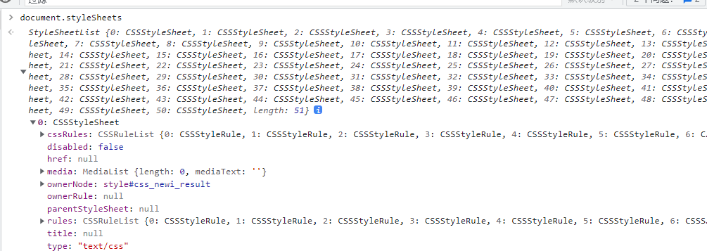
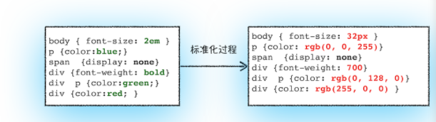

# `Render-Tree`—回流—重绘—优化

## 构建DOM树

为什么要构建 DOM 树呢？因为浏览器无法直接理解和使用 HTML，所以需要将 HTML 转换（**DOM parser**）为浏览器能够理解的结构 —— DOM 树。


## CSS树

#### styleSheets

和 HTML 文件一样，浏览器也是无法直接理解这些纯文本的 CSS 样式，所以**当渲染引擎接收到 CSS 文本时，会执行一个转换操作，将 CSS 文本转换为浏览器可以理解的结构 —— styleSheets**。




#### 转换样式表中的属性值，使其标准化

```css
body { font-size: 2em }
p { color: blue }
span { display: none }
div { font-weight: bold }
div p { color: green }
div { color: red }
```

可以看到上面的 CSS 文本中有很多属性值，如 2em、blue、bold，这些类型数值不容易被渲染引擎理解，所以**需要将所有值转换为渲染引擎容易理解的、标准化的计算值**，这个过程就是属性值标准化。


那标准化后的属性值是什么样子的？\

从图中可以看到，2em 被解析成 32px，red 被解析成了 rgb(255, 0, 0)，bold 被解析成了 700




#### 计算出 DOM 树中每个节点的具体样式

这就涉及到 CSS 的继承规则和层叠规则了。

具体的不展开：[可以先看这篇文章](https://www.cnblogs.com/bala/p/12112431.html)


### RenderTree

RenderTree构建完毕后--> 浏览器会根据它绘制页面

- 渲染树每个节点都有自己的样式。
- 不包含display: none  head之类不需要绘制的节点。
- visibility: hidden相对应的节点是包含在渲染树上的。
- 渲染树上的每一个节点都会被当做一个盒子box。


## 回流与重绘

当JS对页面的节点操作时，就会产生回流或者重绘。

### 回流（重排）reflow

> 因为节点的尺寸、布局、display: none block这一些改变的时候，渲染树中的一部分或者全部需要重新构建。这就叫做回流

#### 引起回流的因素：

- DOM节点增加、删除。
- DOM节点位置变化。
- 元素的尺寸、边距、填充、边框、宽高。
- DOM节点display显示与否。
- 页面渲染初始化。
- 浏览器窗口尺寸变化 -> resize。
- 向浏览器请求某些样式信息 `offset`、`scroll`、`client`、`width`、`height`、`getComputedStyle()`、`currentStyle`。


### 重绘

> 回流时，浏览器会重新构建受影响部分的渲染树；回流完成后，浏览器会根据新的渲染树重新绘制回流影响的部分节点；这就叫重绘

#### 引起重绘的因素：

- 仅修改DOM元素的字体颜色


## 回流与重绘的关系

回流一定导致重绘

重绘不一定是回流引起的；


## 性能优化

[性能](https://www.cnblogs.com/hyddd/archive/2013/02/07/2908960.html)

```html
<!DOCTYPE html>
<html lang="en">
<head>
  <meta charset="UTF-8">
  <title>DOM/CSS/渲染树、解析与加载、回流与重绘</title>
  <style type="text/css">
    div {
      width: 100px;
      height: 100px;
      background-color:#000;
    }

    div.active {
      width: 200px;
      height: 200px;
      background-color: green;
      border: 5px solid orange;
    }
  </style>
</head>
<body>
  <div></div>
  <script type="text/javascript">
    var oDiv = document.getElementsByTagName('div')[0],
        oBoxStyle = oDiv.style,
        width = 200,
        height = 200,
        backgroundColor = 'green',
        border = '5px solid orange';

    oDiv.onmouseover = function () {
      // 添加类名修改样式（只会引起一次回流）
      // this.className += ' active';

      // 只会引起一次回流
      // this.style.cssText = '\
      // width: '+ width +'px;\
      // height: '+ height +'px;\
      // background-color: '+ backgroundColor +';\
      // border: '+ border +';\
      // ';

      // 只会回流两次
      oBoxStyle.display = 'none';
      oBoxStyle.width = '200px';
      oBoxStyle.height = '200px';
      oBoxStyle.background = 'green';
      oBoxStyle.border = '5px solid orange';
      oBoxStyle.display = 'block'
    }
  </script>
</body>
</html>
```

