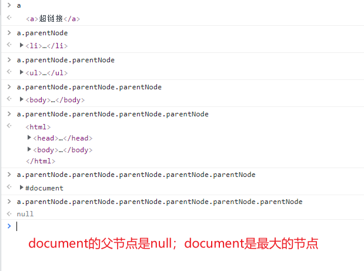

# document对象-获取元素-遍历树

## `document`

- 是最上层

```js
document = {
  
}
```

## 获取元素

### `getElementById`

- IE8以下，不区分id大小写
- IE8 getElementById 可以通过name属性来找dom

```js
<div name='box'></div>
var box = document.getElementById('box');
```

### `getElementsByTagName`

- 获取一组

```js
var boxes = document.getElementsByTagName('box');
boxes[0]
```

### `getElementsByClassName`

- IE8**及以下没有**

### `getElementsByName`

- 不常用

```js
<div name='box'></div>
var box = document.getElementsByName('box');
```

### H5新增

#### `querySelector`，`querySelectorAll`

- HTML5 新引入Web API

- 兼容到IE7

- 参数和css选择器表示方式类似

- **缺点：**

  - 性能不好

  - **不实时（具有缓存性）**

    ```js
    <body>
        <div>123</div>
        <div>345</div>
        <div>456</div>
        <script>
            var divs = document.querySelectorAll('div')
            divs[0] = 1
            console.log(divs); // 不变
    	</script>
    </body>
    ```


## 遍历元素节点树

> 节点树不是元素，节点包含元素 -->> 元素节点 == DOM元素

### `parentNode`

上一级，一个子元素只有一个父节点

```js
var a = document.getElementsByTagName('a')[0];
```




### `childNodes`

获取子节点，节点包括元素节点，属性节点，文本节点，注释节点等

节点-----节点号（**nodeType**)

- 元素节点 = 1
- 属性节点 = 2
- 文本节点 = 3
- 注释节点 =8
- document = 9
- DocumnetFragment = 11


### `firstChild`

第一个节点（并不一定是元素节点）

### `lastChild`

最后一个节点（并不一定是元素节点）


### 兼容问题

- parentElement 父元素 遍历到顶层是HTML元素 IE9及以下不支持
- childElementCount = children.length IE9及以下不支持
- firstElementChild lastElementChild  IE9及以下不支持
- nextElementSibling previousElementSibling   IE9及以下不支持
- children 子元素  IE7及以下不支持

