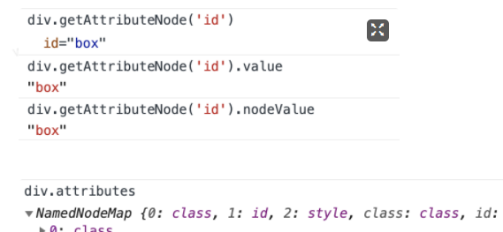
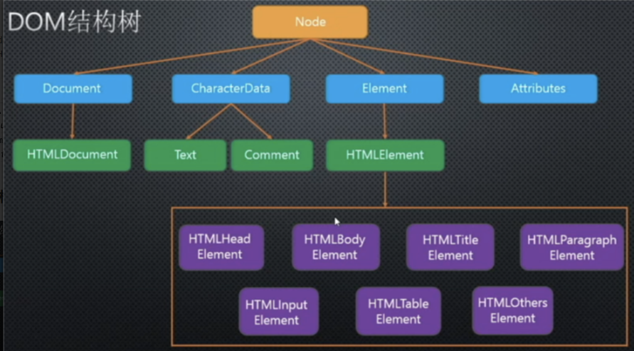
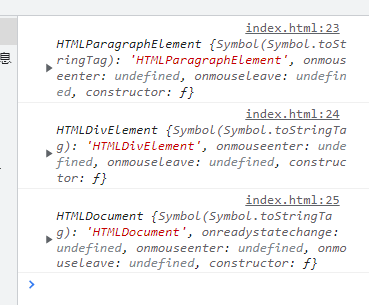

# 节点属性，方法，封装，DOM继承

```html
<div class="box" id='box' style="background-color: aqua;">
  我是文本节点
  <!-- 注释一下 -->
  <h2>我是h2</h2>
  <a>超链接</a>
  <p>p标签</p>
</div>
```

## 属性

### `nodeName`

- 元素节点的`nodeName`是大写
- 不可更改

### `nodeValue`

- 文本节点
- 属性节点
- 注释节点
- 元素节点没有`nodeValue`
- **可以修改**

```js
div.firstChild.nodeValue

div.childNodes[1]

div.childNodes[1].nodeValue

div.childNodes[3]

div.childNodes[3].nodeValue
```

### `nodeType`

- 元素节点 = 1
- 属性节点 = 2
- 文本节点 = 3
- 注释节点 =8
- document = 9
- `DocumnetFragment` = 11
- **只读**


### `getAttributeNode` `attributes`

> 获取属性节点和属性集




### `hasChildNodes`

- 是否具有子节点
- 包括文本节点


## 封装

> 封装一个获取元素节点的函数

```js
function elemChildren(node){
	var arr = [],
      children = node.childNodes;
  for(var i = 0; i < children.length; i++){
    var childItem = children[i];
  	if(childItem.nodeType == 1){
    	arr.push(childItem)
    }
  }
  return arr;
}
console.log(elemChildren(div));
```


## DOM继承




和ES对象一样，DOM对象同样也有继承，上图就是DOM构造函数的继承；

我们先看一看平时创建的DOM对象的原型分别是什么

```html
<body>
    <div>
        <p></p>
    </div>
    <script>
        var oDiv = document.getElementsByTagName('div')[0]，
        	oP = oDiv.getElementsByTagName('p')[0];
        console.log(oP.__proto__);
        console.log(oDiv.__proto__);
        console.log(document.__proto__);
    </script>    
</body>
```



**打印 `div， docunment， p` 元素的原型会发现 `HTMLDocument, HTMLDivElement, HTMLParagraphElement`这三个的原型如DOM树继承一般，各自继承着相应的原型；同时发现选择元素的方法如`getElementsByTagName`不在`HTMLDocument, HTMLDivElement, HTMLParagraphElement`这上面；而是在 `Document,Element`上面**


### DOM修改原型

```js
Element.prototype.aaa = 'aaa';
HTMLElement.prototype.bbb = 'bbb';
HTMLDivElement.prototype.ccc = 'ccc';
var div = document.getElementsByTagName('div')[0];
var p = document.getElementsByTagName('p')[0];

console.log(div.ccc);
console.log(div.bbb);
console.log(div.aaa);
console.log(p.aaa); // aaa
console.log(p.bbb); // bbb
console.log(p.ccc); // undefined
```


### 判断DOM元素类型

```js
var p = document.getElementsByTagName('p')[0];
var tostr = Object.prototype.toString
console.log(tostr.call(p)); // [object HTMLParagraphElement]
```


## Document补充

### `documentElement`

> 获取整个html文档

```
document.documentElement
```

