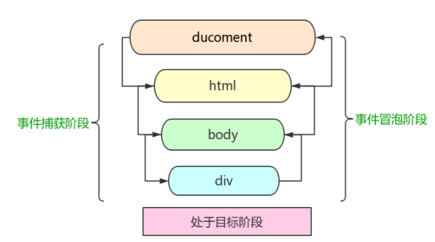

# 冒泡捕获流、事件代理

[冒泡捕获事件详谈](https://www.cnblogs.com/christineqing/p/7607113.html)

## 事件对象

```js
wrapper.onclick = function(e){
  // IE window.event
  var e = e || window.event
	console.log(e);
}
```

## 事件流

> 事件流描述的是从页面中接受事件的顺序

**IE的事件流是事件冒泡流(event bubbling)**

> 事件捕获流的思想是不太具体的DOM节点应该更早接收到事件，而最具体的节点应该最后接收到事件

**Netscape的事件流是事件捕获流(event capturing)**

> 事件开始时由**最具体的元素接收，然后逐级向上传播到较为不具体的节点**

## DOM事件流

DOM2级事件’规定的事件流包含3个阶段，**事件捕获阶段、处于目标阶段、事件冒泡阶段**。这个意思就是DOM事件触发了（用onclick触发），先捕获，看看有没有父级DOM有相同的事件，DOM父级执行完后，到了目标阶段，然后再进行冒泡




```html
<!DOCTYPE html>
<html lang="en">

<head>
    <meta charset="UTF-8">
    <title>Title</title>
</head>

<body>
    <button id="btn">DOM事件流</button>
    <script>
        var btn = document.getElementById("btn");
        btn.onclick = function (event) {
            console.log("div 处于目标阶段");
        };
        document.body.addEventListener("click", function (event) {
            console.log("event bubble 事件冒泡");
        }, false);
        document.body.addEventListener("click", function (event) {
            console.log("event catch 事件捕获");
        }, true);
    </script>

</body>

</html>
```


