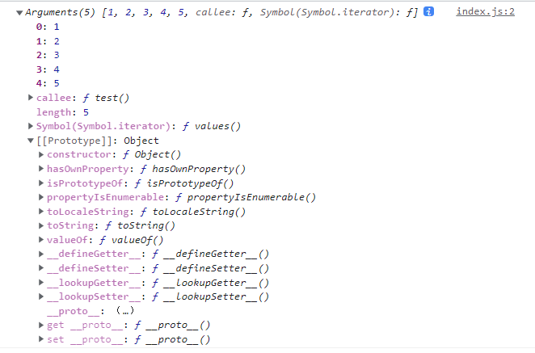

# 数组与类数组

## 数组

### 数组的创建

- 字面量

  ```js
  var arr = []
  ```

- 构造函数声明

  ```js
  var arr = Array() // 不推荐
  ```

- new 创建

  - 不传参

    ```js
    var arr = new Array()
    ```

  - 传参

    ```js
    var arr = new Array(5) // 参数是整数并且只有一个表示创建数组的长度
    
    var arr = new Array('2') 
    var arr = new Array(1,2,3,5) // 参数不是整数 且具有多个的话，表示数组元素
    ```

  ```js
  console.log(arr.__proto__) // 数组都继承于Array.prototype
  ```


- 对象的创建方式同数组一样

```js
var obj1 = {}; // 对象字面量
var obj2 = new Object();
//通过系统内置的Object构造函数声明对象
var obj3 = Object();

console.log(obj1.__proto__);
console.log(obj2.__proto__);
console.log(obj3.__proto__);
// 所有对象都继承于Object.ptototype
```


### 稀松数组

```js
var arr1 = [, 1, 3, , , 5, 7]; // 稀疏数组---中间和前面的逗号会保留
var arr2 = [1, 3, 5,,,];//最后的一个 , 会被省略；所以数组长度是 5；而不是6
console.log(arr1);
console.log(arr2);
```


### 数组方法

#### `push` 和 `unshift`

- 共同点
  - **返回的是执行操作后数组的长度**
  - **会修改原数组**
- 不同点
  - `push`  可以将多个元素添加至数组末尾
  - `unshift`  可以将多个元素添加至数组首位


#### **push的实现**

```js
Array.prototype.MyPush = function(){
  for (let i = 0; i<arguments.length; i++){
    this[this.length] = arguments[i]
  }
  return this.length
}
var arr = [1,2,3]
arr.MyPush('1')
console.log(arr);
```


#### `pop` 和 `shift`

- 共同点
  - **会修改原数组**
  - 返回被删除元素的值；如果数组是空则返回 `undefined`

- 不同点
  - `pop` 删除最后一个元素
  - `shift` 删除第一个元素

```js
var arr = []
var str1 = arr.pop()
var str2 = arr.shift()
```


#### **`reverse`**

将数组中的位置颠倒，方法会**改变原数组**

```js
var arr = ['a', 'b', 'c', 'd', 'e'];
var res = arr.reverse();
console.log(arr === res); // true
console.log(res, arr); // ['e', 'd', 'c', 'b', 'a']
```


#### **`splice`**

通过删除，替换或者添加新的元素来修改数组；**并返回修改的数组（不是修改后的数组）**；**原数组会改变**

```js
arr.splice(start, deleteCount, item1, item2, ...)
```

- `start`
  - 正数
  - 负数
- `deleteCount`
  - 整数
- `item1, item2, ...`
  - 要添加进数组的元素


#### `sort`

> 对数组元素进行排序，排序规则是将元素转为字符串，比较utf-16编码（升序排布）

```js
arr.sort(compareFunction)

var arr = [1,22,3,4,5];
console.log(arr.sort()); // [1, 22, 3, 4, 5]
```

##### 参数（可选）

```
arr.sort(function(a,b){	})
```

指定排列的函数，如果省略则按各个字符的Unicode进行升序排布

- a：第一个比较元素
- b：第二个比较元素

**返回结果会影响排布结果**

- 返回值小于 0 ；a 会排到 b 之前
- 返回值大于 0 ；a 会排到 b 之后
- 返回值等于 0 ；a 和 b 相对位置不变


##### 比较函数

```js
var arr = [27, 49, 5, 7];

arr.sort(function (a, b) {
  // 升序排列
  return a - b;
  // 降序排列
  // return b - a;
});

console.log(arr);
```

##### 随机排序

```js
var arr = [1, 2, 3, 4, 5, 6];

arr.sort(function (a, b) {
  return Math.random() - 0.5;
});

console.log(arr);
```


#### concat

concat()方法用于合并两个或多个数组。**此方法不会更改现有数组**，而是返回一个新数组。

```js
var newArr = oldArr.concat(value1, value2, ...);
```

**参数**
valueN（可选）
数组/或值，将被合并到一个新的数组中。**如果省略了所有valueN参数，则concat会返回调用此方法的现存数组的一个浅拷贝。**

```js
var arr1 = ['a', 'b', 'c',[22,44]];
var arr2 = ['d', 'e', 'f'];
var arr3 = arr1.concat(); // 浅拷贝
var arr4 = arr2.concat(arr1);
arr3[3][1]=2
console.log(arr1);
console.log(arr2);
console.log(arr3);
console.log(arr4);
```


#### **toString()**

> toString()方法返回一个字符串，表示指定的数组及其元素。

```js
var arr = ['a', 'b', 'c', 'd'];
console.log(arr.toString());
```


#### **slice()**

slice()方法返回一个新的数组对象，这一对象是一个由begin和end决定的原数组的浅拷贝（包括begin，不包括end）。**原始数组不会被改变。**

```js
// 语法
arr.slice(begin, end)
```

**参数：**

- begin (可选)

  - 省略参数，则从 0 开始

    ```js
    var arr = ['a', 'b', 'c', 'd', 'e', 'f'];
    var arr1 = arr.slice();
    
    console.log(arr);
    console.log(arr1);
    ```

  - 负数

    begin 从 `arr.length+begin` 开始

    ```js
    var arr = ['a', 'b', 'c', 'd', 'e', 'f'];
    var arr1 = arr.slice(-1); // 从 5 开始
    
    console.log(arr);
    console.log(arr1); // ['f']
    ```

  - begin 大于等于数组长度

    返回空数组

    ```js
    var arr = ['a', 'b', 'c', 'd', 'e', 'f'];
    var arr1 = arr.slice(6); // 从 5 开始
    
    console.log(arr);
    console.log(arr1); // []
    ```

    

- end (可选)

  - 负数

    截取位数就是 `arr.length+end`

    ```js
    var arr = ['a', 'b', 'c', 'd', 'e', 'f'];
    var arr1 = arr.slice(0,-1);
    
    console.log(arr);
    console.log(arr1); // ['a', 'b', 'c', 'd', 'e']
    ```

  - end省略或者超出数组长度

    默认截取位数是数组长度

    ```js
    var arr = ['a', 'b', 'c', 'd', 'e', 'f'];
    var arr1 = arr.slice(0);
    
    console.log(arr);
    console.log(arr1);
    ```


#### join

**不影响原先数组**

- 省略参数

  默认逗号连接

  ```js
  var arr = ['a', 'b', 'c', 'd', 'e', 'f'];
  var arr1 = arr.join();
  
  console.log(arr);
  console.log(arr1); // a,b,c,d,e,f
  ```


#### `split`

```js
str.split(separator, limit)
```

- `separator` 可以是一个 字符串或者正则表达式，如果是省略，则返回一个原字符串的数组

  ```js
  var str1 = 'a-b-c-d-e';
  var arr1 = str1.split('-');
  var arr3 = str1.split('');
  var arr4 = str1.split();
  console.log(arr3); // ['a', '-', 'b', '-', 'c', '-', 'd', '-', 'e']
  console.log(arr4); // ['a-b-c-d-e']
  ```

- `limit` 限制数组的长度

  ```js
  var str1 = 'a-b-c-d-e';
  var arr2 = str1.split('-', 3);
  console.log(arr2); // ['a', 'b', 'c']
  ```

  

## 类数组

先看一下类数组长什么样

```js
function test (){
  console.log(arguments);
}

test(1,2,3,4,5)
```



**我们能看到类数组的原型和我们知道数组的原型是不一样的，类数组没有push等方法**


### 类数组实现push

```js
var obj = {
  '2': 3,
  '3': 4,
  'length': 2,
  'splice': Array.prototype.splice,
  'push': Array.prototype.push
};

obj.push(1);
obj.push(2);
console.log(obj);
```

### push 的 原理

在push的实现中我们知道添加数据是利用了 `length` 属性；那我们在类数组中修改length会不会也影响结果

```js
var obj = {
  '2': 3,
  '3': 4,
  'length': 4,
  'splice': Array.prototype.splice,
  'push': Array.prototype.push
};

/**
* 数组下标是从0开始的，length = 2 -> Array(2) -> [empty, empty]
* 每次push都是从this.length开始插入
* obj[length] = 1	 -> obj[2] = 1  length++
* obj[length] = 2  -> obj[3] = 2  length++
 */
obj.push(1);
obj.push(2);
console.log(obj); // obj.length = 6 而不是 3
```


## 练习

### 实现unshift方法

```js
Array.prototype.myUnShift = function(){
  var pos = 0
  for (let index = 0; index < arguments.length; index++) {
    this.splice(pos,0,arguments[index])
    pos++
  }
  return this.length
}
```

#### 字节排序数组

```js
function getBytes(str) {
  var bytes = str.length;

  for (var i = 0; i < str.length; i++) {
    if (str.charCodeAt(i) > 255) {
      bytes++;
    }
  }

  return bytes;
}

var arr = ['我爱你', 'OK', 'Hello', '你说WHAT', '可以'];

arr.sort(function (a, b) {
  return getBytes(a) - getBytes(b);
});

console.log(arr);
```

