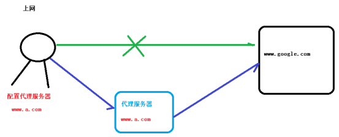
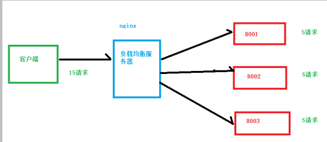
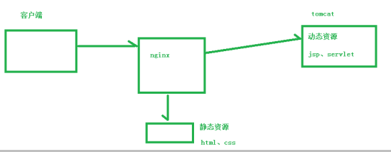

# 概念篇

## 什么是nginx

Nginx 是高性能的 HTTP 和反向代理的服务器，处理高并发能力是十分强大的，能经受高负 载的考验。

Nginx 可以作为静态页面的 web 服务器，同时还支持 CGI 协议的动态语言，比如 perl、php等，但是不支持 java。Java 程序只能通过与 tomcat 配合完成。Nginx 专为性能优化而开发，性能是其最重要的考量,实现上非常注重效率 ，能经受高负载的考验,有报告表明能支持高达 50,000 个并发连接数。

## 正向代理

**正向代理**是一个位于客户端和目标服务器之间的代理服务器(中间服务器)。为了从原始服务器取得内容，客户端向代理服务器发送一个请求，并且指定目标服务器，之后代理向目标服务器转交并且将获得的内容返回给客户端。正向代理的情况下客户端必须要进行一些特别的设置才能使用。

## 反向代理

**反向代理**正好相反。对于客户端来说，反向代理就好像目标服务器。并且客户端不需要进行任何设置。客户端向反向代理发送请求，接着反向代理判断请求走向何处，并将请求转交给客户端，使得这些内容就好似他自己一样，一次客户端并不会感知到反向代理后面的服务，也因此不需要客户端做任何设置，只需要把反向代理服务器当成真正的服务器就好了。

## 正向代理反向代理的区别

> 正向代理:客户端 <一> 代理 一>服务端

正向代理简单地打个租房的比方:

A(客户端)想租C(服务端)的房子,但是A(客户端)并不认识C(服务端)租不到。 B(代理)认识C(服务端)能租这个房子所以你找了B(代理)帮忙租到了这个房子。

这个过程中C(服务端)不认识A(客户端)只认识B(代理) C(服务端)并不知道A(客户端)租了房子，只知道房子租给了B(代理)。

> 反向代理:客户端 一>代理 <一> 服务端

A(客户端)想租一个房子,B(代理)就把这个房子租给了他。 这时候实际上C(服务端)才是房东。 B(代理)是中介把这个房子租给了A(客户端)。

这个过程中A(客户端)并不知道这个房子到底谁才是房东。

**由上的例子和图，我们可以知道正向代理和反向代理的区别在于代理的对象不一样,正向代理的代理对象是客户端,反向代理的代理对象是服务端。**

## 负载均衡

增加服务器的数量，然后将请求分发到各个服务器上，将原先请求集中到单个服务器上的情况改为将请求分发到多个服务器上，将负载分发到不同的服务器，也就是我们所说的负\载均衡

##  动静分离

为了加快网站的解析速度，可以把动态页面和静态页面由不同的服务器来解析，加快解析速度。降低原来单个服务器的压力。

