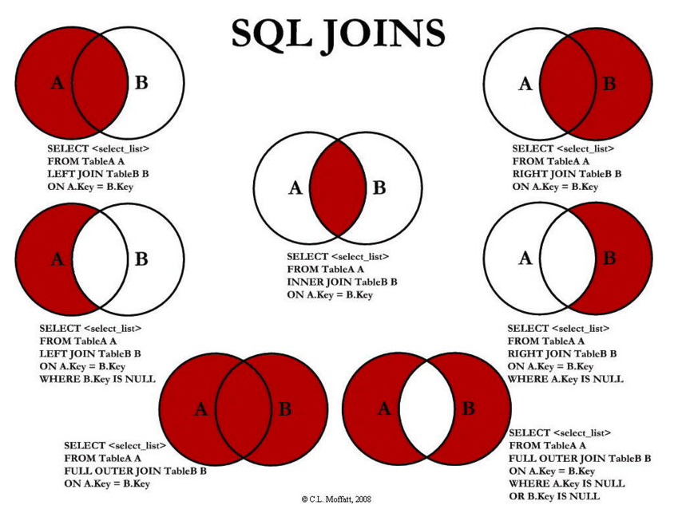

# 多表的设计

## 多表之间的关联—外键

试想一下，能不能把所有的数据都放在一张表里面，这明显是不可理的！这个时候可能需要多张表来存放，这些表存放数据那就需要关联，这个关联就是——外键


### 增加第二张表

```mysql
CREATE TABLE IF NOT EXISTS `brand`(
	id INT PRIMARY KEY AUTO_INCREMENT,
	name VARCHAR(20) NOT NULL,
	website VARCHAR(100),
	worldRank INT
);

INSERT INTO `brand` (name, website, worldRank) VALUES ('华为', 'www.huawei.com', 1);
INSERT INTO `brand` (name, website, worldRank) VALUES ('小米', 'www.mi.com', 10);
INSERT INTO `brand` (name, website, worldRank) VALUES ('苹果', 'www.apple.com', 5);
INSERT INTO `brand` (name, website, worldRank) VALUES ('oppo', 'www.oppo.com', 15);
INSERT INTO `brand` (name, website, worldRank) VALUES ('京东', 'www.jd.com', 3);
INSERT INTO `brand` (name, website, worldRank) VALUES ('Google', 'www.google.com', 8);
```


### 增加外键

```mysql
# 给brand_id 设置引用brand中id的外键约束
# 先增加字段
ALTER TABLE `products` ADD `brand_id` INT;
# 再增加外键关联
ALTER TABLE `products` ADD FOREIGN KEY (brand_id) REFERENCES brand(id);

UPDATE `products` SET `brand_id` = 1 WHERE `brand` = '华为';
UPDATE `products` SET `brand_id` = 2 WHERE `brand` = '苹果';
UPDATE `products` SET `brand_id` = 3 WHERE `brand` = '小米';
UPDATE `products` SET `brand_id` = 4 WHERE `brand` = 'OPPO';
```


### 外键更改，引用表中的数据也需要更改

```mysql
# 3：修改外键时的更新动作
# 3.1：id 作为外键 被引用的时候不能直接更改
UPDATE `brand` SET id = 100 WHERE id = 1;
# 3.2：正确操作
# 3.2.1：查看表结构
SHOW CREATE TABLE `products`;
-- CREATE TABLE `products` (
--   `id` int NOT NULL AUTO_INCREMENT,
--   `brand` varchar(20) DEFAULT NULL,
--   `title` varchar(100) NOT NULL,
--   `price` double NOT NULL,
--   `score` decimal(2,1) DEFAULT NULL,
--   `voteCnt` int DEFAULT NULL,
--   `url` varchar(100) DEFAULT NULL,
--   `pid` int DEFAULT NULL,
--   `brand_id` int DEFAULT NULL,
--   PRIMARY KEY (`id`),
--   KEY `brand_id` (`brand_id`),
--   CONSTRAINT `products_ibfk_1` FOREIGN KEY (`brand_id`) REFERENCES `brand` (`id`),
--   CONSTRAINT `products_ibfk_2` FOREIGN KEY (`brand_id`) REFERENCES `brand` (`id`)
-- ) ENGINE=InnoDB AUTO_INCREMENT=109 DEFAULT CHARSET=utf8mb4 COLLATE=utf8mb4_0900_ai_ci

# 3.2.2：删除之前的外键
ALTER TABLE `products` DROP FOREIGN KEY `products_ibfk_1`;
ALTER TABLE `products` DROP FOREIGN KEY `products_ibfk_2`;

# 3.2.3：添加新的外键、并且设置新的 action
ALTER TABLE `products` ADD FOREIGN KEY (brand_id) REFERENCES brand(id) ON UPDATE CASCADE ON DELETE RESTRICT;

# 3.2.4：更新外键
UPDATE `brand` SET id = 99 WHERE id = 1;
```


## 多表之间的关联—查询

### 笛卡尔乘积

```mysql
# products 与 brand 表中数据的长度相乘
SELECT * FROM `products`, `brand`;

# 笛卡尔乘积进行筛选
SELECT * FROM `products`, `brand` WHERE products.brand_id = brand.id;
```


### **多表之间的连接**

我们想要的效果并不是这样的，而且表中的某些特定的数据，这个时候我们可以使用 SQL JOIN 操作：

- 左连接 

- 右连接 

- 内连接 

- 全连接




#### 左连接

如果我们希望获取到的是左边所有的数据（以左表为主）：

- 这个时候就表示无论左边的表是否有对应的brand_id的值对应右边表的id，左边的数据都会被查询出来；
- 这个也是开发中使用最多的情况，它的完整写法是LEFT [OUTER] JOIN，但是OUTER可以省略的；

```mysql
-- WHERE brand.id IS NULL：这里表示的是查出来的结果里面的 id(1) 是null的情况下
-- 虽然brand 这张表里面的 id 没有 NULL，但是这个是在 查询结果之后的筛选，brand.id 就是 id(1) 
-- 也可以用 brand.name IS NULL；查出来的结果是一样的

SELECT * FROM `products` LEFT JOIN `brand` ON `products`.brand_id = `brand`.id;
SELECT * FROM `products` LEFT JOIN `brand` ON `products`.brand_id = `brand`.id
WHERE brand.id IS NULL;
```


#### **右连接**

如果我们希望获取到的是右边所有的数据（以由表为主）：

- 这个时候就表示无论左边的表中的brand_id是否有和右边表中的id对应，右边的数据都会被查询出来；

- 右连接在开发中没有左连接常用，它的完整写法是RIGHT [OUTER] JOIN，但是OUTER可以省略的；

```mysql
SELECT * FROM `products` RIGHT JOIN `brand` ON `products`.brand_id = `brand`.id;
SELECT * FROM `products` RIGHT JOIN `brand` ON `products`.brand_id = `brand`.id
WHERE products.id IS NULL;
```


#### **内连接**

事实上内连接是表示左边的表和右边的表都有对应的数据关联：

- 内连接在开发中偶尔也会常见使用，看自己的场景。 

- 内连接有其他的写法：CROSS JOIN或者 JOIN都可以；

```mysql
SELECT * FROM `products` INNER JOIN `brand` ON `products`.brand_id = `brand`.id;
```

这个和 `SELECT * FROM products, brand WHERE products.brand_id = brand.id;` 查询出来的结果是一样的，但是含义不一样！

- SQL语句一：内连接，代表的是在两张表连接时就会约束数据之间的关系，来决定之后查询的结果；

- SQL语句二：where条件，代表的是先计算出笛卡尔乘积，在笛卡尔乘积的数据基础之上进行where条件的帅

  选；


#### **全连接**

SQL规范中全连接是使用FULL JOIN，但是MySQL中并没有对它的支持，我们需要使用 UNION 来实现：

```mysql
(SELECT * FROM `products` LEFT JOIN `brand` ON `products`.brand_id = `brand`.id)
UNION
(SELECT * FROM `products` RIGHT JOIN `brand` ON `products`.brand_id = `brand`.id);

(SELECT * FROM `products` LEFT JOIN `brand` ON `products`.brand_id = `brand`.id WHERE `brand`.id IS NULL)
UNION
(SELECT * FROM `products` RIGHT JOIN `brand` ON `products`.brand_id = `brand`.id WHERE `products`.id IS NULL);
```

