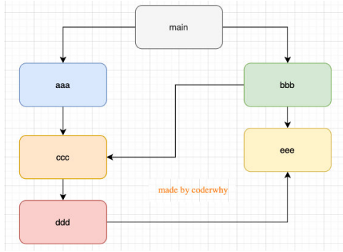

# 全局对象与模块化

## 全局对象

Node中给我们提供了一些全局对象，方便我们进行一些操作：

[global 全局变量 | Node.js API 文档 (nodejs.cn)](http://nodejs.cn/api/globals.html)

### 特殊的全局对象

这些全局对象可以在模块中任意使用，但是在命令行交互中是不可以使用的；

包括：`__dirname、__filename、exports、module、require()`

`__dirname`：获取当前文件所在的路径，不包括后面的文件名

`__filename`：获取当前文件所在的路径和文件名称，包括后面的文件名称

没有模块化可以用立即执行函数来实现

### 常见的全局对象

1. process对象：process提供了Node进程中相关的信息，比如Node的运行环境、参数信息等；
2. console对象：提供了简单的调试控制台
3. 定时器函数：在Node中使用定时器有好几种方式：
   - `setTimeout(callback, delay[, ...args])`：`callback`在delay毫秒后执行一次；
   - `setImmediate(callback[, ...args])`：`callback` I / O事件后的回调的“立即”执行；
   - `process.nextTick(callback[, ...args])`：添加到下一次tick队列中；

### global

global是一个全局对象，事实上前端我们提到的process、console、`setTimeout`等都有被放到global中；就好比浏览器中的window，this；

但是 `var` 一个全局变量，可以隐式的成为window的属性，但是不会成为global的属性

 

## 模块化

### 什么是模块化开发呢？

- 模块化开发最终的目的是将程序划分成一个个小的结构；
- 这个结构中编写属于自己的逻辑代码，有自己的作用域，不会影响到其他的结构；
- 这个结构可以将自己希望暴露的变量、函数、对象等导出给其结构使用
- 也可以通过某种方式，导入另外结构中的变量、函数、对象等；

这个结构就是模块，按照这种结构划分开发程序的过程，就是模块化开发的过程


### 没有模块化的问题

早期没有模块化带来了很多的问题：比如命名冲突的问题

```js
// a.js
var a = "abc"
// b.js
var a = "阿伯茨"
// c.js
var a = "123"

// index.html 引入三个文件 
console.log(a)// ????
```

我们有办法可以解决上面的问题：**立即函数调用表达式（IIFE）**；但这治标不治本，所有的代码包裹在一个匿名函数中来写会导致这样的代码混乱不堪


### `CommonJS`

`CommonJS`是一个规范，最初提出来是在浏览器以外的地方使用，并且当时被命名为`ServerJS`，后来为了 体现它的广泛性，修改为`CommonJS`，平时我们也会简称为`CJS`。

- Node是CommonJS在服务器端一个具有代表性的实现； 
- Browserify是CommonJS在浏览器中的一种实现； 
- webpack打包工具具备对CommonJS的支持和转换；


`Node`中对`CommonJS`进行了支持和实现，让我们在开发`node`的过程中可以方便的进行模块化开发：

- 在Node中每一个js文件都是一个单独的模块；
- 这个模块中包括CommonJS规范的核心变量：`exports`、`module.exports`、`require`


#### `exports`和`require`

基本用法

```js
// bar.js
const age = 18;
let name = "my name is why";
function sayHello(name) {
  console.log("Hello " + name);
}
exports.name = name;
exports.age = age;
exports.sayHello = sayHello;

// ----------------------------------------------------

// main.js
const bar = require('./bar');
console.log(bar.name);
console.log(bar.age);
bar.sayHello("kobe");
```


详细解读

- `require('./bar')`返回的是一个对象，内容就是`exports`中的属性

- `bar`和`exports`是同一个对象，`require`就是将`exports`对象做了一个浅拷贝，引用的含是一个地址

  - ```js
    // bar.js
    setTimeout(() => {
      exports.name = 'ssss';
    }, 1000);
    
    // main.js
    setTimeout(() => {
      console.log(bar.name); // sssss
    }, 2000);
    
    // 值得注意的是可以在main.js中去改变bar.js中的值；如
    // bar.js
    setTimeout(() => {
      console.log(exports.name); // 33
    }, 1000);
    
    // main.js
    setTimeout(() => {
     bar.name = 33
    }, 2000);
    ```

##### `require`的细节

`require`是一个函数，可以帮助我们引入一个文件（模块）中导入的对象。

`require`的查找规则：

https://nodejs.org/dist/latest-v14.x/docs/api/modules.html#modules_all_together

常见如下：导入格式如下：require(X)

- 1：X是一个核心模块，比如`path`、`http`
  - 直接返回核心模块，并且停止查找
- 2：X是以 ./ 或 ../ 或 /（根目录）开头的
  - 将X当做一个**文件**在对应的目录下查找；
    - 如果有后缀名，按照后缀名的格式查找对应的文件
    - 如果没有后缀名，会按照如下顺序
      - 直接查找文件X 
      - 查找X.js文件
      - 查找X.json文件
      - 查找X.node文件
  - 没有找到对应的文件，将X作为一个**目录**
    - 查找目录下面的index文件
      - 查找X/index.js文件
      - 查找X/index.json文件
      - 查找X/index.node文件
  - **如果没有找到，那么报错：not found**
- 3：直接是一个X（没有路径），并且X不是一个核心模块
  - 从当前文件夹往上一步一步去找`node_modules`包
  - **如果没有找到，那么报错：not found**

#### `module.exports`

通过维基百科中对CommonJS规范的解析：

CommonJS中是没有module.exports的概念的；但是为了实现模块的导出，Node中使用的是Module的类，每一个模块都是Module的一个实例，也就是 module；

所以在Node中真正用于导出的其实根本不是exports，而是module.exports


##### `module.exports`和`exports`的关系

一个对象的相同一个引用；好比：`module.exports` = `exports` = `main`中的`bar`；


#### 模块的加载过程

- 模块在被第一次引入时，模块中的js代码会被运行一次

- 模块被多次引入时，会缓存，最终只加载（运行）一次

  - 是因为每个模块对象module都有一个属性：loaded。
  - loaded为false表示还没有加载，为true表示已经加载；

- 如果有循环引入，那么加载顺序是什么？

  - 这个时候用到的是数据结构中图的遍历方式–**深度优先搜索**

  

#### CommonJS规范缺点

- CommonJS加载模块是同步的：
  - 同步的意味着只有等到对应的模块加载完毕，当前模块中的内容才能被运行；
  - 这个在服务器不会有什么问题，因为服务器加载的js文件都是本地文件，加载速度非常快；
- 如果将它应用于浏览器
  - 浏览器加载js文件需要先从服务器将文件下载下来，之后在加载运行；
  - 那么采用同步的就意味着后续的js代码都无法正常运行，即使是一些简单的DOM操作；


### `AMD`和`CMD`（了解）

AMD主要是应用于浏览器的一种模块化规范：

- AMD是Asynchronous Module Definition（异步模块定义）的缩写
- 它采用的是异步加载模块；
- 事实上AMD的规范还要早于CommonJS，但是CommonJS目前依然在被使用，而AMD使用的较少了；

`AMD`的例子

`AMD`实现的比较常用的库是require.js和curl.js

- 下载require.js

- 定义HTML的script标签引入require.js和定义入口文件：

  - <script src="./lib/require.js" data-main="./index.js"></script>

  - data-main属性的作用是在加载完src的文件后会加载执行该文件

- 具体配置 [require.js](https://www.hangge.com/blog/cache/detail_1702.html)


`CMD`规范也是应用于浏览器的一种模块化规范：

- CMD 是Common Module Definition（通用模块定义）的缩写
- 它也采用了异步加载模块，但是它将CommonJS的优点吸收了过来；

`CMD`的例子

`CMD`实现的比较常用的库是SeaJS

- 下载SeaJS
  - 下载地址：https://github.com/seajs/seajs
  - 找到dist文件夹下的sea.js
- 引入sea.js和使用主入口文件

```html
  <script src="./lib/sea.js"></script>
  <script>
    seajs.use('./index.js');
  </script>
```

- sea.js具体配置：[sea.js](https://segmentfault.com/a/1190000006643221#:~:text=CMD%20%E6%98%AF%20SeaJS%20%E5%9C%A8%E6%8E%A8%E5%B9%BF%E8%BF%87%E7%A8%8B%E4%B8%AD%E5%AF%B9%E6%A8%A1%E5%9D%97%E5%AE%9A%E4%B9%89%E7%9A%84%E8%A7%84%E8%8C%83%E5%8C%96%E4%BA%A7%E5%87%BA%E3%80%82%20%E7%B1%BB%E4%BC%BC%E7%9A%84%E8%BF%98%E6%9C%89,CommonJS%20Modules%2F2.0%20%E8%A7%84%E8%8C%83%EF%BC%8C%E6%98%AF%20BravoJS%20%E5%9C%A8%E6%8E%A8%E5%B9%BF%E8%BF%87%E7%A8%8B%E4%B8%AD%E5%AF%B9%E6%A8%A1%E5%9D%97%E5%AE%9A%E4%B9%89%E7%9A%84%E8%A7%84%E8%8C%83%E5%8C%96%E4%BA%A7%E5%87%BA%E3%80%82)


### ES Module

JavaScript在2015之后推出的[模块化]([JavaScript modules 模块 - JavaScript | MDN (mozilla.org)](https://developer.mozilla.org/zh-CN/docs/Web/JavaScript/Guide/Modules))

#### export

> 这里是export不是exports，与commonjs不同

export关键字将一个模块中的变量、函数、类等导出；导出方式如下：

- ```js
  // 方式一:
  export const name = "why";
  export const age = 18;
  export const sayHello = function(name) {
    console.log("你好" + name);
  }
  ```

- ```js
  // 方式二: {}中统一导出
  export {
    name,
    age,
    sayHello
  }
  ```

- ```js
  // 方式三: {} 导出时, 可以给变量起名别
  export {
    name as fName,
    age as fAge,
    sayHello as fSayHello
  }
  ```

  

#### import

import关键字负责从另外一个模块中导入内容；导入内容的方式也有多种：

- ```js
  // 方式一: import {} from '路径';
  import { name, age, sayHello } from './modules/foo.js';
  ```

- ```js
  // 方式二: 导出变量之后可以起别名
  import { name as wName, age as wAge, sayHello as wSayHello } from './modules/foo.js';
  import { fName as wName, fAge as wAge, fSayHello as wSayHello } from './modules/foo.js';
  
  ```

- ```js
  // 方式三: * as foo
  import * as foo from './modules/foo.js';
  ```

  

#### Export和import结合使用

```js
// 演练: export和import结合使用
import { name, age, sayHello } from './modules/foo.js';
```


#### default

我们之前的导入导出是有名字的，还有一种叫默认导出，默认导出有以下几个特点：

- 默认导出export时可以不需要指定名字；
- **在导入时不需要使用 {}，并且可以自己来指定名字；**
- 在一个模块中，**只能有一个默认导出**（default export）；

- 可以和export导出一起用

  ```js
  import {
    name,
    age,
    sayHello
  } from './modules/bar.js';
  
  console.log(name);
  console.log(age);
  console.log(sayHello);
  
  
  // 演练: default export如何导入
  import format from './modules/foo.js';
  ```


#### 动态加载模块

通过**关键字import**加载一个模块，是不可以在其放到逻辑代码中的；因为ES Module在被JS引擎解析时，就必须知道它的依赖关系；由于这个时候js代码没有任何的运行，所以无法在进行类似于if判断中根据代码的执行情况；

如：

```js
// 这种写法是错误的
if (flag) {
  import { name,age} from './modules/bar.js';
}
```

那么如何实现呢？

import函数和require函数

```js
import('./bar.js') // 返回的是一个promise，可以获得导入文件中所有导出的值
```


### 加载过程

#### CommonJS加载过程

CommonJS模块加载js文件的过程是运行时加载的，并且是同步的：

- 运行时加载意味着是js引擎在执行js代码的过程中加载 模块；
- 同步的就意味着一个文件没有加载结束之前，后面的代码都不会执行；

#### ES Module的加载过程

ES Module加载js文件的过程是编译（解析）时加载的，并且是异步的：

- 编译时（解析）时加载，意味着import不能和运行时相关的内容放在一起使用；比如不能将import放到if等语句的代码块中；

- 比如不能将import放到if等语句的代码块中；


**注意：**

ES Module通过export导出的是变量本身的引用：

- export在导出一个变量时，js引擎会解析这个语法，并且创建模块环境记录（module environment  record）
- 模块环境记录会和变量进行 绑定（binding），并且这个绑定是实时的；
- 在导入的地方不可以修改变量，因为它只是被绑定到了这个变量上（其实是一个常量）

**export的导出和commonJs中exports的导出不一样，commonJs中exports的导出是导出一个对象，export的导出是导出变量本身的引用**


### CommonJS和ES Module交互

- 通常情况下，CommonJS不能加载ES Module
  - 因为CommonJS是同步加载的，但是ES Module必须经过静态分析等，无法在这个时候执行JavaScript代码
  - 但是这个并非绝对的，某些平台在实现的时候可以对代码进行针对性的解析，也可能会支持；
- 多数情况下，ES Module可以加载CommonJS