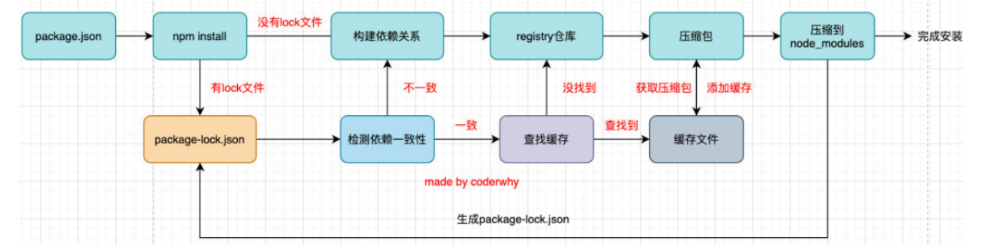

# 包管理工具

## `npm`

Node Package Manager，也就是Node包管理器；在前端项目中我们也在使用它来管理依赖的包，比如express、koa、react、react-dom、axios、babel、webpack等等；


## 项目配置文件package.json

每一个项目都会有一个对应的配置文件，无论是前端项目还是后端项目：

- 这个配置文件会记录着你项目的名称、版本号、项目描述等；
- 也会记录着你项目所依赖的其他库的信息和依赖库的版本号；


### 属性

#### 必须填写的属性：

- name是项目的名称
- version是当前项目的版本号
- description是描述信息，很多时候是作为项目的基本描述；
- author是作者相关信息（发布时用到）
- license是开源协议（发布时用到）

#### private属性

- private属性记录当前的项目是否是私有的；当值为true时，npm是不能发布它的，这是防止私有项目或模块发布出去的方式

#### dependencies属性

- dependencies属性是指定无论开发环境还是生成环境都需要依赖的包

#### devDependencies属性

- 一些包在生产环境是不需要的，比如webpack、babel等；
- 这个时候我们会通过 npm install webpack --save-dev，将它安装到devDependencies属性中；

#### 版本管理

我们会发现安装的依赖版本出现：^2.0.3或~2.0.3，这是什么意思呢？

npm的包通常需要遵从semver版本规范：

- semver：https://semver.org/lang/zh-CN
- npm semver：https://docs.npmjs.com/misc/semver


semver版本规范是X.Y.Z：

- X主版本号（major）：当你做了不兼容的 API 修改（可能不兼容之前的版本）；
- Y次版本号（minor）：当你做了向下兼容的功能性新增（新功能增加，但是兼容之前的版本）；
- Z修订号（patch）：当你做了向下兼容的问题修正（没有新功能，修复了之前版本的bug）；


^和~的区别：

- ^x.y.z：表示x是保持不变的，y和z永远安装最新的版本；
- ~x.y.z：表示x和y保持不变的，z永远安装最新的版本；


### npm install 命令

#### 命令

- 全局安装（global install）： `npm install yarn -g;`
- 项目（局部）安装（local install）： `npm install`


#### 全局安装

通常使用npm全局安装的包都是一些**工具包**：yarn、webpack等；并不是类似于 axios、express、koa等库文件；


### npm install 原理



npm install会检测是有package-lock.json文件

- 没有lock文件
  - 分析依赖关系，这是因为我们可能包会依赖其他的包，并且多个包之间会产生相同依赖的情况；
  - 从registry仓库中下载压缩包（如果我们设置了镜像，那么会从镜像服务器下载压缩包）；
  - 获取到压缩包后会对压缩包进行缓存（从npm5开始有的）
  - 将压缩包解压到项目的node_modules文件夹中（前面我们讲过，require的查找顺序会在该包下面查找）

- 有lock文件
  - 检测lock中包的版本是否和package.json中一致（会按照semver版本规范检测）；
    - 不一致，那么会重新构建依赖关系，直接会走顶层的流程；
    - 一致的情况下，会去优先查找缓存
      - 没有找到，会从registry仓库下载，直接走顶层流程；
    - 查找到，会获取缓存中的压缩文件，并且将压缩文件解压到node_modules文件夹中；


### npx工具

npx的作用非常多，但是比较常见的是使用它来调用项目中的某个模块的指令

以webpack举个例子：

局部命令执行有好几种方式

- 明确查找到node_module下面的webpack

  ```shell
  ./node_modules/.bin/webpack --version
  ```

- 在 scripts定义脚本，来执行webpack；

  ```json
  "scripts": {
  	"webpack": "webpack --version"
  }
  ```

- 使用npx

  ```shell
  npx webpack --version
  ```

npx的原理非常简单，它会到当前目录的node_modules/.bin目录下查找对应的命令；

