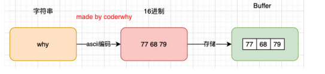

# Buffer和事件循环

## 二进制数据

计算机中所有的内容：文字、数字、图片、音频、视频最终都会使用二进制来表示。但是在`JavaScript`中很难处理图片，视频之类的数据，平时在程序中用到的`img`其实只是拿到了一个地址，浏览器负责获取这个图片，并且最终讲这个图片渲染出来；


但是对于服务器来说，处理数据就显得很平常了；

比如我们需要读取的是一张图片数据（二进制），再通过某些手段对图片数据进行二次的处理（裁剪、格式转换、旋转、添加滤 镜），Node中有一个Sharp的库，就是读取图片或者传入图片的Buffer对其再进行处理；

## Buffer

Node提供了一个类Buffer，去存储其二进制的数据；

> 如何存储的

- 可以将Buffer看成是一个存储二进制的数组
- 这个数组中的每一项，可以保存8位二进制： 00000000



### 操作

> 字符串存储到Buffer中

```js
const message = "Hello";

// 1.创建方式一: 不推荐(过期)
// const buffer = new Buffer(message);
// console.log(buffer);

// 2.创建方式二:
const buffer = Buffer.from(message);
console.log(buffer);

```

> 中文字符串存储到Buffer中

```js
const message = "你好啊";

// 1.编解码相同
// 对中文进行编码: utf8
// const buffer = Buffer.from(message); // Buffer.from默认utf8编码
// console.log(buffer);

// // 对字节进行解码: utf8
// console.log(buffer.toString()); // tostring默认utf8解码

// 2.编码使用utf16le, 解码使用utf8
const buffer = Buffer.from(message, "utf8");
console.log(buffer);
console.log(buffer.toString("utf16le")); // 解码编码不一致，乱码
```

> Buffer的`alloc`创建方式

```js
const buffer = Buffer.alloc(8);
console.log(buffer);

buffer[0] = 88;
buffer[1] = 0x88;
console.log(buffer);
```

> Buffer和文件操作

```js
// 读取文本文件
fs.readFile("./foo.txt", (err, data) => {
  console.log(data);
  console.log(data.toString());
});

fs.readFile("./bar.png", (err, data) => {
  console.log(data);

  fs.writeFile("./foo.png", data, (err) => {
    console.log(err);
  });
});

// sharp库的使用
sharp("./bar.png").resize(200, 200).toFile("./baz.png");
```


