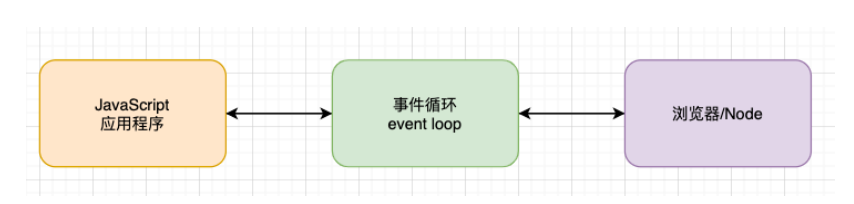
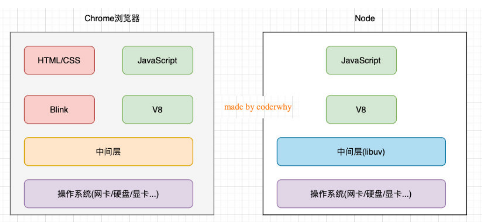
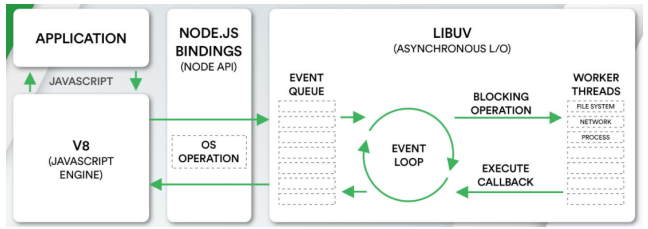
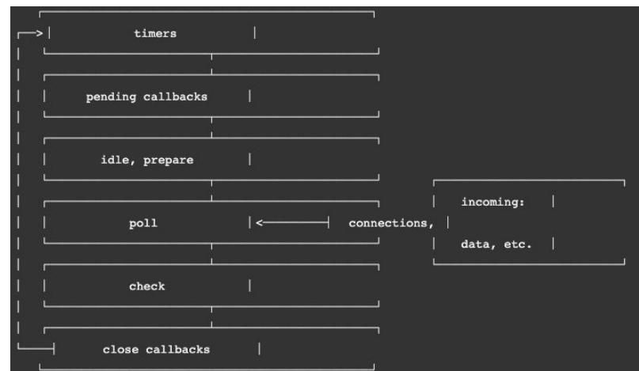
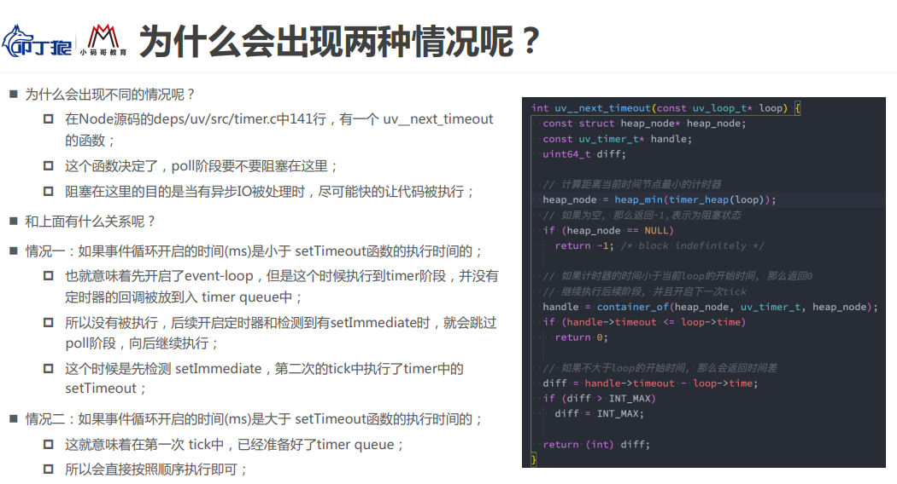

# 事件循环和异步IO

## 什么是事件循环？

**事件循环可以理解成我们编写的JavaScript和浏览器或者Node之间的一个桥梁。**

浏览器的事件循环是一个我们编写的JavaScript代码和浏览器API调用(`setTimeout`/AJAX/监听事件等)的一个桥梁,  桥梁之间他们通过回调函数进行沟通。

Node的事件循环是一个我们编写的JavaScript代码和系统调用（file system、network等）之间的一个桥梁, 桥梁 之间他们通过回调函数进行沟通的



## 进程和线程

线程和进程是操作系统中的两个概念：

- 进程（process）：计算机已经运行的程序；
- 进程（process）：计算机已经运行的程序；

直观一点的解释：

- 进程：我们可以认为，启动一个应用程序，就会默认启动一个进程（也可能是多个进程）；
- 线程：每一个进程中，都会启动一个线程用来执行程序中的代码，这个线程被称之为主线程；
- 也可以说进程是线程的容器；

用一个形象的例子解释：

- 操作系统类似于一个工厂；
- 工厂中里有很多车间，这个车间就是进程；
- 每个车间可能有一个以上的工人在工厂，这个工人就是线程；


### 多进程多线程开发

操作系统是如何做到同时让多个进程（边听歌、边写代码、边查阅资料）同时工作呢？

- 这是因为CPU的运算速度非常快，它可以快速的在多个进程之间迅速的切换；
- 当我们的进程中的线程获取获取到时间片时，就可以快速执行我们编写的代码；
- **对于用户来说是感受不到这种快速的切换的**；


## 浏览器和JavaScript的事件循环

JavaScript是单线程的，有线程就会有进程；JavaScript的进程就是：浏览器或者Node。

目前**多数的浏览器其实都是多进程的**，当我们打开一个tab页面时就会开启一个新的进程，这是为了防止一个 页面卡死而造成所有页面无法响应，整个浏览器需要强制退出。

每个进程中又有很多的线程，其中包括执行JavaScript代码的线程；

但JavaScript的代码执行是在一个单独的线程中执行的：

- 这就意味着JavaScript的代码，在同一个时刻只能做一件事；
- 如果这件事是非常耗时的，就意味着当前的线程就会被阻塞；


### 浏览器的事件循环

事件循环是有两个队列的：

- 宏任务队列：ajax、`setTimeout`、`setInterval`、DOM监听、UI Rendering等
- 微任务队列：`Promise`的`then`回调、 `Mutation Observer API`、`queueMicrotask`()等

> 执行顺序

在执行任何一个宏任务之前，都会先查看微任务队列中是否有任务需要执行

- 也就是宏任务执行之前，必须保证微任务队列是空的；
- 如果不为空，那么久优先执行微任务队列中的任务（回调）；

### 浏览器的事件循环面试题

```
async function async1 () {
  console.log('async1 start')
  await async2();
  console.log('async1 end')
}
 
async function async2 () {
  console.log('async2')
}

console.log('script start')

setTimeout(function () {
  console.log('setTimeout')
}, 0)
 
async1();
 
new Promise (function (resolve) {
  console.log('promise1')
  resolve();
}).then (function () {
  console.log('promise2')
})

console.log('script end')
```

## node和JavaScript的事件循环

浏览器中的EventLoop是根据HTML5定义的规范来实现的，不同的浏览器可能会有不同的实现，而Node中是由 libuv实现的

### libuv

> libuv是一个多平台的专注于异步IO的库，它最初是为Node开发的，但是现在也被使用到Luvit、Julia、pyuv等其 他地方；

我们先看node的架构简图和详细作用图






> libuv的作用

- libuv中主要维护了一个EventLoop和worker threads（线程池）；
- EventLoop负责调用系统的一些其他操作：文件的IO、Network、child-processes等


### 阻塞IO和非阻塞IO

在程序中对一个文件进行操作，这个时候的操作都是需要进行系统调用（操作系统的文件系统）；

操作系统为我们提供了阻塞式调用和非阻塞式调用：

**阻塞式调用：** 调用结果返回之前，当前线程处于阻塞态（阻塞态CPU是不会分配时间片的），调用线程只有 在得到调用结果之后才会继续执行。

**非阻塞式调用：** 调用执行之后，当前线程不会停止执行，只需要过一段时间来检查一下有没有结果返回即可。

所以我们开发中的很多耗时操作，都可以基于这样的 非阻塞式调用：

- 比如网络请求本身使用了Socket通信，而Socket本身提供了select模型，可以进行非阻塞方式的工作；
- 比如文件读写的IO操作，我们可以使用操作系统提供的基于事件的回调机制；

#### 非阻塞IO的问题

是非阻塞IO也会存在一定的问题：

- 以读取为例，并不清楚是否读取结束，需要频繁的去确定读取到的数据是否是完整的；这个过程我们称之为**轮训操作**；


##### 轮训操作的执行

开发中我们可能不只是一个文件的读写，可能是多个文件，如果我们的主线程频繁的去进行轮训的工作，那么必然会大大降低性能；这个时候`libuv`提供了一个线程池（Thread Pool）

- 线程池会负责所有相关的操作，并且会通过轮训等方式等待结果
- 当获取到结果时，就可以将对应的回调放到事件循环（某一个事件队列）中；
- **事件循环就可以负责接管后续的回调工作，告知JavaScript应用程序执行对应的回调函数；**

### 阻塞和非阻塞，同步和异步的区别？

**阻塞和非阻塞是对于被调用者来说的：**

- 阻塞和非阻塞是对于被调用者来说的；

**同步和异步是对于调用者来说的；**

- 就是自己的程序；
- 如果我们在发起调用之后，不会进行其他任何的操作，只是等待结果，这个过程就称之为同步调用；
- 如果我们再发起调用之后，并不会等待结果，继续完成其他的工作，等到有回调时再去执行，这个过程就是 异步调用；

**Libuv采用的就是非阻塞异步IO的调用方式**


### Node事件循环的阶段

在最前面就强调过，事件循环像是一个桥梁，是连接着应用程序的JavaScript和系统调用之间的通道：

- 无论是我们的文件IO、数据库、网络IO、定时器、子进程，在完成对应的操作后，都会将对应的结果和回调 函数放到事件循环（任务队列）中；
- **事件循环会不断的从任务队列中取出对应的事件（回调函数）来执行；**

但是一次完整的事件循环Tick分成很多个阶段：

- **定时器（Timers）**：本阶段执行已经被 setTimeout() 和 setInterval() 的调度回调函数。
- **待定回调（Pending Callback）**：对某些系统操作（如TCP错误类型）执行回调，比如TCP连接时接收到 ECONNREFUSED。

- **idle, prepare**：仅系统内部使用。
- **轮询（Poll）**：检索新的 I/O 事件；执行与 I/O 相关的回调；

- **检测**：setImmediate() 回调函数在这里执行。
- **关闭的回调函数**：一些关闭的回调函数，如：socket.on('close', ...)。




#### Node的微任务和宏任务

从一次事件循环的Tick来说，Node的事件循环更复杂，它也分为微任务和宏任务：

- 宏任务（macrotask）：setTimeout、setInterval、IO事件、setImmediate、close事件；
- 微任务（microtask）：Promise的then回调、process.nextTick、queueMicrotask；


#### Node事件循环面试题分析

```js
// 面试题1
async function async1() {
  console.log('async1 start')
  await async2()
  console.log('async1 end')
}

async function async2() {
  console.log('async2')
}

console.log('script start')

setTimeout(function () {
  console.log('setTimeout0')
}, 0)

setTimeout(function () {
  console.log('setTimeout2')
}, 300)

setImmediate(() => console.log('setImmediate'));

process.nextTick(() => console.log('nextTick1'));

async1();

process.nextTick(() => console.log('nextTick2'));

new Promise(function (resolve) {
  console.log('promise1')
  resolve();
  console.log('promise2')
}).then(function () {
  console.log('promise3')
})

console.log('script end')
```

```js
// 面试题2
setTimeout(() => {
  console.log("setTimeout");
}, 0);

setImmediate(() => {
  console.log("setImmediate");
});
// 执行顺序是不唯一的
```

面试题二的的结果不唯一的原因：

> 不明白先放着，可以先去了解libuv的架构再来这里




https://nodejs.org/zh-cn/docs/guides/event-loop-timers-and-nexttick/