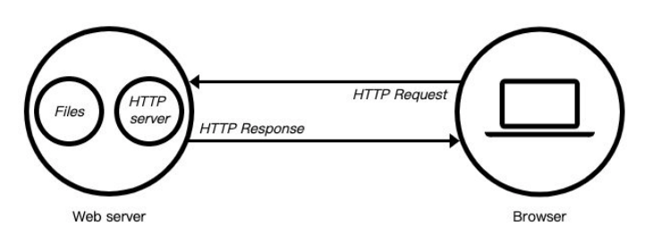
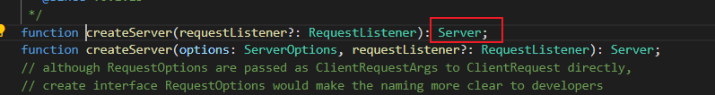
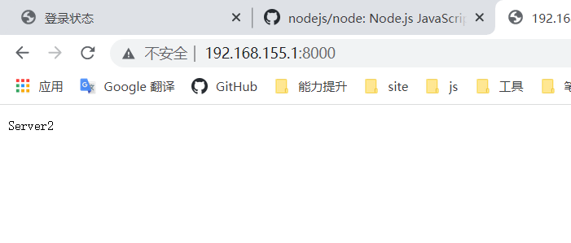
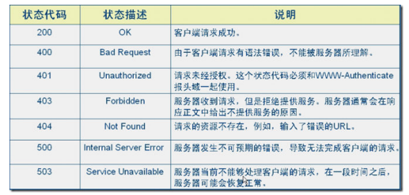

# http模块

## web服务器

当应用程序（客户端）需要某一个资源时，可以向一个台服务器，通过Http请求获取到这个资源；提供资源的这个服务器，就是一个Web服务器；

目前有很多开源的Web服务器：Nginx、Apache（静态）、Apache Tomcat（静态、动态）、Node.js



## http模块解析

### 创建服务器

创建服务器对象，通过 `createServer` 来完成的；`http.createServer`会返回服务器的对象；其实也就是Server对象

```js
const http = require("http");

const server1 = http.createServer((req, res) => {
  res.end("Server1");
});
```



我们知道`createServer` 就是返回了一个Server实例，所以也可以通过Server来创建服务器

```js
const server2 = new http.Server((req, res) => {
  res.end("Server2");
});
```

### 监听

Server通过listen方法来开启服务器，并且在某一个主机和端口上监听网络请求。

listen函数有三个参数：

- 端口`port`: 可以不传, 系统会默认分配端

- 主机`host`: 通常可以传入`localhost`、`ip`地址`127.0.0.1`、或者`ip`地址`0.0.0.0`，默认是`0.0.0.0`；

  - `localhost`：本质上是一个域名，通常情况下会被解析成127.0.0.1；

  - `127.0.0.1`：回环地址（`Loop Back Address`），表达的意思其实是我们主机自己发出去的包，直接被自己接收；

    - 正常的数据库包经常 应用层 - 传输层 - 网络层 - 数据链路层 - 物理层 ；
    - 而回环地址，是在网络层直接就被获取到了，是不会经常数据链路层和物理层的；
    - 比如我们监听 `127.0.0.1`时，在同一个网段下的主机中，通过`ip`地址是不能访问的；

  - `0.0.0.0`：监听IPV4上所有的地址，再根据端口找到不同的应用程序；比如我们监听 `0.0.0.0`时，在同一个网段下的主机中，通过`ip`地址是可以访问的；

    

- 回调函数：服务器启动成功时的回调函数；

### `nodemon`

每次更改服务都要重启服务太麻烦了，`nodemon`帮我们解决了这个问题

#### 安装

```shell
npm install -g nodemon
//或
npm install --save-dev nodemon
```

#### 使用

```js
nodemon   ./main.js // 启动node服务
```


### 请求对象解析

在向服务器发送请求时，我们会携带很多信息，比如：

- 本次请求的URL，服务器需要根据不同的URL进行不同的处理；
- 本次请求的请求方式，比如GET、POST请求传入的参数和处理的方式是不同的；
- 本次请求的headers中也会携带一些信息，比如客户端信息、接受数据的格式、支持的编码格式等；

这些信息，Node会帮助我们封装到一个request的对象中，我们可以直接来处理这个request对象：

request对象中有很多属性，如headers，method，`url`等，接下来就是对这属性进行处理

#### `url`的处理

客户端在发送请求时，会请求不同的数据，那么会传入不同的请求地址：`http://localhost:8000/login`或者`http://localhost:8000/user`；那么我们的处理也是不同的

```js
// 基本方式
  if (req.url === '/login') {
    res.end("欢迎回来~");
  } else if (req.url === '/users') {
    res.end("用户列表~");
  } else {
    res.end("错误请求, 检查~");
  }
```

##### `url`参数的处理

请求同常会携带参数，内置模块`url`提供了方法进行解析

```js
const url = require("url");
const qs = require("querystring");
// 获取参数和路径
const { pathname, query } = url.parse(req.url);
// 解析参数
const { username, password } = qs.parse(query);
```

对于post方式传输数据的接口，我们为了可以在获取body中的数据，可以通过监听data事件获取

```js
// 创建一个web服务器
const server = http.createServer((req, res) => {
  const { pathname } = url.parse(req.url);
  if (pathname === "/login") {
    if (req.method === "POST") {
      // 拿到body中的数据
      req.setEncoding("utf-16");
      req.on("data", (data) => {
        const { username, password } = JSON.parse(data);
        console.log(username, password);
      });

      res.end("Hello World");
    }
  }
});
```

#### headers

在request对象的header中也包含很多有用的信息，客户端会默认传递过来一些信息：

```json
{
  'content-type': 'text/plain',
  'user-agent': 'PostmanRuntime/7.28.4',
  accept: '*/*',
  'cache-control': 'no-cache',
  'postman-token': '488b2970-00a8-4c11-9abe-20183dea42b4',
  host: 'localhost:8888',
  'accept-encoding': 'gzip, deflate, br',
  connection: 'keep-alive',
  'content-length': '46'
}
```

##### content-type

是这次请求携带的数据的类型：

- `application/json`表示是一个`json`类型；
- `text/plain`表示是文本类型
- `application/xml`表示是xml类型；
- `multipart/form-data`表示是上传文件；

##### content-length

文件的大小和长度

##### keep-alive

- http是基于TCP协议的，但是通常在进行一次请求和响应结束后会立刻中断；在http1.0中，如果想要继续保持连接：
  - 浏览器需要在请求头中添加 `connection: keep-alive`；
  - 服务器需要在响应头中添加 `connection:keey-alive`；
  - 当客户端再次放请求时，就会使用同一个连接，直接一方中断连接；
- 在http1.1中，所有连接默认是 connection: keep-alive的；
  - 不同的Web服务器会有不同的保持 keep-alive的时间；
  - Node中默认是5s中；


##### `accept-encoding`

告知服务器，客户端支持的文件压缩格式，比如~文件可以使用`gzip`编码，对应 `.gz`文件；


##### accept

告知服务器，客户端可接受文件的格式类型


### 响应对象解析

#### 响应结果

如果我们希望给客户端响应的结果数据，可以通过两种方式：

- Write方法：这种方式是直接写出数据，但是并没有关闭流；
- end方法：这种方式是写出最后的数据，并且写出后会关闭流

如果我们没有调用 end和close，客户端将会一直等待结果：会一直不结束，所以客户端在发送网络请求时，都会设置超时时间。

```js
const http = require('http');

// 创建一个web服务器
const server = http.createServer((req, res) => {

  // 响应结果
  res.write("响应结果一");
  res.end("Hello World");
});

// 启动服务器,并且制定端口号和主机
server.listen(8888, '0.0.0.0', () => {
  console.log("服务器启动成功~");
});

```


#### 状态码

Http状态码（Http Status Code）是用来表示Http响应状态的数字代码：



```js
// 创建一个web服务器
const server = http.createServer((req, res) => {

  // 设置状态码
  // 方式一: 直接给属性赋值
  // res.statusCode = 400;
  // 方式二: 和Head一起设置
  res.writeHead(503)

  // 响应结果
  res.write("响应结果一");
  res.end("Hello World");
});
```

