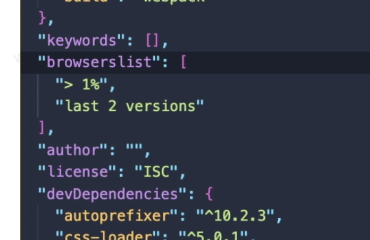

# 配置、样式、字体打包

## 配置

配置文件 `webpack.config.js`

> `webpack`需要打包的项目是非常复杂的，并且我们需要一系列的配置来满足要求

**修改配置文件名**

**两步：**

1. `webpack --config wk.config.js` 配置文件即是 `wk.config.js`

2. 在`package.json`中增加一个新的脚本

   ```json
   {
     "name": "test-webapck",
     "version": "1.0.0",
     "description": "",
     "main": "index.js",
     "dependencies": {
       "webpack": "^5.48.0",
       "webpack-cli": "^4.7.2"
     },
     "devDependencies": {},
     "scripts": {
       "build": "webpack --config wk.config.js"
     },
     "keywords": [],
     "author": "",
     "license": "ISC"
   }
   ```

   

### 入口与出口

> 当我们运行`webpack`时，`webpack`会查找当前目录下的 `src/index.js`作为入口；所以，如果当前项目中没有存在`src/index.js`文件，那么会报错

```js
const path = require('path')

module.exports = {
    // 指定入口文件
    entry: "./src/main.js",
    // 指定出口文件
    output: {
        path: path.resolve(__dirname, './build'),  // 绝对路径
        filename:'boundle.js'
    }
}
```


## 样式打包

### 处理`css`

`style-loader,css-loader`

```js
const path = require('path')

module.exports = {
  mode: 'development',
	entry: './src/index.js',
  module: {
  	rules: [
      {
      	test: /\.(jpe?g|png|gif)$/,
        use: {
        	loader: 'url-loader',
          options: {
          	name: '[name].[ext]', // 设置loader文件的名字
            outputPath: 'img/', // 将打包的文件放入到img文件夹
          }
        }
      },
      {
      	test: /\.css$/,
        use: ['style-loader', 'css-loader'],
      }
    ]
  },
  output: {
  	filename: 'bundle.js',
    path: path.resolve(__dirname, 'dist')
  }
}
```

### 处理`Scss`

安装`sass-loader,node-sass`

```js
const path = require('path')

module.exports = {
  mode: 'development',
	entry: './src/index.js',
  module: {
  	rules: [
      {
      	test: /\.(jpe?g|png|gif)$/,
        use: {
        	loader: 'url-loader',
          options: {
          	name: '[name].[ext]', // 设置loader文件的名字
            outputPath: 'img/', // 将打包的文件放入到img文件夹
          }
        }
      },
      {
      	test: /\.scss$/,
        use: ['style-loader', 'css-loader', 'sass-loader'],
      }
    ]
  },
  output: {
  	filename: 'bundle.js',
    path: path.resolve(__dirname, 'dist')
  }
}
```

### `postcss`

> 这部分可以看之前的笔记

[postcss](https://6e9de850.wiz06.com/wapp/pages/view/share/s/1KDuxg3NQx7G22jsfI2P8GS73pkf5L3h9QTc2Rvh9B2WqyLs)

`PostCSS`是一个通过`JavaScript`来转换样式的工具，这个工具可以帮助我们进行一些`CSS`的转换和适配，比如自动添加浏览器前缀、`css`样式的重置；

#### 使用

1. 安装插件`autoprefixer`

   ```
   npm install autoprefixer -D
   ```

2. 安装loader

   ```
   npm install postcss-loader -D
   ```

3. 增加`postcss.config.js`文件

   ```js
   module.export = {
   	parser: 'sugarss',
     	plugin: {
           require('autoprefixer')
         }
   }
   ```

#### 可能会出现的问题

1. 如果打包的文件还是没有浏览器的厂商前缀，就需要去修改`package.json`




### `css-loader`的问题

当我在一个css文件中去引入另一个样式文件，这个时候会存在一个问题；这个问题就是这个样式文件不在经历sass-loader，postcss-loader的处理了，直接就是css-loader；这个时候我们要限制这个样式文件

#### `importLoaders`

`importLoaders`: 2, 走当前loader前面的2个loader（`sass-loader`, `postcss-loader`）

```js
const path = require('path')

module.exports = {
  mode: 'development',
	entry: './src/index.js',
  module: {
  	rules: [
      {
      	test: /\.(jpe?g|png|gif)$/,
        use: {
        	loader: 'url-loader',
          options: {
          	name: '[name].[ext]', // 设置loader文件的名字
            outputPath: 'img/', // 将打包的文件放入到img文件夹
          }
        }
      },
      {
      	test: /\.scss$/,
        use: [
          'style-loader', 
          {
          	loader: 'css-loader',
            options: {
            	importLoaders: 2
            }
          },
          'postcss-loader', 
          'sass-loader'
        ],
      }
    ]
  },
  output: {
  	filename: 'bundle.js',
    path: path.resolve(__dirname, 'dist')
  }
}
```


### `css`模块化

modules: true 开启模块化

```js
const path = require('path')

module.exports = {
  mode: 'development',
	entry: './src/index.js',
  module: {
  	rules: [
      {
      	test: /\.(jpe?g|png|gif)$/,
        use: {
        	loader: 'url-loader',
          options: {
          	name: '[name].[ext]', // 设置loader文件的名字
            outputPath: 'img/', // 将打包的文件放入到img文件夹
          }
        }
      },
      {
      	test: /\.scss$/,
        use: [
          'style-loader', 
          {
          	loader: 'css-loader',
            options: {
            	importLoaders: 2,
              modules: true
            }
          },
          'postcss-loader', 
          'sass-loader'
        ],
      }
    ]
  },
  output: {
  	filename: 'bundle.js',
    path: path.resolve(__dirname, 'dist')
  }
}
```


## 字体

```js
const path = require('path')

module.exports = {
  mode: 'development',
	entry: './src/index.js',
  module: {
  	rules: [
      {
      	test: /\.(jpe?g|png|gif)$/,
        use: {
        	loader: 'url-loader',
          options: {
          	name: '[name].[ext]', // 设置loader文件的名字
            outputPath: 'img/', // 将打包的文件放入到img文件夹
          }
        }
      },
      {
      	test: /\.scss$/,
        use: [
          'style-loader', 
          {
          	loader: 'css-loader',
            options: {
            	importLoaders: 2,
              modules: true
            }
          },
          'postcss-loader', 
          'sass-loader'
        ],
      },
      {
      	test: /\.(eot|svg|ttf|woff)/,
        loader: 'file-loader'
      }
    ]
  },
  output: {
  	filename: 'bundle.js',
    path: path.resolve(__dirname, 'dist')
  }
}
```

