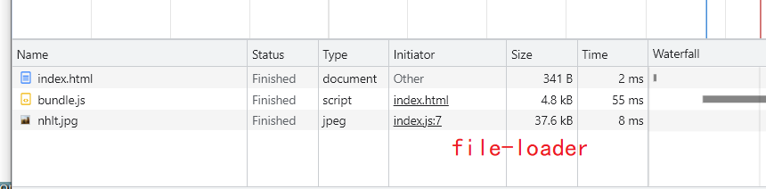
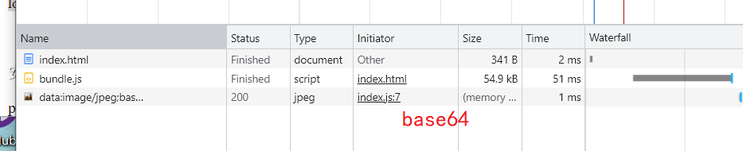
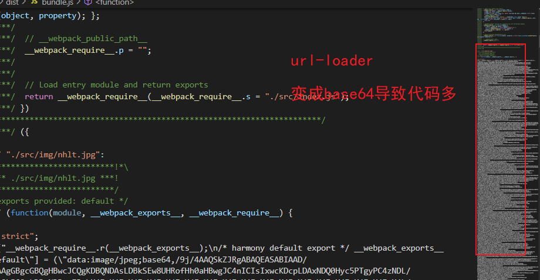

# 图片处理

## `file-loader`

```js
const path = require('path')

module.exports = {
	entry: './src/index.js',
  module: {
  	rules: [
      {
      	test: /\.(jpe?g|png|gif)$/,
        use: {
        	loader: 'file-loader',
          options: {
          	name: '[name].[ext]', // 设置loader文件的名字
            outputPath: 'img/', // 将打包的文件放入到img文件夹
          }
        }
      }
    ]
  },
  output: {
  	filename: 'bundle.js',
    path: path.resolve(__dirname, 'dist')
  }
}
```

`index.js`

```js
console.log(1);
import jspp from "./img/nhlt.jpg";

const img = new Image();
img.src = jspp;

const app = document.getElementById("app");
app.appendChild(img);
```

## `url-loader`

作用和file-loader类似，但是可以返回base64文件

```js
const path = require('path')

module.exports = {
	entry: './src/index.js',
  module: {
  	rules: [
      {
      	test: /\.(jpe?g|png|gif)$/,
        use: {
        	loader: 'url-loader',
          options: {
          	name: '[name].[ext]', // 设置loader文件的名字
            outputPath: 'img/', // 将打包的文件放入到img文件夹
          }
        }
      }
    ]
  },
  output: {
  	filename: 'bundle.js',
    path: path.resolve(__dirname, 'dist')
  }
}
```

## 两种loader的区分

- base64 字符串很大导致 -> bundle.js体积很大导致 ->  index.html 加载bundle.js 时间边长
- file-loader 单独生产 xxx.jpg 文件，但是需要发送额外的HTTP图片请求







