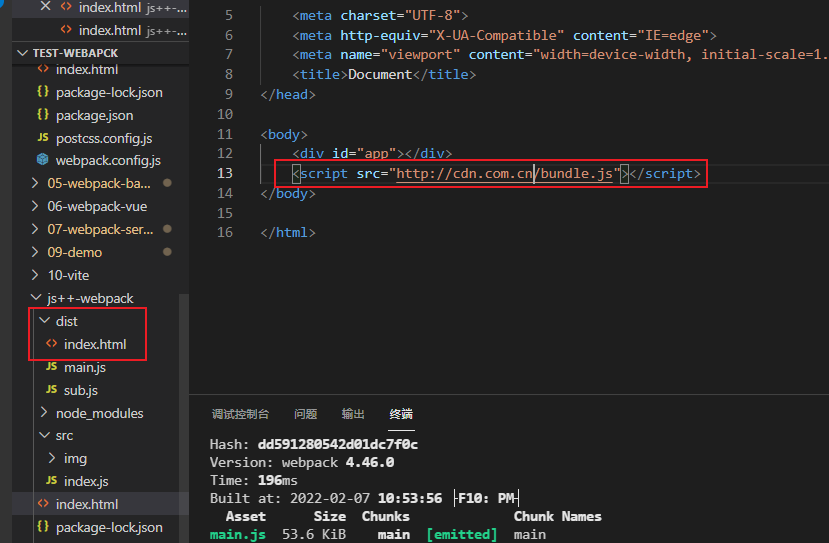

# 知识点

## entry、output

- output 输出的打包文件名称就是entry对象的key值名称

- 默认输出名为main.js

```js
const path = require('path')
const HtmlWebpackPlugin = require('HtmlWebpackPlugin')
const CleanWebpackPlugin = require('CleanWebpackPlugin')
module.exports = {
  mode: 'development',
	entry: {
  	main: './src/index.js',
    sub: './src/index.js'
  },
  output: {
  	filename: '[name].js',
    path: path.resolve(__dirname, 'dist')
  },
}
```


### output中的`publicPath`

- output输出的文件名前面加上cdn网址
- 

```
const path = require('path')
const HtmlWebpackPlugin = require('HtmlWebpackPlugin')
const CleanWebpackPlugin = require('CleanWebpackPlugin')
module.exports = {
  mode: 'development',
	entry: {
  	main: './src/index.js',
    sub: './src/index.js'
  },
  output: {
    publicPath: 'http://cdn.com.cn/',
  	filename: '[name].js',
    path: path.resolve(__dirname, 'dist')
  },
}
```



