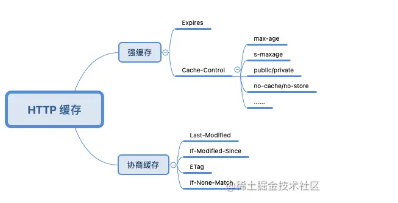

# 1_前端缓存详解

## 什么是前端缓存

> **缓存（cache**），原始意义是指访问速度比一般[随机存取存储器](https://link.juejin.cn/?target=https%3A%2F%2Fbaike.baidu.com%2Fitem%2F%E9%9A%8F%E6%9C%BA%E5%AD%98%E5%8F%96%E5%AD%98%E5%82%A8%E5%99%A8)（RAM）快的一种高速存储器，通常它不像系统主存那样使用[DRAM](https://link.juejin.cn/?target=https%3A%2F%2Fbaike.baidu.com%2Fitem%2FDRAM)技术，而使用昂贵但较快速的[SRAM](https://link.juejin.cn/?target=https%3A%2F%2Fbaike.baidu.com%2Fitem%2FSRAM)技术。缓存的设置是所有现代计算机系统发挥高性能的重要因素之一。


前端缓存也可以直接看作是 **HTTP 缓存**和**浏览器缓存**的结合，两者是相辅相成的关系。

**HTTP 缓存**是产生于客户端与服务器之间通信的一种缓存，利用这一缓存可以提升服务器资源的重复利用率，在有效的时间内不必每次都向服务器请求相同的资源，大大减少服务器的压力；而**浏览器缓存**则是浏览器提供的一种缓存机制，可以将服务器资源和网页访问产生的临时数据缓存到内存或本地，提升客户端的加载速度。


以上我们把前端缓存划分为两个大类，http缓存和浏览器缓存；继续拆解的话可以分的更细：

前端缓存：

- http缓存
  - 强缓存
  - 协商缓存
- 浏览器缓存
  - Service Worker Cache
  - Push Cache
  - Memory Cache
  - Disk Cache
  -  Cookie
  - Web Storage


##  HTTP 的概念：

> 超文本传输协议（Hyper Text Transfer Protocol，HTTP）是一个简单的请求-响应协议，它通常运行在TCP之上。它指定了客户端可能发送给服务器什么样的消息以及得到什么样的响应

HTTP 请求部分又可以称为前端工程师眼中的 HTTP，它主要发生在客户端，请求是由“报文”的形式发送的，请求报文由三部分组成：**请求行、请求报头和请求正文**。同样 HTTP 响应部分的响应报文也由三部分组成：**状态行、响应报头和响应正文**。


这里我们拎出关键与缓存有关的**请求报头**和**响应报头**，也正是我们浏览器 `Network` 面板中常见的 `Request Headers` 和 `Response Headers`部分，以 Chrome 为例：


报头是由一系列中间用冒号 “:” 分隔的键值对组成，我们把它称为首部字段，其由首部字段名和字段值构成。
首部字段又分为四种类型：
- [通用首部字段](https://link.juejin.cn/?target=https%3A%2F%2Fwww.w3.org%2FProtocols%2Frfc2616%2Frfc2616-sec4.html%23sec4.5)（请求报头和响应报头都会用到的首部）
- [请求首部字段](https://link.juejin.cn/?target=https%3A%2F%2Fwww.w3.org%2FProtocols%2Frfc2616%2Frfc2616-sec5.html%23sec5.3)（请求报头用到的首部）

- [响应首部字段](https://link.juejin.cn/?target=https%3A%2F%2Fwww.w3.org%2FProtocols%2Frfc2616%2Frfc2616-sec6.html%23sec6.2)（响应报头用到的首部）

- [实体首部字段](https://link.juejin.cn/?target=https%3A%2F%2Fwww.w3.org%2FProtocols%2Frfc2616%2Frfc2616-sec7.html%23sec7.1)（针对请求报头和响应报头实体部分使用的首部）


## 与缓存有关的首部字段名

HTTP 缓存可以拆解为强缓存和协商缓存，也就是我们需要弄清楚和强缓存、协商缓存有关的首部字段名。



### 强缓存

资源过期前浏览器可以直接从浏览器缓中读取数据，无需再次请求服务器。这里**无需再次请求服务器**便是命中了强缓存。

强缓存有关的首部字段名主要有两个：`Expires` 和 `Cache-Control`

#### Expires

Expires 首部字段是 `HTTP/1.0` 中定义缓存的字段，其给出了缓存过期的**绝对时间**，即在此时间之后，响应资源过期，属于**实体首部字段**

```
Expires: Wed, 11 May 2022 03:50:47 GMT
```

但是因为 Expires 设置的缓存过期时间是一个**绝对时间**，所以会受客户端时间的影响而变得不精准。

#### Cache-Control

Cache-Control 首部字段是 `HTTP/1.1` 中定义缓存的字段，其用于控制缓存的行为，可以组合使用多种指令，多个指令之间可以通过 “,” 分隔，属于**通用首部字段**。常用的指令有：max-age、s-maxage、public/private、no-cache/no store 等。

```
Cache-Control: max-age:3600, s-maxage=3600, public
Cache-Control: no-cache
```

##### `max-age` 

`max-age` 指令给出了缓存过期的**相对时间**，单位为秒数。当其与 Expires 同时出现时，**max-age 的优先级更高**。但往往为了做向下兼容，两者都会经常出现在响应首部中。


同时 max-age 还可在请求首部中被使用，告知服务器客户端希望接收一个存在时间（age）不大于多少秒的资源。

##### `s-maxage`

而 `s-maxage` 与 max-age 不同之处在于，**其只适用于公共缓存服务器**，比如资源从源服务器发出后又被中间的代理服务器接收并缓存。


**当使用 s-maxage 指令后，公共缓存服务器将直接忽略 Expires 和 max-age 指令的值。**

##### `public`

`public` 指令表示该资源可以被任何节点缓存（包括客户端和代理服务器），与其行为相反的 `private` 指令表示该资源只提供给客户端缓存，代理服务器不会进行缓存。**同时当设置了 private 指令后 s-maxage 指令将被忽略。**

##### `no-cache`，`no store`

**这两个指令在请求和响应中都可以使用**，两者看上去都代表不缓存，但在响应首部中被使用时， `no store` 才是真正的不进行任何缓存。

当 no-cache 在请求首部中被使用时，表示告知（代理）服务器不直接使用缓存，要求向源服务器发起请求，而当在响应首部中被返回时，表示客户端可以缓存资源，但每次使用缓存资源前都**必须**先向服务器确认其有效性，这对每次访问都需要确认身份的应用来说很有用。


### 协商缓存

协商缓存就是由服务器来确定缓存资源是否可用，所以客户端与服务器端要通过某种标识来进行通信，从而让服务器判断请求资源是否可以缓存访问。

协商缓存中涉及的主要首部字段名：`Last-Modified`、`If-Modified-Since`、`Etag`、`If-None-Match`。

#### `Last-Modified，If-Modified-Since`

Last-Modified 首部字段顾名思义，代表资源的最后修改时间，其属于**响应首部字段**。当浏览器第一次接收到服务器返回资源的 Last-Modified 值后，其会把这个值存储起来，并再**下次访问该资源时通过携带 If-Modified-Since 请求首部发送给服务器验证该资源有没有过期。**

```
Last-Modified: Fri , 14 May 2021 17:23:13 GMT
If-Modified-Since: Fri , 14 May 2021 17:23:13 GMT
```

如果在 If-Modified-Since 字段指定的时间之后**资源发生了更新**，那么服务器会将更新的资源发送给浏览器（状态码200）并返回最新的 Last-Modified 值，浏览器收到资源后会更新缓存的 If-Modified-Since 的值。

如果在 If-Modified-Since 字段指定的时间之后**资源都没有发生更新**，那么服务器会返回状态码 `304 Not Modified` 的响应。

#### `Etag，If-None-Match`

Etag 首部字段用于代表资源的唯一性标识，服务器会按照指定的规则生成资源的标识，其属于**响应首部字段**。当资源发生变化时，Etag 的标识也会更新。同样的，当浏览器第一次接收到服务器返回资源的 Etag 值后，其会把这个值存储起来，并在下次访问该资源时通过携带 If-None-Match 请求首部发送给服务器验证该资源有没有过期。

```
Etag: "29322-09SpAhH3nXWd8KIVqB10hSSz66"
If-None-Match: "29322-09SpAhH3nXWd8KIVqB10hSSz66"
```

如果服务器发现 If-None-Match 值与 Etag 不一致时，说明服务器上的文件已经被更新，那么服务器会发送更新后的资源给浏览器并返回最新的 Etag 值，浏览器收到资源后会更新缓存的 If-None-Match 的值。

