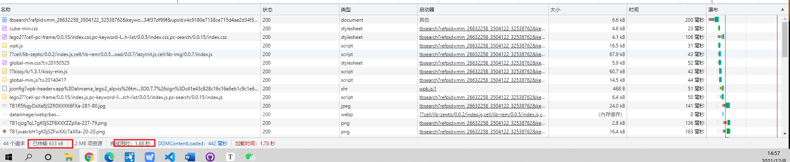
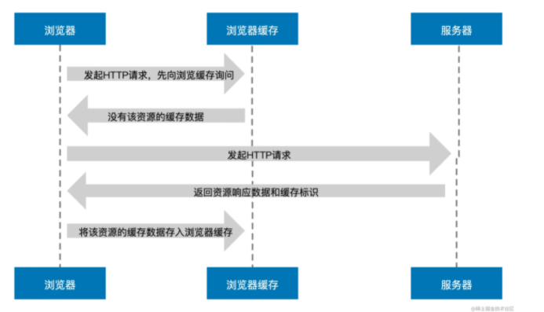
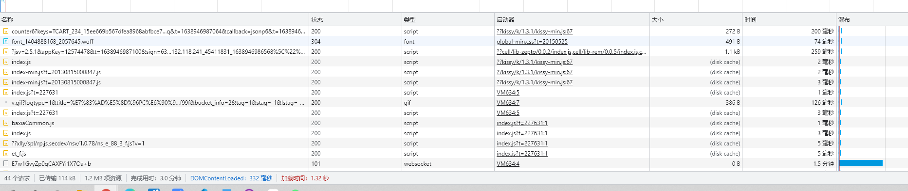
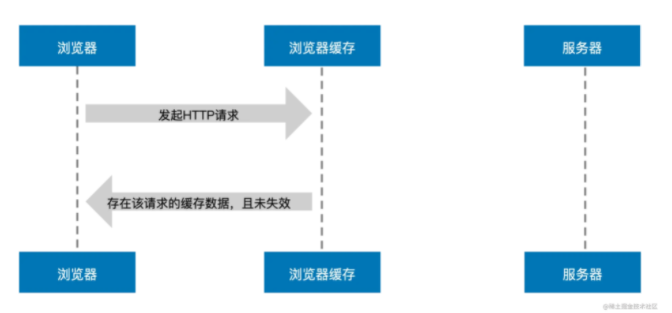
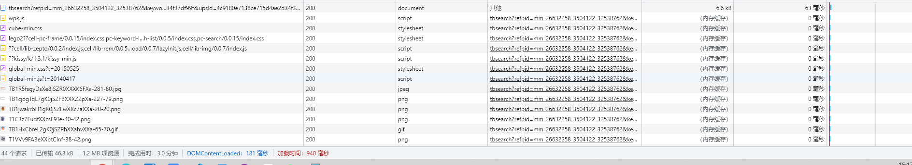
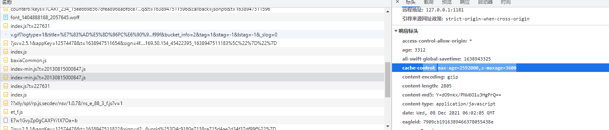

# 强缓存详解

## 一个例子：

我们第一次打开淘宝首页，浏览器未有缓存资源），打开开发者工具我们可以看到资源的加载情况。



`Size` 和 `Time` 列的数据，Size 列表示浏览器从服务器获取资源的大小，Time 列表示资源加载耗时。因为几乎每一个资源都需要从服务器获取并加载，所以网页打开速度会受到影响，这里浏览器用了 **1.88s** 加载完了页面的所有资源（图片、脚本、样式等），633 KB 的数据被传输到了本地。

从强缓存的角度来看，其实第一次访问网页时浏览器已经开始在背后进行强缓存的判断和处理，我们可以通过下方流程图一探究竟。



图中，当浏览器发起 HTTP 请求时，会向浏览器缓存进行一次询问，若浏览器缓存没有该资源的缓存数据，那么浏览器便会向服务器发起请求，服务器接收请求后将资源返回给浏览器，浏览器会将资源的响应数据存储到浏览器缓存中，这便是**强缓存的生成过程**。


第二次打开淘宝首页，继续观察开发者工具中原来的几项指标。




我们发现 Size 一列大部分由原先的资源加载大小变成了 `disk cache`（**磁盘缓存**），而变成这一数据对应的 Time 列资源加载速度异常之快，加载总耗时由原来的 1.88s 变成了 **1.32s**，而传输到本地的数据降到了 114 KB，效率提升近30%。这便是强缓存生效导致的现象。

强缓存的生效流程如下图所示：



我们可以看到**浏览器并没有和服务器进行交互**，而是在发起请求时浏览器缓存告诉浏览器它那有该资源的缓存数据并且还没有过期，于是浏览器直接加载了缓存中的数据资源。就好比你要买牛奶，原本需要跑去生产厂商买，但是发现楼下的超市就有该厂商生产的牛奶并且没有过期，那你只需要花费跑一趟楼下的功夫就可以喝到新鲜的牛奶，大大缩短了你买牛奶的时间。

接下来我们连续刷新几下淘宝首页，会发现开发者工具中的 Size 列大部分变成了 memory Cache（内存缓存），其对应的 Time 列变成了 **0ms**。可见，**memory Cache 比 disk cache 更快**，快到不需要时间。




**按照缓存位置的读取顺序，相比 disk cache，浏览器会优先读取 memory Cache。通过对以上开发者工具图例的对比不难得出，读取磁盘缓存会存在稍许的耗时，而读取内存缓存是及时性的，不存在耗时。**


## max-age 与 s-maxage

我们继续来看一下那些被浏览器缓存的资源的特点，响应报头中都包含了与强缓存有关的首部字段：Expires 或 Cache-Control。



按照上图所示报头的 Cache-Control 首部，根据上一章节介绍的知识点，此资源将被浏览器缓存 2592000 秒（即 30 天），30 天之内我们再次访问，该资源都将从浏览器缓存中读取，但是需要注意图中首部值还包括了 s-maxage=3600 秒，下面便到了划重点的时候：

- **s-maxage 仅在代理服务器中生效**
- **在代理服务器中 s-maxage 优先级高于 max-age，同时出现时 max-age 会被覆盖**

说明该资源其实是一个 CDN 资源，属于代理服务器资源，在其服务器中的缓存时间并不是 30 天，而是 3600 秒（1 个小时），所以当浏览器缓存 30 天之后重新向 CDN 服务器获取资源时，此时 CDN 缓存的资源也已经过期，会触发回源机制，即向源服务器发起请求更新缓存数据。

## expires 的缓存失效

**Expires 设置的缓存过期时间是一个绝对时间，所以会受客户端时间的影响而变得不精准**

当把电脑客户端时间修改了，此时再次访问网页你会发现浏览器重新向服务器获取了该资源，原来的缓存失效了。这便解释了 expires “不精准”的概念。

**expires “不精准” 是因为它的值是一个绝对时间，而 max-age 与其相反却是一个相对时间**，由于 max-age 优先级更高，表示浏览器可以将该资源缓存 3153600 秒（365天），但是当我们修改电脑时间时：**缓存会不会失效？同样也会！**


## max-age的缓存失效

食品是否过期的标准就是看生产日期+保质期是否超过当前日期；用一个数学公式来统一：

当前日期 - 生产日期其实就是 使用期

```
食品是否新鲜 = 食品保质期 > 食品使用期
```

那么回归强缓存，上述计算食品是否新鲜的公式同样也适用于强缓存。我们只需要把食品改为强缓存，把食品保质期修改为缓存新鲜度：

```
强缓存是否新鲜 = 缓存新鲜度 > 缓存使用期
```

### 缓存新鲜度

```
缓存新鲜度 = max-age || (expires - date)
```

当 max-age 存在时缓存新鲜度等于 max-age 的秒数，是一个时间单位，就像保质期为 6 个月一样。当 max-age 不存在时，缓存新鲜度等于 `expires - date` 的值，expires 我们应该已经熟悉，它是一个绝对时间，表示缓存过期的时间，那么下面主要介绍下首部字段 **date**。

**Date 表示创建报文的日期时间**，可以理解为服务器（包含源服务器和代理服务器）返回新资源的时间，和 expires 一样是一个绝对时间，比如

```
date：Wed, 25 Aug 2021 13:52:55 GMT
```

那么过期时间（expires）减去创建时间（date）就可以计算出浏览器真实可以缓存的时间（默认已经转化为秒数），即缓存的保质期限（缓存新鲜度）。

### 缓存使用期

根据字面意思，**缓存使用期可以理解为浏览器已经使用该资源的时间**。相比食品的使用期与当前日期和生产日期有关，**缓存使用期主要与响应使用期、传输延迟时间和停留缓存时间有关**，计算公式如下：

```
缓存使用期 = 响应使用期 + 传输延迟时间 + 停留缓存时间
```

#### 响应使用期

响应使用期可以通过以下两种方式进行计算：

- `max(0, response_time - date_value)`
- `age_value`

第一种方式中的 `response_time`（浏览器缓存收到响应的本地时间）是电脑客户端缓存获取到响应的本地时间，而 date_value（响应首部 date 值） 上面已经介绍过是服务器创建报文的时间，两者相减与 0 取最大值


第二种方式直接获取 `age_value` （响应首部 age 值），**Age 表示推算资源创建经过时间，可以理解为源服务器在多久前创建了响应或在代理服务器中存贮的时长**，单位为秒。

> Age 的值通常接近于 0。表示此对象刚刚从原始服务器获取不久；其他的值则是表示代理服务器当前的系统时间与此应答中的通用头 Date的值之差。

最终我们可以将以上两种方式进行组合，组合后的计算公式为：

```
apparent_age = max(0, response_time - date_value) 
响应使用期 = max(apparent_age, age_value)
```

#### 传输延迟时间

因为 HTTP 的传输是耗时的，所以传输延迟时间是存在的，**传输延迟时间可以理解为浏览器缓存发起请求到收到响应的时间差**，其计算公式为：

```
传输延迟时间 = response_time - request_time
```

`response_time` 代表浏览器缓存收到响应的本地时间，`request_time` 代表浏览器缓存发起请求的本地时间，两者相减便得到了传输延迟时间。

#### 停留缓存时间

停留缓存时间表示资源在浏览器上已经缓存的时间，其计算公式为：

```
停留缓存时间 = now - response_time
```

`now` 代表电脑客户端的当前时间，`response_time` 代表浏览器缓存收到响应的本地时间，两者相减便得到了停留缓存时间。

#### max-age 仍然受到本地时间影响揭秘

通过上述字段及公式的介绍，最终我们总结出影响强缓存使用期的因素有以下几个：

```
age_value：响应首部 age 值
date_value：响应首部 date 值
request_time：浏览器缓存发起请求的本地时间
response_time：浏览器缓存收到响应的本地时间
now：客户端当前时间
```

需要注意的是以上 request_time、response_time 和 now 取的都是客户端本地时间，而 now 则是修改客户端本地时间直接导致强缓存失效的“罪魁祸首”。

**因此一旦修改了电脑客户端本地时间为未来时间，缓存使用期的计算便会受到影响，主要是停留缓存时间会变大，从而导致缓存使用期超出缓存新鲜度范围（强缓存失效）。** 这便是 max-age 仍然受到本地时间影响的原因所在。