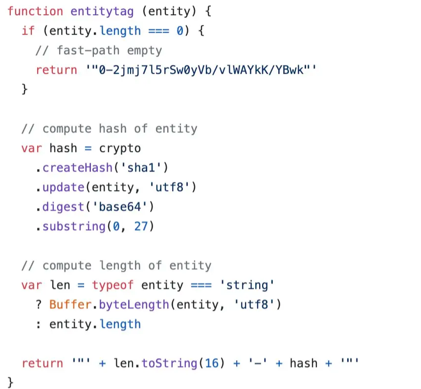

# 协商缓存详解

> 协商缓存可以看作是强制缓存失效后，浏览器携带缓存标识向服务器发起请求，由服务器根据缓存标识决定是否使用缓存的过程。

由此可知，**浏览器启用协商缓存的前提是强缓存失效**，但是反过来强缓存失效并不一定导致浏览器启用协商缓存。下面我们来了解下协商缓存的生效流程。

## 协商缓存的生效流程


我们先经历了一段强缓存的失效流程：浏览器发起 HTTP 请求后浏览器缓存发现该请求的资源失效，便将其**缓存标识**返回给浏览器，于是浏览器携带该缓存标识向服务器发起 HTTP 请求，之后服务器根据该标识判断这个资源其实没有更新过，最终返回 `304` 给浏览器，浏览器收到无更新的响应后便转向浏览器缓存获取数据。

## 缓存标识 Last-Modified 与 ETag

除了强缓存失效外，浏览器判断是否要走协商缓存还得借助上述提到的缓存标识：`last-modified`、`eTag`，这两个首部字段我们在前面章节已经有所介绍，它们是服务器响应请求时返回的报头首部。


eTag 的优先级要高于 last-modified，当两者同时出现时，只有 eTag 会生效。只要有这两个缓存标识之一，在强缓存失效后浏览器便会携带它们向服务器发起请求，携带方式如下图请求头所示：


其中 `if-modified-since` 对应 last-modified 的值，`if-none-match` 对应 eTag 的值。服务器根据优先级高的缓存标识的值进行判断。

倘若 eTag 对应的 if-none-match 不存在，那么服务器会将 last-modified 对应的 if-modified-since 的时间值与服务器该资源的最后修改时间进行对比，最后判断是否走协商缓存。

###  **last-modified** 的问题

last-modified 是一个时间，最小单位为秒，试想一下，如果资源的修改时间非常快，快到毫秒级别，那么服务器会误认为该资源仍然是没有修改的，这便导致了资源无法在浏览器及时更新的现象。

另外还有一种情况，比如服务器资源确实被编辑了，但是其实资源的实质内容并没有被修改，那么服务器还是会返回最新的 last-modified 时间值，但是我们并不希望浏览器认为这个资源被修改而重新加载。

为了避免以上现象的发生，在特殊的场景下，我们便需要使用 eTag。

### ETag 原理及实现

相比 last-modified，eTag 的优势在于能够更加精准的分析资源的改变，同时浏览器也便能更加精准的控制缓存。

不同的后端语言对 eTag 有着多种处理方式，以node中的etag包为例介绍：

生成 eTag 值的方式有两种：

- **使用文件大小和修改时间**。

图中当判断所要处理的内容是文件 stats 对象时，将会采用上述方法生成 eTag 值，最后返回的值是由文件大小和文件最后一次修改时间组成的字符串。而当内容非文件 stats 对象时，etag会使用**文件内容的 hash 值和内容长度**的方式

- **使用文件内容的 hash 值和内容长度**。

图中方法通过对内容的 hash 转化和截取，最终返回内容长度与其 hash 值组合成的字符串。


通过上述方法生成的 eTag 也被称为**强 eTag 值**，其不论实体发生多么细微的变化都会改变它的值。那么与其对立的便是**弱 eTag 值**，在 eTag 包源码中我们可以发现通过传递第二个参数 `weak` 值为 `true` 时便可启用弱校验。

> 弱 ETag 值只适用于提示资源是否相同。只有资源发生了根本改变（实质性内容改变），产生差异时才会改变 ETag 值。这时会在字段值最开始处附加 W/。

```
ETag: W/"29322-09SpAhH3nXWd8KIVqB10hSSz66"
```

