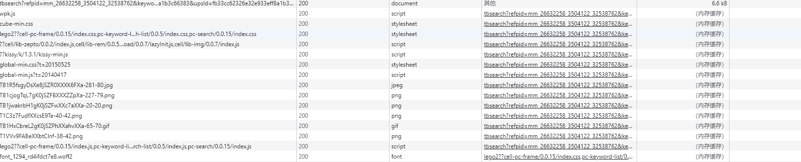
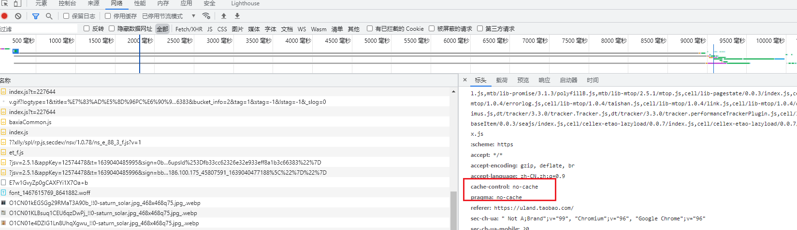
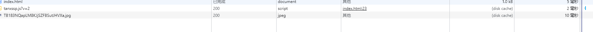

# chrome的三种加载

Chrome 具备三种加载模式，除了通过快捷键的方式触发，这三种模式只在开发者工具打开时才能够使用，此时我们打开开发者工具，在浏览器刷新按钮上右键鼠标便会展示这几种模式，如下图所示：


## 模式一：正常重新加载

**正常重新加载**这种模式对于浏览器的用户来说都很熟悉，也是我们常说的“刷新网页”，和直接点击浏览器上的刷新按钮效果一样，用户触发该模式在控制台可以看到大多数资源会命中强缓存：



上图中刷新页面后大部分资源直接会从浏览器内存缓存（memory cache）中读取，**由此我们可以得出“正常重新加载”模式会优先读取缓存。**

## 模式二：硬性重新加载

可以看到所有资源都重新向服务器获取，这个没有问题，但是检查下请求报头我们会发现，使用硬性重新加载后所有资源的请求首部都被加上了 `cache-control: no-cache` 和 `pragma: no-cache`，两者的作用都表示告知（代理）服务器不直接使用缓存，要求向源服务器发起请求，而 **pragma 则是为了兼容 HTTP/1.0。**



因此**硬性重新加载并没有清空缓存，而是禁用缓存**，其效果类似于在开发者工具 Network 面板勾选了 `Disable cache` 选项：


## 模式三：清空缓存并硬性重新加载

该模式顾名思义，其比硬性重新加载多了清空缓存的操作，因此**触发该操作会将浏览器存储的本地缓存都清空掉后再重新向服务器发送请求**，同时其影响的并不是当前网站，所有访问过的网站缓存都将被清除。


## 一个问题

**我们使用硬性重新加载（Ctrl + F5）时，为什么有个别资源还是走了强缓存？**

原因也很简单，因为硬性重新加载并没有清空缓存，当异步资源在页面加载完后插入时，其加载时仍然优先读取缓存，如果使用清空缓存并硬性重新加载便不会出现这种现象。

举个例子：

```js
<!DOCTYPE html>
<html lang="zh-CN">
<head>
    <meta charset="UTF-8">
    <meta name="viewport" content="width=device-width, initial-scale=1.0">
    <title>Demo</title>
</head>
<body>
    <div id="cache">异步资源</div>
    <script>
        window.onload = (function() {
            setTimeout(function() {
                // 异步加载背景图片
                var a = document.getElementById("cache");
                    a.style.backgroundImage= 'url(https://aecpm.alicdn.com/simba/img/TB183NQapLM8KJjSZFBSutJHVXa.jpg)';
                
                // 异步插入 JS 资源
                var s = document.createElement('script');
                    s.type = 'text/javascript';
                    s.async = true;
                    s.src = 'https://g.alicdn.com/mm/tanx-cdn/t/tanxssp.js?v=2';
                    var x = document.getElementsByTagName('script')[0];
                    x.parentNode.insertBefore(s, x);
            }, 1000)
        })
    </script>
</body>
</html>
```

上述代码我们通过一个 1 秒的延时器异步加载了一张背景图片和一个 JS 资源，当在确保浏览器已经缓存了以上资源的前提下，我们采用硬性重新加载后来观察 Network 面板：



发现两者都命中了强缓存，同时两者的请求报头发现都没有被加上 `cache-control: no-cache` 和 `pragma: no-cache` 两个首部，


还有一种资源比异步资源更加“顽固”，几乎永远都是 `from memory cache`，不管是首次加载还是清空缓存都不奏效，它便是 `base64` 图片。


> Base64 格式的图片被塞进 memory cache 可以视作浏览器为节省渲染开销的“自保行为”。