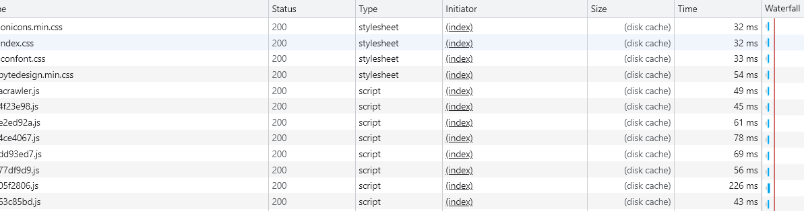
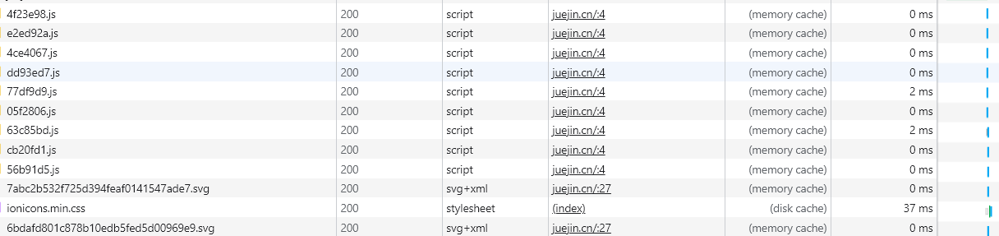
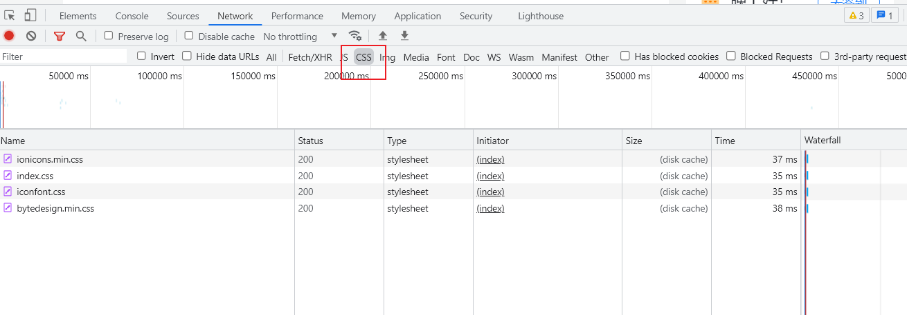

# DiskCache和MemoryCache

## MemoryCache

`Memory Cache` 翻译过来便是“内存缓存”，顾名思义，它是存储在浏览器内存中的。其优点为获取速度快、优先级高，从内存中获取资源耗时为 0 ms，而其缺点也显而易见，比如生命周期短，当网页关闭后内存就会释放，同时虽然内存非常高效，但它也受限制于计算机内存的大小，是有限的。

那么如果要存储大量的资源，这是还得用到磁盘缓存。

## Disk Cache

`Disk Cache` 翻译过来是“磁盘缓存”的意思，它是存储在计算机硬盘中的一种缓存，它的优缺点与 Memory Cache 正好相反，比如优点是生命周期长，不触发删除操作则一直存在，而缺点则是获取资源的速度相对内存缓存较慢。

Disk Cache 会根据保存下来的资源的 HTTP 首部字段来判断它们是否需要重新请求，如果重新请求那便是强缓存的失效流程，否则便是生效流程。


**从两者的优缺点中我们可以发现，Memory Cache 与 Disk Cache 珠联璧合，优势互补，共同构成了浏览器本地缓存的左右手。**


## 浏览器缓存机制

### 缓存获取顺序

当一个资源准备加载时，浏览器会根据其**三级缓存原理**进行判断。

- 浏览器会率先查找内存缓存，如果资源在内存中存在，那么直接从内存中加载
- 如果内存中没找到，接下去会去磁盘中查找，找到便从磁盘中获取
- 如果磁盘中也没有找到，那么就进行网络请求，并将请求后符合条件的资源存入内存和磁盘中

### 缓存存储优先级

这里先给出答案，在作解释：

- base64 的图片永远从内存加载外，其他大部分资源会从磁盘加载。


我们打开开发者工具并在浏览器输入 url 访问后，会发现size大部分来自于DiskCache；磁盘缓存会将命中强缓存的 js、css、图片等资源都收入囊中。



此时我们刷新下页面：



我们发现大部分的js文件变成了memoryCache，这是为什么？

我们从`Initiator` 列去寻找答案，`Initiator` 列表示资源加载发起的位置，memoryCache中的js文件我们发现它是内嵌在html文件中的，而diskCache中的文件则是异步的；如下面代码：

```html
<!DOCTYPE html>
<html lang="zh-CN">
    <head>
        <title>Demo</title>
        <script src="https://i.snssdk.com/slardar/sdk.js"></script>
    </head>
    <body>
        <div id="cache">加载的 JS 资源大概率会存储到内存中</div>
    </body>
</html>

// 异步加载js文件
<!DOCTYPE html>
<html lang="zh-CN">
    <head>
        <title>Demo</title>
    </head>
    <body>
        <div id="cache">异步加载的 JS 资源没有存储到内存中</div>
        <script>
            window.onload = function () {
                setTimeout(function () {
                    var s = document.createElement("script");
                    s.type = "text/javascript";
                    s.async = true;
                    s.src = "https://i.snssdk.com/slardar/sdk.js";
                    var x = document.getElementsByTagName("script")[0];
                    x.parentNode.insertBefore(s, x);
                }, 2000);
            };
        </script>
    </body>
</html>
```

但这并不代表异步加载的文件就是存储在diskcache中的，我们把上面异步代码中的settimeout时间改为1s，会发现它变成了memorycache；

所以我们可以得出一个答案：

> 浏览器内存缓存生效的前提下，JS 资源的执行加载时间会影响其是否被内存缓存


而 CSS 资源比较与众不同，其被磁盘缓存的概率远大于被内存缓存。



网上给出的非标准解释是：

> 因为 CSS 文件加载一次就可渲染出来，我们不会频繁读取它，所以它不适合缓存到内存中，但是 JS 之类的脚本却随时可能会执行，如果脚本在磁盘当中，我们在执行脚本的时候需要从磁盘取到内存中来，这样 IO 开销就很大了，有可能导致浏览器失去响应。


### Preload 与 Prefetch

与资源加载相关的两个功能（`Preload` 与 `Prefetch`）也会潜移默化的影响着浏览器缓存。

preload 也被称为预加载，其用于 link 标签中，可以指明哪些资源是在页面加载完成后即刻需要的，浏览器会在主渲染机制介入前预先加载这些资源，并不阻塞页面的初步渲染。例如：

```html
<link rel="preload" href="https://i.snssdk.com/slardar/sdk.js" as="script" />
```

而当使用 preload 预加载资源后，笔者发现该资源一直会从磁盘缓存中读取，JS、CSS 及图片资源都有同样的表现，这主要还是和资源的渲染时机有关，在渲染机制还没有介入前的资源加载不会被内存缓存。


相反 prefetch 则表示预提取，告诉浏览器加载下一页面可能会用到的资源，浏览器会利用空闲状态进行下载并将资源存储到缓存中。

```html
<link rel="prefetch" href="https://i.snssdk.com/slardar/sdk.js" />
```

使用 prefetch 加载的资源，刷新页面时大概率会从磁盘缓存中读取，如果跳转到使用它的页面，则直接会从磁盘中加载该资源。