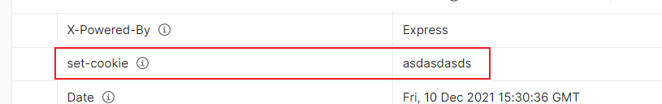

# 浏览器存储型缓存

览器存储型缓存包含了 Cookie、Web Storage、IndexedDB 等，它们也是我们日常开发中经常会接触的缓存；就比如登录了一个网站，下次进去就不用登陆了

## 登录逻辑

当用户从客户端界面输入账号密码点击登录后，前端会将数据发送给服务端进行验证，如果服务端判断用户存在且账号密码正确则向客户端返回响应并颁发有效的 token 信息，如果校验失败则会返回错误信息。

一旦唯一并有效的 token 信息返回到客户端，后续的所有需登录访问的接口请求客户端都需要携带 token 给服务端判断用户登录的有效性，因此 **token 信息在客户端的存储及传输是用户不必重复登录的关键**。


常见的客户端存储 token 信息的方式有两种：服务端自动植入和前端手动存储。

### 服务端自动植入

服务端登录接口可以在返回前端的响应报头中设置首部字段 `set-cookie` 来将 token 信息植入浏览器 cookie 中，如下图所示：



之后前端调用任何同域下的接口时，浏览器会自动将网站的 cookie 值附加在请求头中传给后端进行校验，前端则不需要关心 token 的存取问题。

### 前端手动存储

前端存储的方式不受限于浏览器环境，比如像 APP 或小程序等一些没有浏览器 cookie 的环境下也可以使用该种方式。

服务端登录接口成功后直接将用户的 token 信息通过响应实体的方式返回给前端。

前端获取到 token 信息后可以通过前端存储方法将数据持久化缓存起来，并在退出后手动清除。同时在调用后端接口时需要手动将 token 传递给服务端。例如：

```js
import axios from 'axios'

export const http = params => {
    let instance = axios.create({
        baseURL: 'https://juejin.cn',
    })
    
    let token = localStorage.getItem('token') // 从缓存中获取对应 name 值

    return instance({
        url: '/xxx/xxx',
        method: 'post',
        data: params,
        headers: {
            'x-token': token // 前端手动设置自定义 token 响应头
        }
    })
}
```


## 浏览器存储型缓存方案

### Cookie 存储方案

`Cookie` 作为最老牌的存储型缓存，其诞生之初其实并不是为了提供浏览器存储的功能，而是为了辨别用户身份，实现页面间状态的维持和传递。


**Cookie 的存储空间很小，不能超过 4KB，因此这一缺点也限制了它用于存储较大容量数据的能力。** 

不建议将非用户身份类的数据存储在 Cookie 中，因为 Cookie 在同域下会伴随着每一次资源请求的请求报头传递到服务端进行验证，在 Cookie 中，伴随着请求响应会造成多大的无效资源传输及性能浪费。


 Cookie 存储 API 方面，浏览器提供的原始 API 使用起来也不是特别方便，比如：

```js
// 存储 Cookie
document.cookie='name=juejin; domain=juejin.cn'

// 读取 Cookie
// 只能通过 document.cookie 读取所有 Cookie 并进行字符串截取，非常不便

// 删除 Cookie
let date = new Date()

date.setTime(date.getTime() - 10000) // 设置一个过期时间

document.cookie=`name=test; domain=juejin.cn; expires=${date.toGMTString()}`
```

### Web Storage 存储方案

`Web Storage` 作为 HTML5 推出的浏览器存储机制，其又可分为 `Session Storage` 和 `Local Storage`，两者相辅相成。

Web Storage 与 Cookie 相比存储大小得到了明显的提升，一般为 2.5-10M 之间（各家浏览器不同），这容量对于用于网页数据存储来说已经十分充足。


### `IndexedDB` 存储方案（遗留，等学完mysql过来补）

大容量的数据库相比 Web Storage 存储的空间还是相对有限，此时最终的解决方案便是 —— `IndexedDB`。

`IndexedDB` 是一个大规模的 NoSQL 存储系统，它几乎可以存储浏览器中的任何数据内容，包括二进制数据（`ArrayBuffer` 对象和 Blob 对象），其可以存储不少于 250M 的数据。

在使用 `IndexedDB` 前，我们需要判断浏览器是否支持：

```js
if (!('indexedDB' in window)) {
    console.log('浏览器不支持 indexedDB')
    return
}
```

