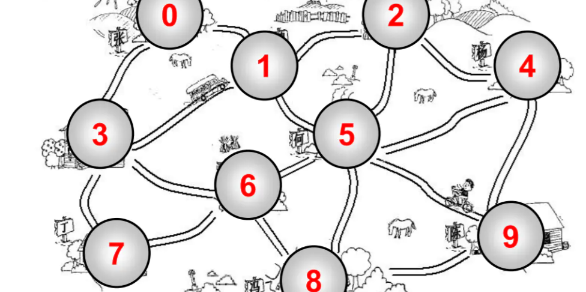
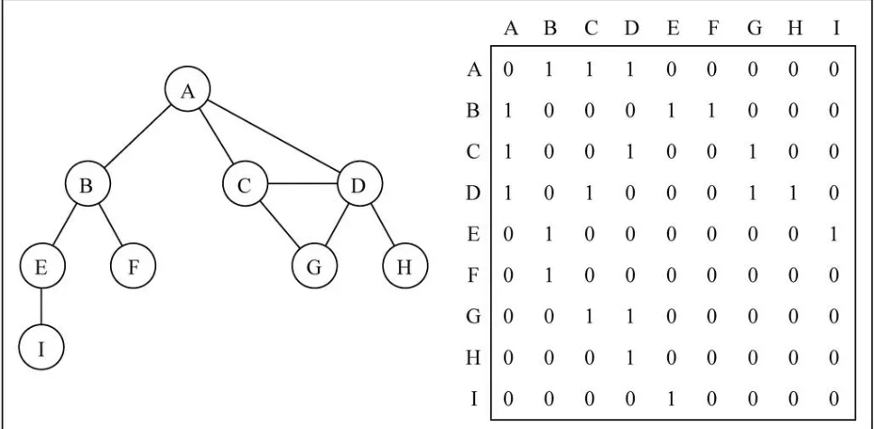
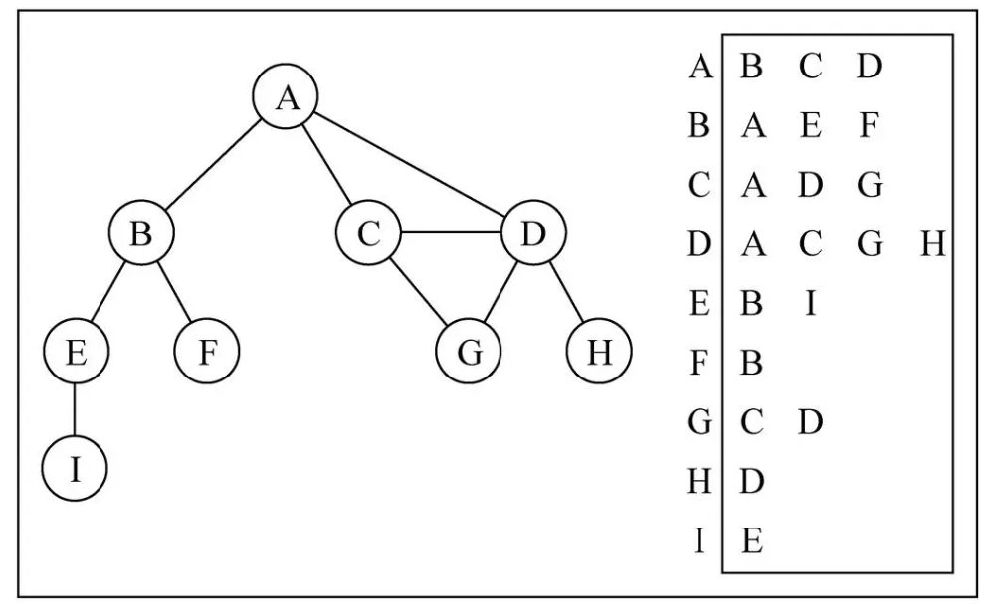

# 图

图结构可以用来表示车站，地铁之间的关系




## 图的名词

| 名词     | 含义                                                         |
| -------- | ------------------------------------------------------------ |
| 顶点     | 图中的一个结点、如地铁的某一个站                             |
| 边       | 顶点和顶点之间的连线                                         |
| 相邻顶点 | 由一条边连接在一起的顶点称为相邻顶点                         |
| 度       | 一个顶点的度是相邻顶点的数量                                 |
| 路径     | 路径是顶点v1, v2..., vn的一个连续序列, 比如上图中0 1 5 9就是一条路径、简单路径: 简单路径要求不包含重复的顶点. 比如 0 1 5 9是一条简单路径、回路: 第一个顶点和最后一个顶点相同的路径称为回路. 比如 0 1 5 6 3 0 |
| 无向图   | 有的边都没有方向                                             |
| 有向图   | 图中的边是有方向的                                           |
| 无权图   | 边没有携带权重                                               |
| 有权图   | 边有一定的权重、如地铁的票价                                 |


## 图的表示

### 邻接矩阵

用一个二维数组来表示顶点之间的连接.

- 在二维数组中, 0表示没有连线, 1表示有连线.
- 通过二维数组, 我们可以很快的找到一个顶点和哪些顶点有连线.(比如A顶点, 只需要遍历第一行即可)
- 另外, A - A, B - B(也就是顶点到自己的连线), 通常使用0表示.




#### 邻接矩阵的问题

- 如果是一个无向图, 邻接矩阵展示出来的二维数组, 其实是一个对称图、那么这种情况下会造成空间的浪费
- 如果图是一个稀疏图、那么矩阵中将存在大量的0, 这意味着我们浪费了计算机存储空间来表示根本不存在的边.


### 邻接表

- 邻接表由图中每个顶点以及和顶点相邻的顶点列表组成.
- 这个列表有很多中方式来存储: 数组/链表/字典(哈希表)都可以.




## 图的封装

```js
function Graph() {
    // 属性
    this.vertexes = [] // 存储顶点
    this.adjList = new Dictionay() // 存储边

    // 方法
    // 添加方法
    Graph.prototype.addVertex = function (v) {
        this.vertexes.push(v)
        this.adjList.set(v, [])
    }
    Graph.prototype.addEdge = function (v, w) {
        this.adjList.get(v).push(w)
        this.adjList.get(w).push(v)
    }
    Graph.prototype.toString = function () {
        var resultStr = ""
        for (var i = 0; i < this.vertexes.length; i++) {
            resultStr += this.vertexes[i] + "->"
            var adj = this.adjList.get(this.vertexes[i])
            for (var j = 0; j < adj.length; j++) {
                resultStr += adj[j] + " "
            }
            resultStr += "\n"
        }
        return resultStr
    }
}
// 创建字典的构造函数
function Dictionay() {
    // 字典属性
    this.items = {}

    // 字典操作方法
    // 在字典中添加键值对
    Dictionay.prototype.set = function (key, value) {
        this.items[key] = value
    }

    // 判断字典中是否有某个key
    Dictionay.prototype.has = function (key) {
        return this.items.hasOwnProperty(key)
    }

    // 从字典中移除元素
    Dictionay.prototype.remove = function (key) {
        // 1.判断字典中是否有这个key
        if (!this.has(key)) return false

        // 2.从字典中删除key
        delete this.items[key]
        return true
    }

    // 根据key去获取value
    Dictionay.prototype.get = function (key) {
        return this.has(key) ? this.items[key] : undefined
    }

    // 获取所有的keys
    Dictionay.prototype.keys = function () {
        return Object.keys(this.items)
    }

    // 获取所有的value
    Dictionay.prototype.values = function () {
        return Object.values(this.items)
    }

    // size方法
    Dictionay.prototype.size = function () {
        return this.keys().length
    }

    // clear方法
    Dictionay.prototype.clear = function () {
        this.items = {}
    }
}

var graph = new Graph()
// 添加顶点
var myVertexes = ["A", "B", "C", "D", "E", "F", "G", "H", "I"]
for (var i = 0; i < myVertexes.length; i++) {
    graph.addVertex(myVertexes[i])
}

// 添加边
graph.addEdge('A', 'B');
graph.addEdge('A', 'C');
graph.addEdge('A', 'D');
graph.addEdge('C', 'D');
graph.addEdge('C', 'G');
graph.addEdge('D', 'G');
graph.addEdge('D', 'H');
graph.addEdge('B', 'E');
graph.addEdge('B', 'F');
graph.addEdge('E', 'I');

console.log(graph.toString());
```

