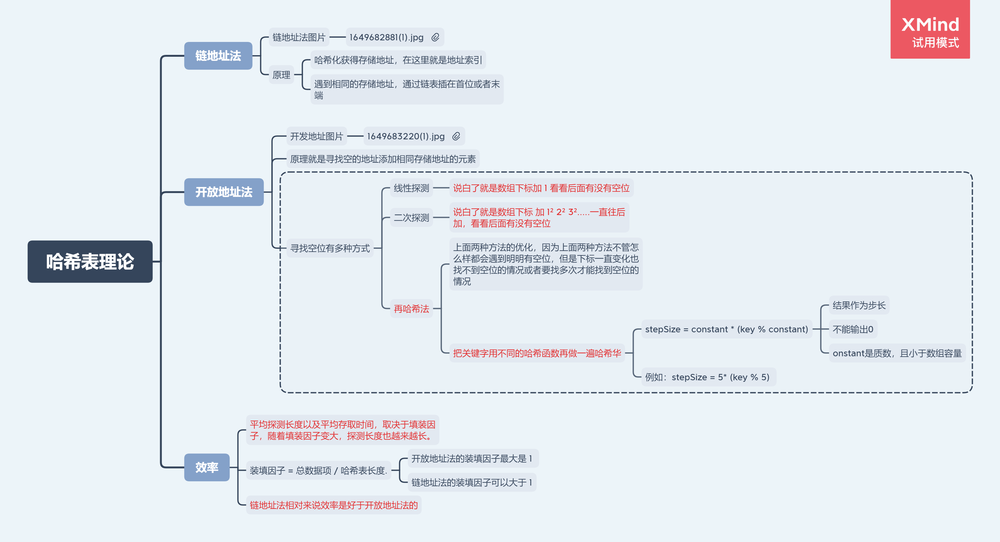

# 哈希表

## 什么是哈希表

[哈希表理论](https://www.jianshu.com/p/6e88d63061f2)

哈希表通常是基于数组进行实现的，但是它神奇的地方在于对下标值的一种变换, 这种变换我们可以称之为哈希函数, 通过哈希函数可以获取到`HashCode`

## 优势与不足

### 优势

- 它可以提供非常快速的插入-删除-查找操作

- 无论多少数据, 插入和删除值需要接近常量的时间: 即O(1)的时间级. 实际上, 只需要几个机器指令即可

- 哈希表的速度比树还要快, 基本可以瞬间查找到想要的元素

- 哈希表相对于树来说编码要容易很多

### 不足

- 哈希表中的**数据是没有顺序的,** 所以不能以一种固定的方式(比如从小到大)来遍历其中的元素.
- 通常情况下, 哈希表中的**key是不允许重复的**, 不能放置相同的key, 用于保存不同的元素.

