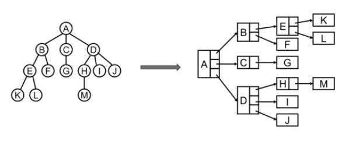
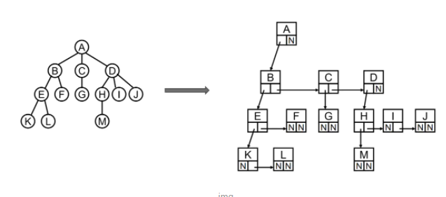
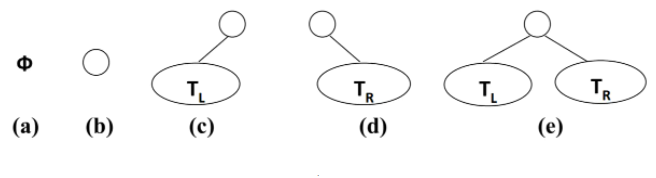
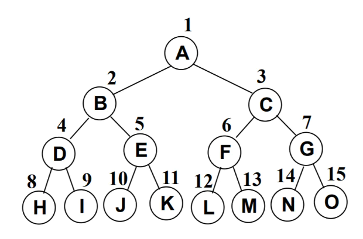
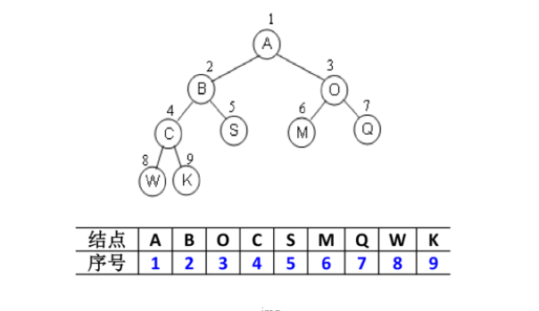
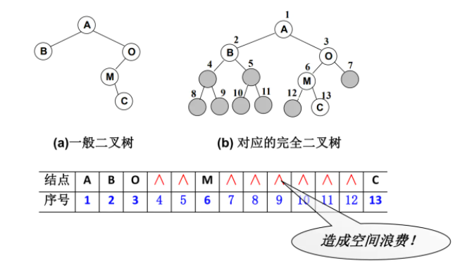
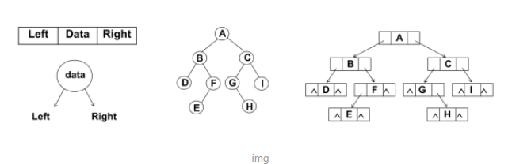
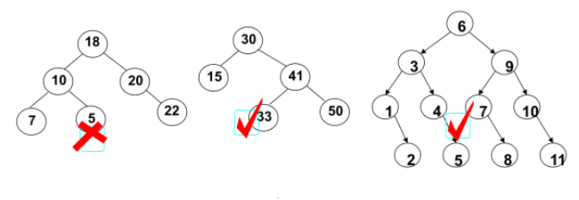

# 树结构

[TOC]

.jpg)


- 根节点最有一个
- 子树不可相交

| 术语     | 含义                                             |
| -------- | ------------------------------------------------ |
| 度       | 节点的子树个数                                   |
| 叶节点   | 度为 0 的节点                                    |
| 节点层次 | 根节点在第一层，其他节点层数等于其父结点层数 + 1 |


## 树的表示

- 普通




- 儿子-兄弟表示法




## 二叉树

- 二叉树可以为空, 也就是没有结点.
- 若不为空，则它是由根结点和称为其左子树TL和右子树TR的两个不相交的二叉树组成。


- 二叉树有五种形态

  


### 满二叉树




### 二叉树的存储

- 数组存储

  

- 非完全二叉树会造成内存浪费

  

- 链表存储

  

### 二叉搜索树

> 二叉搜索树（BST，Binary Search Tree），也称二叉排序树或二叉查找树

满足以下性质：

- 非空左子树的所有键值小于其根结点的键值。
- 非空右子树的所有键值大于其根结点的键值。
- 左、右子树本身也都是二叉搜索树。
- 二叉搜索树的特点就是相对较小的值总是保存在左结点上, 相对较大的值总是保存在右结点上



#### 二叉搜索树的操作

- `insert(key)`：向树中插入一个新的键。

- `search(key)`：在树中查找一个键，如果结点存在，则返回`true`；如果不存在，则返回`false`。
- `preOrderTraverse`：通过先序遍历方式遍历所有结点。
- `inOrderTraverse`：通过中序遍历方式遍历所有结点。
- `postOrderTraverse`：通过后序遍历方式遍历所有结点。
- `min`：返回树中最小的值/键。
- `max`：返回树中最大的值/键。
- `remove(key)`：从树中移除某个键。


#### 实现

```js
// 创建BinarySearchTree
function BinarySerachTree() {
    // 创建结点构造函数
    function Node(key) {
        this.key = key
        this.left = null
        this.right = null
    }
    
    // 保存根的属性
    this.root = null
    
    // 二叉搜索树相关的操作方法
}
```


##### `insert(key)`

```js
// 向树中插入数据
BinarySerachTree.prototype.insert = function (key) {
    // 1.根据key创建对应的node
    var newNode = new Node(key)
    
    // 2.判断根结点是否有值
    if (this.root === null) {
        this.root = newNode
    } else {
        this.insertNode(this.root, newNode)
    }
}

BinarySerachTree.prototype.insertNode = function (node, newNode) {
    if (newNode.key < node.key) { // 1.准备向左子树插入数据
        if (node.left === null) { // 1.1.node的左子树上没有内容
            node.left = newNode
        } else { // 1.2.node的左子树上已经有了内容
            this.insertNode(node.left, newNode)
        }
    } else { // 2.准备向右子树插入数据
        if (node.right === null) { // 2.1.node的右子树上没有内容
            node.right = newNode
        } else { // 2.2.node的右子树上有内容
            this.insertNode(node.right, newNode)
        }
    }
}
```


##### `search(key)`

```js
// 搜搜特定的值
BinarySerachTree.prototype.search = function (key) {
    return this.searchNode(this.root, key)
}

BinarySerachTree.prototype.searchNode = function (node, key) {
    // 1.如果传入的node为null那么, 那么就退出递归
    if (node === null) {
        return false
    }

    // 2.判断node节点的值和传入的key大小
    if (node.key > key) { // 2.1.传入的key较小, 向左边继续查找
        return this.searchNode(node.left, key)
    } else if (node.key < key) { // 2.2.传入的key较大, 向右边继续查找
        return this.searchNode(node.right, key)
    } else { // 2.3.相同, 说明找到了key
        return true
    }
}
```


##### `preOrderTraverse`

- 访问根结点；
- 先序遍历其左子树；
- 先序遍历其右子树

```js
BinarySerachTree.prototype.preOrderTraversal = function (handler) {
    this.preOrderTranversalNode(this.root, handler)
}

BinarySerachTree.prototype.preOrderTranversalNode = function (node, handler) {
    if (node !== null) {
        // 1.打印当前经过的节点
        handler(node.key)
        // 2.遍历所有的左子树
        this.preOrderTranversalNode(node.left, handler)
        // 3.遍历所有的右子树
        this.preOrderTranversalNode(node.right, handler)
    }
}

// 测试前序遍历结果
// 测试代码
var bst = new BinarySerachTree()

// 插入数据
bst.insert(11)
bst.insert(7)
bst.insert(15)
bst.insert(5)
bst.insert(3)
bst.insert(9)
bst.insert(8)
bst.insert(10)
bst.insert(13)
bst.insert(12)
bst.insert(14)
bst.insert(20)
bst.insert(18)
bst.insert(25)
var resultString = ""
bst.preOrderTraversal(function (key) {
    resultString += key + " "
})
alert(resultString) // 11 7 5 3 6 9 8 10 15 13 12 14 20 18 25
```


##### `inOrderTraverse`

- 中序遍历其左子树；
- 访问根结点；
- 中序遍历其右子树。

```js
// 中序遍历
BinarySerachTree.prototype.inOrderTraversal = function (handler) {
    this.inOrderTraversalNode(this.root, handler)
}

BinarySerachTree.prototype.inOrderTraversalNode = function (node, handler) {
    if (node !== null) {
        this.inOrderTraversalNode(node.left, handler)
        handler(node.key)
        this.inOrderTraversalNode(node.right, handler)
    }
}
```


##### `postOrderTraverse`

- 后序遍历其左子树；
- 后序遍历其右子树；
- 访问根结点。

```js
// 后续遍历
BinarySerachTree.prototype.postOrderTraversal = function (handler) {
    this.postOrderTraversalNode(this.root, handler)
}

BinarySerachTree.prototype.postOrderTraversalNode = function (node, handler) {
    if (node !== null) {
        this.postOrderTraversalNode(node.left, handler)
        this.postOrderTraversalNode(node.right, handler)
        handler(node.key)
    }
}
```

##### 最大值&最小值

```js
// 获取最大值和最小值
BinarySerachTree.prototype.min = function () {
    var node = this.root
    while (node.left !== null) {
        node = node.left
    }
    return node.key
}

BinarySerachTree.prototype.max = function () {
    var node = this.root
    while (node.right !== null) {
        node = node.right
    }
    return node.key
}
```

##### 搜索特定的值

```js
// 搜搜特定的值
BinarySerachTree.prototype.search = function (key) {
    return this.searchNode(this.root, key)
}

BinarySerachTree.prototype.searchNode = function (node, key) {
    // 1.如果传入的node为null那么, 那么就退出递归
    if (node === null) {
        return false
    }

    // 2.判断node节点的值和传入的key大小
    if (node.key > key) { // 2.1.传入的key较小, 向左边继续查找
        return this.searchNode(node.left, key)
    } else if (node.key < key) { // 2.2.传入的key较大, 向右边继续查找
        return this.searchNode(node.right, key)
    } else { // 2.3.相同, 说明找到了key
        return true
    }
}

// 非递归实现
BinarySerachTree.prototype.search = function (key) {
    var node = this.root
    while (node !== null) {
        if (node.key > key) {
            node = node.left
        } else if (node.key < key) {
            node = node.right
        } else {
            return true
        }
    }
    return false
}
```


##### 删除


| 名词 | 含义                                                         |
| ---- | ------------------------------------------------------------ |
| 前驱 | 比目标节点值小一点的节点, 称为目标节点的前驱；一定是目标节点左子树的最大值. |
| 后继 | 比目标节点值大一点的节点, 称为目标节点的后继；一定是目标节点右子树的最小值. |

删除很麻烦，先给代码

```js
// 删除结点
BinarySerachTree.prototype.remove = function (key) {
    // 1.定义临时保存的变量
    var current = this.root
    var parent = this.root
    var isLeftChild = true

    // 2.开始查找节点
    while (current.key !== key) {
        parent = current
        if (key < current.key) {
            isLeftChild = true
            current = current.left
        } else {
            isLeftChild = false
            current = current.right
        }

        // 如果发现current已经指向null, 那么说明没有找到要删除的数据
        if (current === null) return false
    }

    // 3.删除的结点是叶结点
    if (current.left === null && current.right === null) {
        if (current == this.root) {
            this.root == null
        } else if (isLeftChild) {
            parent.left = null
        } else {
            parent.right = null
        }
    }

    // 4.删除有一个子节点的节点
    else if (current.right === null) {
        if (current == this.root) {
            this.root = current.left
        } else if (isLeftChild) {
            parent.left = current.left
        } else {
            parent.right = current.left
        }
    } else if (current.left === null) {
        if (current == this.root) {
            this.root = current.right
        } else if (isLeftChild) {
            parent.left = current.right
        } else {
            parent.right = current.right
        }
    }

    // 5.删除有两个节点的节点
    else {
        // 1.获取后继节点
        var successor = this.getSuccessor(current)

        // 2.判断是否是根节点
        if (current == this.root) {
            this.root = successor
        } else if (isLeftChild) {
            parent.left = successor
        } else {
            parent.right = successor
        }

        // 3.将删除节点的左子树赋值给successor
        successor.left = current.left
    }

    return true
}

// 找后继的方法
BinarySerachTree.prototype.getSuccessor = function (delNode) {
    // 1.使用变量保存临时的节点
    var successorParent = delNode
    var successor = delNode
    var current = delNode.right // 要从右子树开始找

    // 2.寻找节点
    while (current != null) {
        successorParent = successor
        successor = current
        current = current.left
    }

    // 3.如果是删除图中15的情况, 还需要如下代码
    if (successor != delNode.right) {
        successorParent.left = successor.right
        successor.right = delNode.right
    }
    
    return successor
}


var bst = new BinarySerachTree()

// 插入数据
bst.insert(11)
bst.insert(7)
bst.insert(15)
bst.insert(6)
bst.insert(3)
bst.insert(9)
bst.insert(8)
bst.insert(10)
bst.insert(13)
bst.insert(12)
bst.insert(14)
bst.insert(20)
bst.insert(18)
bst.insert(25)

bst.remove(7)
var resultString = ""
bst.preOrderTraversal(function (key) {
    resultString += key + " "
})

console.log(resultString);
```

