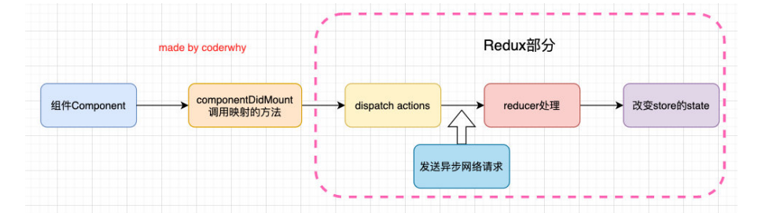

# 中间件

我们在发送异步请求的时候可能会写在componentDidMount 生命周期函数中、请求到了数据可能会再去dispatch处理数据、但是放在redux中处理异步请求是一种更好的方式




这个就需要中间件（Middleware）、在这类框架中，Middleware可以帮助我们在请求和响应之间嵌入一些操作的代码，比如cookie解析、日志记录、文件压缩等操作；


## redux-thunk

我们知道，默认情况下的dispatch(action)，action需要是一个JavaScript的对象；redux-thunk可以让dispatch(action函数)，action可以是一个函数；

该函数会被调用，并且会传给这个函数一个dispatch函数和getState函数；

- dispatch函数用于我们之后再次派发action；
- getState函数考虑到我们之后的一些操作需要依赖原来的状态，用于让我们可以获取之前的一些状态；


### 使用

```
yarn add redux-thunk
```

```js
import { createStore, applyMiddleware, compose } from 'redux';
import thunkMiddleware from 'redux-thunk';

const storeEnhancer = applyMiddleware(thunkMiddleware);
const store = createStore(reducer, storeEnhancer);
```

```jsx
import React, { PureComponent } from 'react';

import { connect } from 'react-redux';


import {
  incAction,
  addAction,
  getHomeMultidataAction
} from '../store/actionCreators'

class Home extends PureComponent {
  componentDidMount() {
    this.props.getHomeMultidata();
  }

  render() {
    return (
      <div>
        <h1>Home</h1>
        <h2>当前计数: {this.props.counter}</h2>
        <button onClick={e => this.props.increment()}>+1</button>
        <button onClick={e => this.props.addNumber(5)}>+5</button>
      </div>
    )
  }
}

const mapStateToProps = state => ({
  counter: state.counter
})

const mapDispatchToProps = dispatch => ({
  getHomeMultidata() {
    // 派发函数
    dispatch(getHomeMultidataAction);
  }
})

export default connect(mapStateToProps, mapDispatchToProps)(Home);
```


```js
// actionCreators.js
// 异步请求数据、请求到了在同步的派发处理数据
export const getHomeMultidataAction = (dispatch, getState) => {
  axios({
    url: "http://123.207.32.32:8000/home/multidata",
  }).then(res => {
    const data = res.data.data;
    dispatch(changeBannersAction(data.banner.list));
    dispatch(changeRecommendAction(data.recommend.list));
  })
}
```


## redux-saga

redux-saga是另一个比较常用在redux发送异步请求的中间件，它的使用更加的灵活


## 使用步骤

1. 安装redux-saga   `yarn add redux-saga`

2. 集成redux-saga中间件

   - 导入创建中间件的函数； 
   - 通过创建中间件的函数，创建中间件，并且放到applyMiddleware函数中； 
   - 启动中间件的监听过程，并且传入要监听的saga；

3. saga.js文件的编写

   - takeEvery：可以传入多个监听的actionType，每一个都可以被执行（对应有一个takeLatest，会取消前面的） 
   - put：在saga中派发action不再是通过dispatch，而是通过put
   - all：可以在yield的时候put多个action；

   ```js
   import { createStore, applyMiddleware, compose } from 'redux';
   import thunkMiddleware from 'redux-thunk';
   import createSagaMiddleware from 'redux-saga';
   
   import saga from './saga';
   import reducer from './reducer.js';
   
   // 应用一些中间件
   // 1.引入thunkMiddleware中间件(上面)
   // 2.创建sagaMiddleware中间件
   const sagaMiddleware = createSagaMiddleware();
   const storeEnhancer = applyMiddleware(thunkMiddleware, sagaMiddleware);
   
   
   const store = createStore(reducer, storeEnhancer);
   
   // saga 是一个generator函数
   sagaMiddleware.run(saga);
   
   export default store;
   
   ```

   

​	

```js
// saga.js
import { takeEvery, put, all, takeLatest } from 'redux-saga/effects';
import axios from 'axios';
import {
  FETCH_HOME_MULTIDATA, ADD_NUMBER
} from './constants';
import {
  changeBannersAction,
  changeRecommendAction
} from './actionCreators';

function* fetchHomeMultidata(action) {
  const res = yield axios.get("http://123.207.32.32:8000/home/multidata");
  const banners = res.data.data.banner.list;
  const recommends = res.data.data.recommend.list;
  yield all([
    yield put(changeBannersAction(banners)),
    yield put(changeRecommendAction(recommends))
  ])
}

function* mySaga() {
  // takeLatest takeEvery区别:
  // takeLatest: 依次只能监听一个对应的action
  // takeEvery: 每一个都会被执行
  yield all([
    takeLatest(FETCH_HOME_MULTIDATA, fetchHomeMultidata),
    // takeLatest(ADD_NUMBER, fetchHomeMultidata),
  ]);
}

export default mySaga;
```


```jsx
// actionCreators.js
export const changeRecommendAction = (recommends) => ({
  type: CHANGE_RECOMMEND,
  recommends
});

// ui 组件
import React, { PureComponent } from 'react';
import { connect } from 'react-redux';


import {
  fetchHomeMultidataAction
} from '../store/actionCreators'

class Home extends PureComponent {
  componentDidMount() {
    this.props.getHomeMultidata();
  }

  render() {
    return (
      <div>
        <h1>Home</h1>
        <h2>当前计数: {this.props.counter}</h2>
      </div>
    )
  }
}

const mapStateToProps = state => ({
  counter: state.counter
})

const mapDispatchToProps = dispatch => ({
  getHomeMultidata() {
    // fetchHomeMultidataAction 是一个action对象、不是函数
    dispatch(fetchHomeMultidataAction);
  }
})

export default connect(mapStateToProps, mapDispatchToProps)(Home);
```


